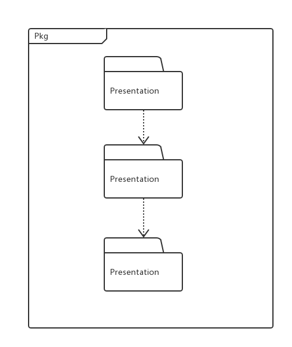
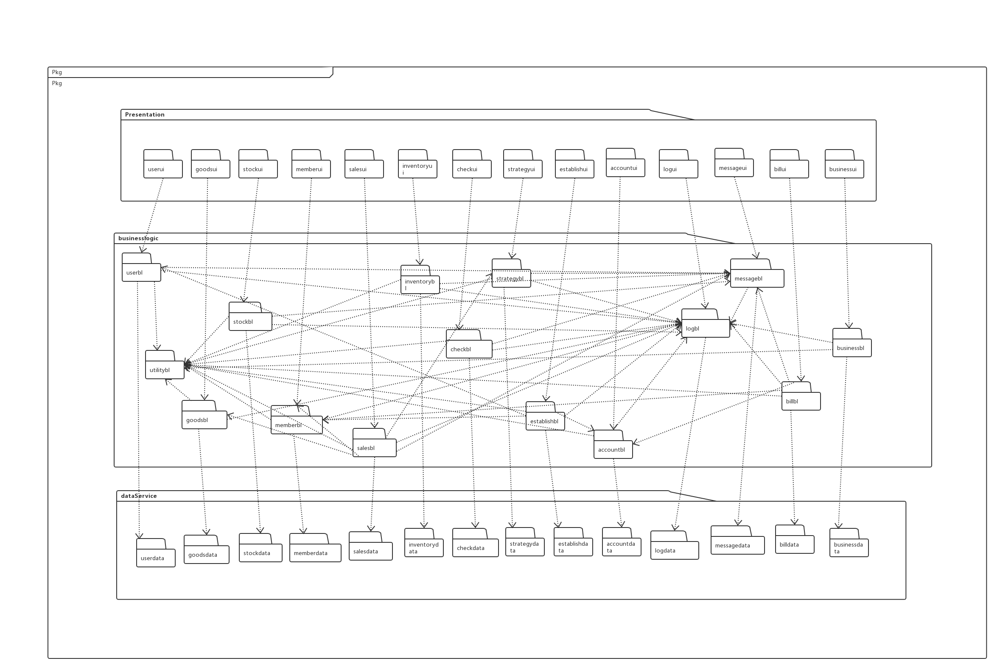
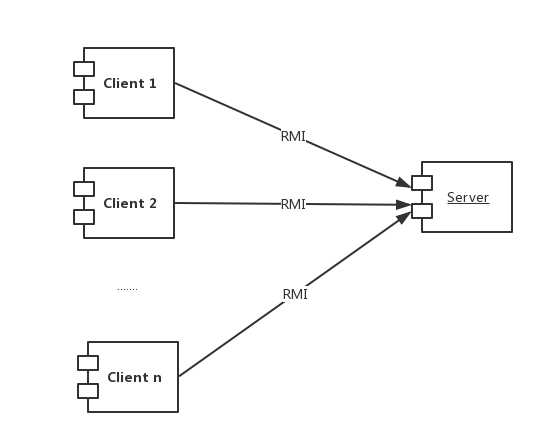
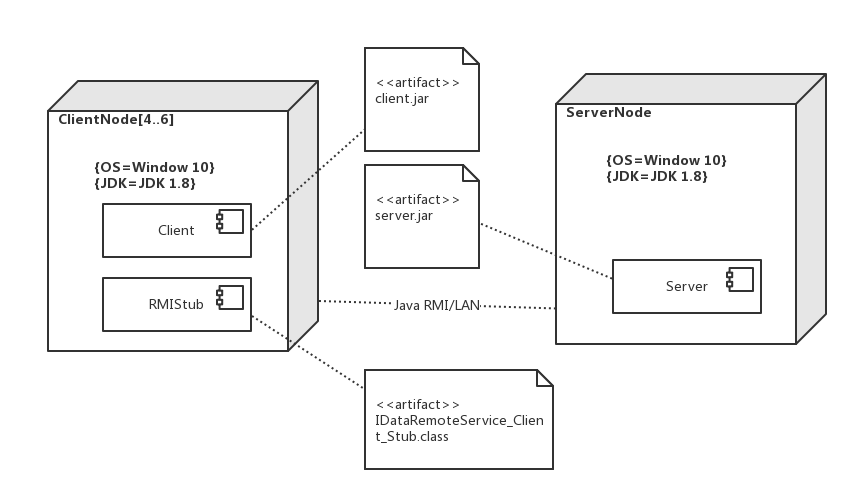
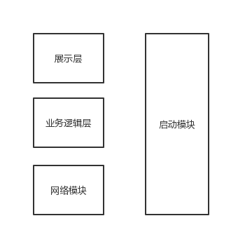
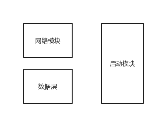

# 某灯具企业进销存管理系统体系结构文档
## V1.0 beta版
### 南京大学GZYZ小分队
#### 2017-10-22创建

---
## 更新版本记录
| **修改人** |**修改日期** |**修改原因**|**版本号** |
| :------   |:----: | ----    | :----: |
|小组|2017.10.22|第一稿整合|V1.0|


---

# 1.引言
## 1.1编制目的
本报告详细完成了对某灯具进销存系统的概要设计，达到指导详细设计和开发的目的，同时实现和测试人员及用户的沟通。  
本报告面向开发人员、测试人员及最终用户而编写，是了解系统的导航

## 1.2词汇表
|**词汇表**|**词汇含义**|**备注**|
|----|----|---|
|ERP|进销存管理系统||
|User|用户||
|Promotion|销售策略||
|Log|操作记录||
|Message|消息||
|SystemMessage|系统消息||
|Check|单据审核||
|Sales|销售||
|Member|客户||
|Stock|库存||
|Bill|款单||
|Business|业务查询||
|Establish|期初建账||
|Account|账户||
|Inventory|库存||
|Goods|商品（管理）||
|GoodsClassification|商品分类||
|UserManager|用户管理||
|Administrator|管理员||
|InventoryView|库存查看||
|InventoryCheck|库存盘点||
|InventoryOverflow|库存报溢|
|InventoryDamage|库存报损|
|InventoryWarning|库存报警|
|MemberManager|客户管理||
|StockPurReceipt|进货单||
|StockRetReceipt|进货退货单||
|SalesSellReceipt|销售单|
|SalesRetReceipt|销售退货单||
|AccountManager|账户管理||
|BillPayReceipt|付款单|
|BillChargeReceipt|收款单||
|CashReceipt|现金费用单||
|SalesDetail|销售明细||
|BusinessProgress|经营历程||
|BusinessCondition|经营情况||
|Establish|期初建账||
|CreditNote|红冲||
|InventoryManager|库存管理人员||
|Salesman|销售人员||
|Accountant|财务人员||
|GeneralManager|总经理||


# 2.产品概述
参考某灯具企业进销存管理系统用例文档以及规格需求文档中对产品的概括描述。

# 3.逻辑视角
某灯具企业进销存管理系统中，选择了分层体系结构风格，将系统分为3层（展示层，业务逻辑层，数据层）能够很好地示意整个高层抽象。展示层包含GUI页面的实现，业务逻辑层包含业务逻辑的实现，数据层负责数据的持久化和访问。分层体系结构的逻辑是叫和逻辑设计方案如下两图。  
下图为逻辑视角
    
下图为设计方案  
    
# 4.组合视角
## 4.1开发包图  
某灯具企业进销存管理系统最终开发包设计如下表  

|**开发包**|**依赖的其他开发包**|
|-----|-----|
|mainui|userui,goodsui,stockui,memberui,salesui,inventoryui,checkui,promotionui,establishui,accountui,logui,messageui,billui,businessui|
|userui|userblService,javaFX界面包,vo|
|stockui|stockblService,javaFX界面包,vo|
|goodsui|goodsblService,javaFX界面包,vo|
|salesui|salesblService,javaFX界面包,vo|
|memberui|memberblService,javaFX界面包,vo|
|inventoryui|inventoryblService,javaFX界面包,vo|
|checkui|checkblService,javaFX界面包,vo|
|promotionui|promotionblService,javaFX界面包,vo|
|establishui|establishblService,javaFX界面包,vo|
|accountui|accountblService,javaFX界面包,vo|
|logui|logblService,javaFX界面包,vo|
|messageui|messageblService,javaFX界面包,vo|
|billui|billblService,javaFX界面包,vo|
|businessui|businessblService,javaFX界面包,vo|
|userblService|vo|
|stockblService|vo|
|goodsblService|vo|
|salesblService|vo|
|memberblService|vo|
|inventoryblService|vo|
|checkblService|vo|
|promotionblService|vo|
|establishblService|vo|
|accountblService|vo|
|logblService|vo|
|messageblService|vo|
|billblService|vo|
|businessblService|vo|
|userbl|userblService,util,userdataService,po,logbl,messagebl|
|stockbl|stockblService,util,stockdataService,po,logbl,messagebl|
|goodsbl|goodsblService,util,goodsdataService,po,logbl,messagebl|
|salesbl|salesblService,util,salesdataService,po,logbl,messagebl,memberbl,goodsbl,promotionbl|
|memberbl|memberblService,util,memberdataService,po,logbl,messagebl|
|inventorybl|inventoryblService,util,inventorydataService,po,logbl,messagebl|
|checkbl|checkblService,util,checkdataService,po,logbl,messagebl|
|promotionbl|promotionblService,util,promotiondataService,inventorybl,po,logbl,messagebl|
|establishbl|establishblService,util,establishdataService,po,logbl,messagebl,userbl,accountbl,memberbl|
|accountbl|accountblService,util,accountdataService,po,logbl,messagebl|
|logbl|logblService,util,logdataService,po|
|messagebl|messageblService,util,messagedataService,po,logbl|
|billbl|billblService,util,billdataService,po,logbl,messagebl,accountbl,memberbl|
|businessbl|businessblService,util,businessdataService,po,logbl|
|userdataService|java RMI,po|
|stockdataService|java RMI,po|
|goodsdataService|java RMI,po|
|salesdataService|java RMI,po|
|memberdataService|java RMI,po|
|inventorydataService|java RMI,po|
|checkdataService|java RMI,po|
|promotiondataService|java RMI,po|
|establishdataService|java RMI,po|
|accountdataService|java RMI,po|
|logdataService|java RMI,po|
|messagedataService|java RMI,po|
|billdataService|java RMI,po|
|businessdataService|java RMI,po|
|userdata|userdataService,databaseutility,po,RMI|
|stockdata|stockdataService,databaseutility,po,RMI|
|goodsdata|goodsdataService,databaseutility,po,RMI|
|salesdata|salesdataService,databaseutility,po,RMI|
|memberdata|memberdataService,databaseutility,po,RMI|
|inventorydata|inventorydataService,databaseutility,po,RMI|
|checkdata|checkdataService,databaseutility,po,RMI|
|promotiondata|promotiondataService,databaseutility,po,RMI|
|establishdata|establishdataService,databaseutility,po,RMI|
|accountdata|accountdataService,databaseutility,po,RMI|
|logdata|logdataService,databaseutility,po,RMI|
|messagedata|messagedataService,databaseutility,po,RMI|
|billdata|billdataService,databaseutility,po,RMI|
|businessdata|businessdataService,databaseutility,po,RMI|
|databaseutility|JDBC|

下图为客户端开发包图
  
  
下图为服务器端开发包图
  

## 4.2运行时进程
在某灯具企业进销存管理系统中，会有多个客户端进程和一个服务器端进程，其进程图如下图，客户端进程是在客户端上运行，服务器端进程是在服务器端进行  



## 4.3物理部署
某灯具企业进销存管理系统构建是放在客户端机器上，服务器端构件是放在服务器端机器上，在客户端节点上，还要部署RMIStub构件，由于javaRMI构件属于JDK 1.8的一部分，所以在系统JDK环境设置好的情况下，不需要再独立部署。
部署图如下图  

# 5.接口视角
## 5.1模块的职责
客户端模块视图如下图  
  
服务器端模块视图如下图  
  
客户端分层职责如下表  

|**层**|**职责**|
|----|----|
|启动模块|负责初始化互联网通信机制，启动用户界面|
|用户界面层|基于窗口的系统客户端用户界面|
|业务逻辑层|对用户输入进行业务逻辑处理|
|客户端网络模块|利用RMI机制查找RMI服务|

服务器端分层职责如下表  

|**层**|**职责**|
|----|----|
|启动模块|负责初始化互联网通信机制，启动用户界面|
|数据层|负责数据的持久化及数据访问接口|
|服务器端网络模块|利用RMI机制开启注册RMI服务|

每一层只是使用下方直接接触的层。层与层之间仅仅是通过接口的调用方法来完成的，层之间的调用接口如下表  

|**接口**|**服务调用方**|**服务提供方**|
|----|----|-----|
|userblService|客户端展示层|客户端业务逻辑层|
|stockblService|客户端展示层|客户端业务逻辑层|
|goodsblService|客户端展示层|客户端业务逻辑层|
|salesblService|客户端展示层|客户端业务逻辑层|
|memberblService|客户端展示层|客户端业务逻辑层|
|inventoryblService|客户端展示层|客户端业务逻辑层|
|checkblService|客户端展示层|客户端业务逻辑层|
|promotionblService|客户端展示层|客户端业务逻辑层|
|establishblService|客户端展示层|客户端业务逻辑层|
|accountblService|客户端展示层|客户端业务逻辑层|
|logblService|客户端展示层|客户端业务逻辑层|
|messageblService|客户端展示层|客户端业务逻辑层|
|billblService|客户端展示层|客户端业务逻辑层|
|businessblService|客户端展示层|客户端业务逻辑层|
|userdataService|客户端业务逻辑层|服务器端数据层|
|stockdataService|客户端业务逻辑层|服务器端数据层|
|goodsdataService|客户端业务逻辑层|服务器端数据层|
|salesdataService|客户端业务逻辑层|服务器端数据层|
|memberdataService|客户端业务逻辑层|服务器端数据层|
|inventorydataService|客户端业务逻辑层|服务器端数据层|
|checkdataService|客户端业务逻辑层|服务器端数据层|
|promotiondataService|客户端业务逻辑层|服务器端数据层|
|establishdataService|客户端业务逻辑层|服务器端数据层|
|accountdataService|客户端业务逻辑层|服务器端数据层|
|logdataService|客户端业务逻辑层|服务器端数据层|
|messagedataService|客户端业务逻辑层|服务器端数据层|
|billdataService|客户端业务逻辑层|服务器端数据层|
|businessdataService|客户端业务逻辑层|服务器端数据层|


## 5.2用户界面层的分解
根据需求，系统共存在

### 5.2.1用户界面层模块的职责
如下表为用户界面层模块的职责范例  

|**模块**|**职责**|
|----|----|
|MainStage|界面Stage，用于界面跳转|
### 5.2.2用户界面层模块接口规范

|**模块名**|**语法**|**前置条件**|**后置条件**|
|----|----|----|----|
|MainFrame|init(args:String[])|无|显示LoginScene|

|**服务名**|**服务**|
|---|---|
|userblService.UserblService|登录界面的业务逻辑接口|

### 5.2.3用户界面模块设计原理
利用javaFX实现

## 5.3业务逻辑层的分解
### 5.3.1业务逻辑层模块的职责
业务逻辑层模块职责如下表  

|**模块**|**职责**|
|----|----|
|userbl|负责实现与用户登录和用户管理有关得服务|
|logbl|负责操作员操作得记录服务|
|messagebl|负责用户之间信息交互服务|
|promotionbl|负责实现与销售策略有关的服务|
|checkbl|负责实现与审批单据有关的服务|
|stockbl|负责实现处理进货类单据有关的服务|
|memberbl|负责实现用户管理有关的服务|
|salesbl|负责实现处理销售类单据有关的服务|
|billbl|负责实现收款单、付款单、现金费用单界面所需要的服务|
|businessbl|负责实现查看经营历程表、经营情况表、销售明细表界面所需要的服务|
|establishbl|负责实现期初建账界面所需要的服务|
|accountbl|负责实现账户管理所需要的服务|
|goodsclassificationbl|负责实现商品分类与商品分类管理界面所需要的服务|
|goodsbl|负责实现商品与商品管理界面所需要的服务|
|inventorybl|负责实现仓库管理界面所需要的服务|


### 5.3.2业务逻辑层的接口规范

#### userbl
|**供接口名**|**语法**|**前置条件**|**后置条件**|
|----|----|----|----|
|User.Login|public ResultMessage login(long id,String password);|password符合输入规则|查找是否存在相应的User，根据输入的password返回登陆验证的结果|
|User.Register|public ResultMessage register(long id,String password1,String password2);|password符合输入规则且两个password一致|根据输入的检查是否有此User，无则新建User并返回创建结果|
|User.SetSafeAnswer|public ResultMessage checkAnswer(String answer);|answer符合输入规则|返回设定验证的结果|
|User.Findpassword|public ResultMessage find(long id);|id符合输入规则|根据输入的检查是否有此User，有则进入安全问题找回密码|
|User.SafeAnswer|public ResultMessage checkAnswer(String answer);|系统找到有此用户且answer符合输入规则|根据输入的检查验证，成功则进入修改密码页面|
|User.SetPassword|public ResultMessage setPassword(String password1,String password2);|两次密码输入一致|改变该用户密码|
|UserManager.Init|public void initUserManager();|用户管理人员成功登陆|系统初始化管理员初始界面数据|
|UserManager.User|public void showUserDetail(UserPO user);|用户管理人员启动用户信息模块|系统显示用户详细信息|
|UserManager.Search|public ArrayList<UserPO> search(String keyword);|用户管理人员启动搜索模块|返回查找用户列表|
|UserManager.Insert|public ResultMessage insert(UserPO user);|用户管理人员启动添加模块|若系统无此用户，则添加此用户，返回添加结果|
|UserManager.Delete|public ResultMessage delete(UserPO user);|用户管理人员启动删除模块|系统删除相应用户，返回删除结果|
|UserManager.Modify|public ResultMessage modify(UserPO user);|用户管理人员启动修改模块|系统修改相应用户，返回修改结果|

|**需接口名**|**服务**|
|---|---|
|DataBaseFactory.getUserDatabase|得到User数据库引用|
|UserDataService.insert(UserPO po)|系统新增User|
|UserDataService.search|系统查询User|
|UserDataService.delete(UserPO po)|系统删除User|
|UserDataService.modify(UserPO po)|系统修改User|


#### logbl
|**供接口名**|**语法**|**前置条件**|**后置条件**|
|----|----|----|----|
|Log.record|public void record(LogPO log);|无|记录当前用户每次操作|
|Log.search|public ArrayList<LogPO> search(String keyword);|财务人员或总经理启动搜索模块|返回操作查询列表|


|**需接口名**|**服务**|
|---|---|
|DataBaseFactory.getLogDatabase|得到Log数据库引用|
|LogDataService.insert(LogPO po)|系统新增Log条目|
|LogDataService.search|检索返回Log条目|


#### messagebl
|**供接口名**|**语法**|**前置条件**|**后置条件**|
|----|----|----|----|
|Message.send|public void send(MessagePO message);|用户启动发送IM信息模块|客户端得到信息|
|Message.save|public void save(MessagePO message);|用户发送了信息|系统存储信息持久化|
|Message.load|public ArrayList<MessagePO> loadMessage();|用户完成初始化|加载数据库的message信息|
|Message.system|public void sendSystemMessage(MessagePO message);|用户完成某重要操作|向用户发送系统信息|


|**需接口名**|**服务**|
|---|---|
|DataBaseFactory.getMessageDatabase|得到Message数据库引用|
|MessageDataService.insertMessage|系统添加Message持久化|
|MessageDataService.selectMessage|系统加载Message数据|
|MessageDataService.updateMessage|系统修改Message持久化|
|MessageDataService.sendMessage|系统向用户发送信息|
|MessageDataService.sendSystemMessage|系统向用户发送系统信息|


#### checkbl
|**供接口名**|**语法**|**前置条件**|**后置条件**|
|----|----|----|----|
|Check.List|public void initCheck();|总经理启动审批单据模块|系统加载完毕界面数据|
|Check.List.Detail|public void showDetail(ReceiptPO receipt);|总经理查看单据信息|系统加载单据信息|
|Check.List.Approve|public void approve(ReceiptPO receipt);|总经理审批同意单据|系统改变单据状态并储存并发送消息|
|Check.List.Reject|public void reject(ReceiptPO receipt);|总经理审批拒绝单据|系统改变单据状态并储存并发送消息|


|**需接口名**|**服务**|
|---|---|
|DataBaseFactory.getCheckDatabase|得到Check数据库引用|
|CheckDataService.List|返回单据列表|
|CheckDataService.Update|更新系统单据持久化|


#### promotionbl
|**供接口名**|**语法**|**前置条件**|**后置条件**|
|----|----|----|----|
|Promotion.List|public void initPromotion();|总经理必须已经被识别和授权|初始化销售策略数据|
|Promotion.Detail|public void showDetail(PromotionPO promotionPO);|总经理必须已经被识别和授权|显示策略详细信息|
|Promotion.List.Add|ublic void insert(PromotionPO promotionPO);|总经理必须已经被识别和授权|系统增加销售策略|
|Promotion.Modify|public void modify(PromotionPO promotionPO);|总经理必须已经被识别和授权|系统修改销售策略|
|Promotion.Modify.Delete|public void delete(PromotionPO promotionPO);|总经理必须已经被识别和授权|删除销售策略|


|**需接口名**|**服务**|
|---|---|
|DataBaseFactory.getPromotionDatabase|得到Promotion数据库引用|
|PromotionDataService.Insert(PromotionPO po)|系统新增Promotion|
|PromotionDataService.Delete(PromotionPO po)|系统删除Promotion|
|PromotionDataService.Update(PromotionPO po)|系统更新Promotion|
|PromotionDataService.Select(PromotionPO po)|系统查找返回PromotionPO|

#### Stockbl的接口规范

供接口

|**供接口名**|**语法**|**前置条件**|**后置条件**|
|:---|:---|:---|:---|
|Stockbl.getStockPurReceiptID|public String getStockPurReceiptID()|新建进货单|返回根据时间和编号生成的单据编号|
|Stockbl.getStockRetReceiptID|public String getStockRetReceiptID()|新建进货退货单|返回根据时间和编号生成的单据编号|
|Stockbl.submit|public ResultMessage submit(StockReceiptVO stockReceiptVO)|输入合法|保存单据，记录操作，发送消息，返回执行结果|
|Stockbl.update|public ResultMessage update(StockReceiptVO stockReceiptVO)|输入合法，存在未审批通过单据|更新单据，记录操作，返回执行结果|
|Stockbl.delete|public ResultMessage delete(String id)|存在未审批通过单据|删除单据，记录操作，返回执行结果|
|Stockbl.find|public StockReceiptVO find(String id)|输入合法单据号|查找单据，返回查找结果|
|Stockbl.getGoodsNames|public ArrayList<String> getGoodsNames()|无|返回可选商口名称|
|Stockbl.getPrice|public int getPrice(String goodsName, String goodsVersion)|选择商品|返回该高品的单价|


需接口

|**需接口名**|**服务**|
|:---|:---|
|StockDataService.insert(StockReceiptPO stockReceiptPO)|添加进货类单据|
|StockDataService.update(StockReceiptPO stockReceiptPO)|更新进货类单据|
|StockDataService.delete(String id)|删除进货类单据|
|StockDataService.find(String id)|查找进货类单据|


#### Memberbl的接口规范
供接口

|**供接口名**|**语法**|**前置条件**|**后置条件**|
|:---|:---|:---|:---|
|Memberbl.insert|public ResultMessage insert(MemberVO memberVO)|输入合法|添加客户，返回执行结果|
|Memberbl.update|public ResultMessage update(MemberVO memberVO)|输入合法|更新客户，返回执行结果|
|Memberbl.delete|public ResultMessage delete(String id)|无|删除客户，返回执行结果|
|Memberbl.search|public ArrayList<MemberVO> search(SearchConditions sc)|输入合法的搜索条件|返回搜索结果|


需接口

|**需接口名**|**服务**|
|:---|:---|
|MemberDataService.insert(MemberPO memberPO)|添加客户|
|MemberDataService.update(MemberPO memberPO)|更新客户|
|MemberDataService.delete(String id)|删除客户|
|MemberDataService.Search(String id)|搜索客户|


#### Salesbl的接口规范 
供接口

|**供接口名**|**语法**|**前置条件**|**后置条件**|
|:---|:---|:---|:---|
|Salesbl.getSalesSellReceiptID|public String getSalesSellReceiptID()|新建销售单|返回根据时间和编号生成的单据编号|
|Salesbl.getSalesRetReceiptID|public String getSalesRetReceiptID()|新建销售退货单|返回根据时间和编号生成的单据编号|
|Salesbl.submit|public ResultMessage submit(SalesReceiptVO salesReceiptVO)|输入合法|保存单据，记录操作，发送消息，返回执行结果|
|Salesbl.update|public ResultMessage update(SalesReceiptVO salesReceiptVO)|输入合法|更新单据，记录操作，返回执行结果|
|Salesbl.delete|public ResultMessage delete(String id)|无|删除单据，记录操作，返回执行结果|
|Salesbl.find|public SalesReceiptVO find(String id)|输入合法单据号|查找单据，返回查找结果|
|Salesbl.getGoodsNames|public ArrayList<String> getGoodsNames()|无|返回可选商口名称|
|Salesbl.getPrice|public int getPrice(String goodsName, String goodsVersion)|选择商品|返回该高品的单价|
|Salesbl.getPromotions|public ArrayList<PromotionVO> getPromotions()|无|返回适合的促销策略|

需接口

|**需接口名**|**服务**|
|:---|:---|
|SalesDataService.insert(SalesReceiptPO salesReceiptPO)|添加销售类单据|
|SalesDataService.update(SalesReceiptPO salesReceiptPO)|更新销售类单据|
|SalesDataService.delete(String id)|删除销售类单据|
|SalesDataService.Search(String id)|搜索销售类单据|

#### accountbl模块的接口规范
|**供接口名**|**语法**|**前置条件**|**后置条件**|
|----|----|----|----|
|Account.ShowAll|public ArrayList(AccountVO> showAllAcounts()|无|返回所有账户信息|
|Account.find|public ArrayList（AccountVO> find(String keywords, FindType type)|关键字符合输入条件|返回符合条件的账户信息|
|Account.add|public Message add(AccountVO vo)|无|增加新的账户，持久化更新涉及的对象的数据|
|Account.delete|public Message delete(AccountVO vo)|无|删除账户信息，持久化更新涉及的对象的数据|
|Account.modify|public Message modify(AccountVO vo)|无|修改账户信息，持久化更新涉及的对象的数据|


|**需接口名**|**服务**|
|---|---|
|AccountDataService.finds(String keywords，FindType type)|根据关键字及其类型查找多个持久化对象|
|AccountDataService.insert(AccountPO po)|插入单一持久化对象|
|AccountDataService.delete(AccountPO po)|删除单一持久化对象|
|AccountDataService.update(AccountPO po)|更新单一持久化对象|
|DatabaseFactory.getAccountsDatabase|得到Accounts数据库的服务的引用|

#### businessbl模块的接口规范
|**供接口名**|**语法**|**前置条件**|**后置条件**|
|----|----|----|----|
|Business.SalesDetail.find|public ArrayList(SalesDetailVO> find(Date start， Date end，GoodVO good,MemberVO member，UserVO user，CommodityVO commodity)|关键字符合输入条件|返回符合条件的销售明细表|
|Business.buisnessProgress.find|public ArrayList(BuisnessProgressVO> find(Date start， Date end，ReciptType type,MemberVO member，UserVO user，CommodityVO commodity)|关键字符合输入条件|返回符合条件的经营历程表|
|Business.buisnessProgres.creditNote|public Message creditNote(BuisnessProgressVO vo)|同样的经营历程表已经存在|返回红冲结果|
|Business.buisnessProgres.creditNote.copy|public Message creditNoteCopy(BuisnessProgressVO vo)|同样的经营历程表已经存在|返回红冲并复制结果|
|Business.businessCondition.find|public ArrayList(BusinessConditionVO> find(Date start， Date end)|关键字符合输入条件|返回符合条件的经营情况表|
|Business.derive|public ArrayList(ExcelVO> deriveEecel()|无|导出excel|

|**需接口名**|**服务**|
|----|----|
|BusinessDataService.insert(BusinessPO po)|插入单一持久化对象|
|BusinessDataService.delete(BusinessPO po)|删除单一持久化对象|
|BusinessDataService.update(BusinessPO po)|插入单一持久化对象|
|DatabaseFactory.getBusinessDatabase|得到Business数据库的服务的引用|

#### billbl模块的接口规范
|**供接口名**|**语法**|**前置条件**|**后置条件**|
|----|----|----|----|
|Bill.billPayReceipt.init|public billPayReceiptVO init()|无|初始化一个付款单|
|Bill.BillChargeReceipt.init|public BillChargeReceiptVO init()|无|初始化一个收款单|
|Bill.billPayReceipt.addTransferItem|public void addTransferItem(TransferItemVO vo)|已建立一个收款单|收款单添加一个转账列表|
|Bill.BillChargeReceipt.addTransferItem|public void addTransferItem(TransferItemVO vo)|已建立一个付款单|付款单添加一个转账列表|
|Bill.billPayReceipt.addAccounts|public void addAccounts(AccountsVO vo)|已建立一个转账列表|收款单添加一个银行账户|
|Bill.BillChargeReceipt.addAccounts|public void addAccounts(AccountsVO vo)|已建立一个转账列表|付款单添加一个银行账户|
|Bill.billPayReceipt.addTranferMoney|public void addTransferMoney(double transferMoney)|符合输入条件|收款单添加转账金额|
|Bill.BillChargeReceipt.addTransferMoney|public void addTransferMoney(double transferMoney)|符合输入条件|付款单添加转账金额|
|Bill.billPayReceipt.addRemarks|public void addAccounts(String remark)|已建立一个付款单|收款单添加备注|
|Bill.BillChargeReceipt.addRemarks|public void addRemarks(String remark)|已建立一个收款单|付款单添加备注|
|Bill.billPayReceipt.addSum|public void addSum(double sum)|符合输入条件|收款单添加金额总额|
|Bill.BillChargeReceipt.addSum|public void addSum(double sum)|符合输入条件|付款单添加金额总额|
|Bill.CashReceipt.init|public CashReceiptVO init()|无|初始化一个现金费用单|
|Bill.CashReceipt.addItem|public void addItem(ItemVO vo)|已建立一个现金费用单|现金费用单添加一个条目|
|Bill.CashReceipt.addItemSum|public void addItemSum(double ItemSum)|符合输入条件|付款单添加条目金额|
|Bill.CashReceipt.addRemarks|public void addRemarks(String remark)|已建立一个条目|现金费用单添加备注|
|Bill.CashReceipt.addSum|public void addSum(double sum)|符合输入条件|现金费用单添加金额总额|
|Bill.submit|public Message submit(BillVO vo)|已建立相应单据|单据提交给总经理审批|
|Bill.deriveExcel|public ArrayList(ExcelVO> deriveExcel()|已建立相应单据|导出单据Excel|

|**需接口名**|**服务**|
|----|----|
|BillDataService.insert(BillPO po)|插入单一持久化对象|
|BillDataService.delete(BillPO po)|删除单一持久化对象|
|BillDataService.update(BillPO po)|插入单一持久化对象|
|DatabaseFactory.getBillDatabase|得到Bill数据库的服务的引用|

#### establishbl模块的接口规范
|**供接口名**|**语法**|**前置条件**|**后置条件**|
|----|----|----|----|
|Establishbl.init|public EstablishVO init(GoodSortVO goodSort,ArrayList(GoodVO> good,ArrayList(MemberVO> member, ArrayList(AccountVO> account|输入符合条件|生成期初信息|
|Establishbl.findIntial|public IntialAccount findIntial()|已生成期初信息|查看期初信息|

|**需接口名**|**服务**|
|----|----|
|EstablishService.insert(EstablishPO po)|插入单一持久化对象|
|EstablishService.intial|初始化单一持久化对象|

#### goodsclassificationbl模块的接口规范
                        
|**供接口名**|**语法**|**前置条件**|**后置条件**|
|----|----|----|----|
|GoodsClassification.show|public ArrayList&lt;GoodsClassificationVO&gt; show();|已经创建一个Goods领域对象|显示所有分类|
|GoodsClassification.getID|public String getID(String upID);|需要添加分类|返回新建ID|
|GoodsClassification.addGoodsClassification|public String addGoodsClassification(String name,String upID);|分类名称输入合法，并且父类中没有添加商品|添加新的商品分类|
|GoodsClassification.deleteGoodsClassification|public String deleteGoodsClassification(String ID);|已选择分类|删除商品，更新信息|
|GoodsClassification.updateGoodsClassification|public String updateGoodsClassification(String ID,String name);|已选择分类|修改商品，更新信息|

|**需接口名**|**服务**|
|----|----|
|GoodsClassificationDataService.getID|得到新建分类的ID|
|GoodsClassificationDataService.insert(GoodsClassificationPO po)|添加单一化持久对象|
|GoodsClassificationDataService.delete(GoodsClassificationPO po)|删除单一化持久对象|
|GoodsClassificationDataService.update(GoodsClassificationPO po)|更新单一化持久对象|
    
    
    
#### goodsclassificationbl模块的接口规范

|**供接口名**|**语法**|**前置条件**|**后置条件**|
|----|----|----|----|
|Goods.show|public ArrayList&lt;GoodsVO&gt; show();|已经创建一个Goods领域对象|显示所有商品|
|Goods.addGoods|public String addGoods(GoodsVO goodsVO);|商品信息输入合法|添加商品到商品分类中|
|Goods.deleteGoods|public String deleteGoods(String ID);|商品编号输入合法|删除相应分类中的商品|
|Goods.updateGoods|public String updateGoods(GoodsVO goodsVO);|商品信息输入合法|更改相应商品信息|
|Goods.updateGoods|public ArrayList&lt;GoodsVO&gt; findGoods(String info);|商品信息输入合法|查找到商品|

|**需接口名**|**服务**|
|----|----|
|GoodsDataService.getID|得到新建商品的ID|
|GoodsDataService.insert(GoodsPO po)|添加单一化持久对象|
|GoodsDataService.delete(GoodsPO po)|删除单一化持久对象|
|GoodsDataService.update(GoodsPO po)|更新单一化持久对象|
|GoodsDataService.findGoods(Sting info)|根据输入信息查找|
        
        
#### goodsclassificationbl模块的接口规范


|**供接口名**|**语法**|**前置条件**|**后置条件**|
|----|----|----|----|
|Inventory.viewInventory|public InventoryViewVO viewInventory(String beginDate,String endDate);|日期的输入合法|显示在此时间段内的出／入库数量／金额，销售／进货数量／金额，以及库存合计|
|Inventory.checkInventory|public InventoryCheckVO checkInventory();|已经得到库存单据数据|显示截至盘点时间的库存快照|
|Inventory.getGiftBill|public InventoryBillVO getGiftBill();|已经得到库存单据数据|返回对应的库存赠送单| 
|Inventory.getOverFlowBill|public InventoryBillVO getOverFlowBill();|已经得到库存单据数据|返回对应的库存报溢单|
|Inventory.getDamageBill|public InventoryBillVO getDamageBill();|已经得到库存单据数据|返回对应的库存报损单|
|Inventory.getWarningBill|public InventoryBillVO getWarningBill();|已经得到库存单据数据|返回对应的库存报警单|
|Goods.addGoods|public String addGoods(String ID,int num);|商品信息输入合法|添加相应商品|
|Goods.submit|public void submit();|输入数据合法|生成相应单据|
    
     
 |**需接口名**|**服务**|
|----|----|
|InventoryDataService.insert(InventoryBillPO po)|提供商品分类数据集体载入、保存、增删改查服务|


## 5.4 数据层的分解

|**模块**|**职责**|
|----|----|
|UserDataService|持久化用户数据，提供增删改查|
|MessageDataService|持久化信息数据，提供增删|
|CheckDataService|提取单据数据提供查询|
|LogDataService|持久化记录数据，提供增删查|
|PromotionDataService|持久化销售策略数据，提供增删改查|
|StockDataService|持久化进货类单据信息，提供增删改查|
|MemberDataService|持久化客户信息，提供增删改查|
|SalesDataService|持久化销售类单据，提供增删改查|
|AccountDataService|提供账户信息集体载入、集体保存、增、删、查、改服务|
|BusinessDataService|提供销售明细表、经营历程表、经营情况表的查看、保存服务，提供对经营历程表的红冲及红冲并复制操作服务|
|BillDataService|提供收款单、付款单、现金费用单信息集体载入、集体保存、查看服务|
|EstablishDataService|提供期初建账信息载入，查看期初建账信息服务|
|GoodsDataService|提供商品集体载入、保存、增删改查服务|
|InventoryDataService|提供库存单据的提交服务（赠送单、报溢单、报损单、报警单）|

#### UserDataService

|**供接口名**|**语法**|**前置条件**|**后置条件**|
|:---|:---|:---|:---|
|UserDataService.insert|public ResultMessage insert(UserPO userPO)|逻辑层请求添加用户|保存新建用户|
|UserDataService.update|public ResultMessage update(UserPO userPO)|逻辑层请求更新用户|更新用户|
|UserDataService.delete|public ResultMessage delete(UserPO userPO)|逻辑层请求删除用户|删除用户|
|UserDataService.find|public ArrayList<UserPO> find(String keyword)|逻辑层请求查询用户|返回查询结果|

#### MessageDataService
|**供接口名**|**语法**|**前置条件**|**后置条件**|
|:---|:---|:---|:---|
|MessageDataService.insert|public ResultMessage insert(MessagePO messagePO)|逻辑层请求添加用户|保存新建用户|
|MessageDataService.delete|public ResultMessage delete(MessagePO messagePO)|逻辑层请求删除用户|删除用户|


#### LogDataService
|**供接口名**|**语法**|**前置条件**|**后置条件**|
|:---|:---|:---|:---|
|LogDataService.insert|public ResultMessage insert(LogPO logPO)|逻辑层请求添加操作记录|保存新建操作记录|
|LogDataService.delete|public ResultMessage delete(LogPO logPO)|逻辑层请求删除操作记录|删除操作记录|
|LogDataService.find|public ArrayList<LogPO> find(String keyword)|逻辑层请求查询操作记录|返回查询结果|

#### CheckDataService
|**供接口名**|**语法**|**前置条件**|**后置条件**|
|:---|:---|:---|:---|
|CheckDataService.update|public ResultMessage update(CheckPO checkPO)|逻辑层请求更新单据|更新单据|
|CheckDataService.find|public ArrayList<CheckPO> find(String keyword)|逻辑层请求查询单据|返回查询结果|

#### PromotionDataService
|**供接口名**|**语法**|**前置条件**|**后置条件**|
|:---|:---|:---|:---|
|PromotionDataService.insert|public ResultMessage insert(PromotionPO promotionPO)|逻辑层请求添加销售策略|保存新建销售策略|
|PromotionDataService.update|public ResultMessage update(PromotionPO promotionPO)|逻辑层请求更新销售策略|更新销售策略|
|PromotionDataService.delete|public ResultMessage delete(PromotionPO promotionPO)|逻辑层请求删除销售策略|删除销售策略|
|PromotionDataService.find|public ArrayList<PromotionPO> find(String keyword)|逻辑层请求查询销售策略|返回查询结果|


#### StockDataService的接口规范
供接口

|**供接口名**|**语法**|**前置条件**|**后置条件**|
|:---|:---|:---|:---|
|StockDataService.insert|public ResultMessage insert(StockReceiptPO stockReceiptPO)|逻辑层请求添加进货类单据|保存单据|
|StockDataService.update|public ResultMessage update(StockReceiptPO stockReceiptPO)|逻辑层请求更新进货类单据|更新单据|
|StockDataService.delete|public ResultMessage delete(String id)|逻辑层请求删除进货类单据|删除单据|
|StockDataService.find|public ArrayList<StockReceiptPO> find(String id)|逻辑层请求查询进货类单据|返回查询结果|

#### MemberDataServic的接口规范
供接口

|**供接口名**|**语法**|**前置条件**|**后置条件**|
|:---|:---|:---|:---|
|MemberDataService.insert|public ResultMessage insert(MemberPO memberPO)|逻辑层请求添加客户|添加客户，返回执行结果|
|MemberDataService.update|public ResultMessage update(MemberPO memberPO)|逻辑层请求添加客户|更新客户，返回执行结果|
|MemberDataService.delete|public ResultMessage delete(String id)|逻辑层请求删除客户|删除客户，返回执行结果|
|MemberDataService.search|public ArrayList<MemberPO> search(SearchConditions sc)|逻辑层请求搜索|返回搜索结果|


#### SalesDataService接口规范
供接口

|**供接口名**|**语法**|**前置条件**|**后置条件**|
|:---|:---|:---|:---|
|SalesDataService.insert|public ResultMessage insert(SalesReceiptPO salesReceiptPO)|逻辑层请求添加销售类单据|保存单据|
|SalesDataService.update|public ResultMessage update(SalesReceiptPO salesReceiptPO)|逻辑层请求更新进货类单据|更新单据|
|SalesDataService.delete|public ResultMessage delete(String id)|逻辑层请求删除销售类单据|删除单据|
|SalesDataService.find|public SalesReceiptPO find(String id)|逻辑层请求查询销售类单据|返回查询结果|


#### AccountDataService接口规范
|**供接口名**|**语法**|**前置条件**|**后置条件**|
|----|----|----|----|
|AccountDataService.find|public ArrayList(AccountPO> find(String keywords, FindType type)|数据库中存在符合条件的账户|返回符合条件的AccountPO结果|
|AccountDataService.insert|public void insert(AccountPO po)|相同账户不存在|在数据库增加一个po记录|
|AccountDataService.delete|public void delete(AccountPO po)|该账户已存在|在数据库删除一个po记录|
|AccountDataService.update|public void update(AccountPO po)|相同账户已存在|在数据库更新一个po记录|
|AccountDataService.showAll|public ArrayList(AccountPO> showAll()|无|返回所有账户信息|
|AccountDataService.init|public void init()|无|初始化持久化数据库|

#### BusinessDataService接口规范
|**供接口名**|**语法**|**前置条件**|**后置条件**|
|----|----|----|----|
|BusinessDataService.findBusinessPro|public ArrayList(BusinessPO> findBusinessPro(String keywords, FindType type)|数据库中存在符合条件的经营历程表、经营情况表、销售明细表|返回符合条件的BussinessPO(经营历程表)结果|
|BusinessDataService.findBusinessCon|public ArrayList(BusinessPO> findBusinessCon(String keywords, FindType type)|数据库中存在符合条件的经营情况表|返回符合条件的BussinessPO(经营情况表)结果|
|BusinessDataService.findSalesAccount|public ArrayList(BusinessPO> findSalesAccount(String keywords, FindType type)|数据库中存在符合条件的销售明细表|返回符合条件的BussinessPO(销售明细表)结果|
|BusinessDataService.insert|public void insert(BusinessPO po)|同样的记录不存在|在数据库增加一个po记录|
|BusinessDataService.delete|public void delete(BusinesstPO po)|该记录已存在|在数据库删除一个po记录|
|BusinessDataService.update|public void update(BusinesstPO po)|该记录已存在|在数据库腾信一个po记录|
|BusinessDataService.init|public void init()|无|初始化持久化数据库|

#### BillDataService接口规范
|**供接口名**|**语法**|**前置条件**|**后置条件**|
|----|----|----|----|
|BillDataService.findbillPayReceipt|public ArrayList(BillPO> findbillPayReceipt(Date start， Date end，ReciptType type,memberPO member，UserPO user，CommodityPO commodity)|数据库中已存在符合条件付款单|返回符合条件的BillPO(付款单)结果|
|BillDataService.findBillChargeReceipt|public ArrayList(BillPO> findBillChargeReceipt(Date start， Date end，ReciptType type,memberPO member，UserPO user，CommodityPO commodity)|数据库中已存在符合条件的收款单|返回符合条件的BillPO(收款单)结果|
|BillDataService.findCashReceipt|public BillPO findCshOrder(Date start， Date end，ReciptType type,memberPO member，UserPO user，CommodityPO commodity)|数据库中已存在符合条件的现金费用单|返回符合条件的BillPO(现金费用单)结果|
|BillDataService.insert|public void insert(BillPO po)|同样的记录不存在|在数据库增加一个po记录|
|BillService.delete|public void delete(BillPO po)|该记录已存在|在数据库删除一个po记录|
|BillDataService.init|public void init()|无|初始化持久化数据库|

#### EstablishDataService接口规范
|**供接口名**|**语法**|**前置条件**|**后置条件**|
|----|----|----|----|
|EstablisDataService.show|public EstablishPO show()|数据库已存在期初信息|返回期初信息|
|EstablishDataService.insert|public Message insert|同样的记录不存在|在数据库中增加一个po记录|
|EstablishDataService.init|public void init|无|初始化持久化数据库|

#### GoodsDataService的接口规范
                         
|**供接口名**|**语法**|**前置条件**|**后置条件**|
|----|----|----|----|
|GoodsDataService.insert|public void insert(GoodsPO po)|同样的po在数据中不存在|增加一条po数据|
|GoodsDataService.delete|public void delete(GoodsPO po)|同样的po在数据中存在|删除PO|  
|GoodsDataService.find|public void find(String info)||查找返回相应的结果|
|GoodsDataService.update|public void update(GoodsPO po)|同样的po在数据中存在|更新PO|
|GoodsDataService.init|public void init()||初始化持久数据|


#### GoodsClassificationDataService的接口规范
|**供接口名**|**语法**|**前置条件**|**后置条件**|
|----|----|----|----|
|GoodsClassificationDataService.insert|public void insert(GoodsClassificationPO po)|同样的po在数据中不存在|增加一条po数据|
|GoodsDataService.delete|>public void delete(String ID)|同样的po在数据中存在|删除PO|
|GoodsDataService.find|public void find(String info)||查找返回相应的结果|
|GoodsDataService.update|public void update(GoodsclassificationPO po)|同样的po在数据中存在|更新PO|
|GoodsClassificationDataService.init|public void init()||初始化持久数据|
    
        
        
        

#### InventoryDataService的接口规范

|**供接口名**|**语法**|**前置条件**|**后置条件**|
|----|----|----|----|
|InventoryDataService.insert|public void insert(InventoryBillPO po)||增加一条po数据|
|InventoryDataService.show|public ArrayList&lt;InventoryPO&gt; show()||返回所有库存单据的数据|
|InventoryDataService.initpublic void init()||初始化持久数据|
        


# 6.信息视角
## 6.1数据持久化对象
系统的PO类就是对应的相关的实体类在此只做简单的介绍  
- UserPO包括用户名，密码，安全问题，用户类型
```java
public class UserPO implements Serializable{

    private int ID;
    private String name;
    private String password;
    private String answer;
    private UserCategory userCategory;

    public UserPO(int ID, String name, String password, String answer, UserCategory userCategory) {
        this.ID = ID;
        this.name = name;
        this.password = password;
        this.answer = answer;
        this.userCategory = userCategory;
    }

    public int getID() {
        return ID;
    }

    public void setID(int ID) {
        this.ID = ID;
    }

    public String getName() {
        return name;
    }

    public void setName(String name) {
        this.name = name;
    }

    public String getPassword() {
        return password;
    }

    public void setPassword(String password) {
        this.password = password;
    }

    public String getAnswer() {
        return answer;
    }

    public void setAnswer(String answer) {
        this.answer = answer;
    }

    public UserCategory getUserCategory() {
        return userCategory;
    }

    public void setUserCategory(UserCategory userCategory) {
        this.userCategory = userCategory;
    }

    @Override
    public String toString() {
        return "UserPO{" +
                ", name='" + name + '\'' +
                ", password='" + password + '\'' +
                ", answer='" + answer + '\'' +
                ", userCategory=" + userCategory +
                '}';
    }
}

```
- LogPO包括用户名，用户类型，时间，事件类型  
```java
public class LogPO implements Serializable {
    private int ID;
    private String username;
    private UserCategory userCategory;
    private EventCategory eventCategory;
    private String time;

    public LogPO(int ID, String username, UserCategory userCategory, EventCategory eventCategory, String time) {
        this.ID = ID;
        this.username = username;
        this.userCategory = userCategory;
        this.eventCategory = eventCategory;
        this.time = time;
    }

    public int getID() {
        return ID;
    }

    public void setID(int ID) {
        this.ID = ID;
    }

    public String getUsername() {
        return username;
    }

    public void setUsername(String username) {
        this.username = username;
    }

    public UserCategory getUserCategory() {
        return userCategory;
    }

    public void setUserCategory(UserCategory userCategory) {
        this.userCategory = userCategory;
    }

    public EventCategory getEventCategory() {
        return eventCategory;
    }

    public void setEventCategory(EventCategory eventCategory) {
        this.eventCategory = eventCategory;
    }

    public String getTime() {
        return time;
    }

    public void setTime(String time) {
        this.time = time;
    }

    @Override
    public String toString() {
        return "LogPO{" +
                ", username='" + username + '\'' +
                ", userCategory=" + userCategory +
                ", eventCategory=" + eventCategory +
                ", time='" + time + '\'' +
                '}';
    }
}

```


- MessagePO包括消息，用户名，时间，接收方  
```java
public class MessagePO implements Serializable
{
    private int ID;
    private String message;
    private String username;
    private String time;
    private String receiver;
    public MessagePO(int ID, String message, String username, String time, String receiver) {
        this.ID = ID;
        this.message = message;
        this.username = username;
        this.time = time;
        this.receiver=receiver;
    }

    public int getID() {
        return ID;
    }

    public void setID(int ID) {
        this.ID = ID;
    }

    public String getMessage() {
        return message;
    }

    public void setMessage(String message) {
        this.message = message;
    }

    public String getUsername() {
        return username;
    }

    public void setUsername(String username) {
        this.username = username;
    }

    public String getTime() {
        return time;
    }

    public void setTime(String time) {
        this.time = time;
    }

    @Override
    public String toString() {
        return "MessagePO{" +
                "message='" + message + '\'' +
                ", username='" + username + '\'' +
                ", time='" + time + '\'' +
                '}';
    }
}
```
- SystemMessagePO包括用户名，时间，类型，备注，接收方类型
```java
public class SystemMessagePO implements Serializable{
    private int ID;
    private String username;
    private String time;
    private MessageType type;
    private String comment;
    private UserCategory receivers;
    public SystemMessagePO(int ID, String username, String time, MessageType type, String comment,UserCategory receivers) {
        this.ID=ID;
        this.username = username;
        this.time = time;
        this.type = type;
        this.comment = comment;
        this.receivers=receivers;
    }

    public UserCategory getReceivers() {
        return receivers;
    }

    public void setReceivers(UserCategory receivers) {
        this.receivers = receivers;
    }

    public int getID() {
        return ID;
    }

    public void setID(int ID) {
        this.ID = ID;
    }

    public String getUsername() {
        return username;
    }

    public void setUsername(String username) {
        this.username = username;
    }

    public String getTime() {
        return time;
    }

    public void setTime(String time) {
        this.time = time;
    }

    public MessageType getType() {
        return type;
    }

    public void setType(MessageType type) {
        this.type = type;
    }

    public String getComment() {
        return comment;
    }

    public void setComment(String comment) {
        this.comment = comment;
    }

    @Override
    public String toString() {
        return "SystemMessagePO{" +
                ", username='" + username + '\'' +
                ", time='" + time + '\'' +
                ", type=" + type +
                ", comment='" + comment + '\'' +
                ", receivers=" + receivers +
                '}';
    }
}
```
- PromotionPO包括用户等级，总价，销售策略组，开始时间，结束时间
```java
public class PromotionPO implements Serializable{
    private int ID;
    private int VIPGrade;
    private int cashSum;
    ArrayList<PromotionType> promotionTypes;
    private String startTime;
    private String endTime;

    public PromotionPO(int ID, int VIPGrade, int cashSum, ArrayList<PromotionType> promotionTypes, String startTime, String endTime) {
        this.ID = ID;
        this.VIPGrade = VIPGrade;
        this.cashSum = cashSum;
        this.promotionTypes = promotionTypes;
        this.startTime = startTime;
        this.endTime = endTime;
    }

    public int getID() {
        return ID;
    }

    public void setID(int ID) {
        this.ID = ID;
    }

    public int getVIPGrade() {
        return VIPGrade;
    }

    public void setVIPGrade(int VIPGrade) {
        this.VIPGrade = VIPGrade;
    }

    public int getCashSum() {
        return cashSum;
    }

    public void setCashSum(int cashSum) {
        this.cashSum = cashSum;
    }

    public ArrayList<PromotionType> getPromotionTypes() {
        return promotionTypes;
    }

    public void setPromotionTypes(ArrayList<PromotionType> promotionTypes) {
        this.promotionTypes = promotionTypes;
    }

    public String getStartTime() {
        return startTime;
    }

    public void setStartTime(String startTime) {
        this.startTime = startTime;
    }

    public String getEndTime() {
        return endTime;
    }

    public void setEndTime(String endTime) {
        this.endTime = endTime;
    }

    @Override
    public String toString() {
        return "PromotionPO{" +
                ", VIPGrade=" + VIPGrade +
                ", cashSum=" + cashSum +
                ", promotionTypes=" + promotionTypes +
                ", startTime='" + startTime + '\'' +
                ", endTime='" + endTime + '\'' +
                '}';
    }
}

```
- MemberPO类包含：编号、分类（进货商、销售商）、级别（级，一级普通用户，五级VIP客户）、姓名、电话、地址、邮编、电子邮箱、应收额度、应收、应付、默认业务员。

```java
	// 省略constructor，getter，setter，下同
	public class MemberPO {
	    private String id;
	    private MemberCategory memberCatogory; // 分为进货商和销售商
	    private int VIPgrade; // 1~5
	    private String name;
	    private String phoneNumber;
	    private String address;
	    private String zipCode;
	    private String emailAddress;
	    private int debtCeiling; // 应收额度
	    private int debt;
	    private int credit;
	    private String defaultOperatorID; // 默认业务员id
	}
```
- GoodsItem类包含：商品编号，名称（从商品选择界面进行选择），型号，数量（手动输入），单价（默认为商品信息中的进价），金额，备注（手动输入）。

```java
	public class GoodsItemPO {
	    private String goodID;
	    private String good;
	    private String version; // 型号
	    private int number; // 数量
	    private int unitPrice; // 单价
	    private int total; // 金额
	    private String remark; // 备注
	}
```

- StockReceiptPO类包含：单据编号（格式为：JHD-yyyyMMdd-xxxxx，后五位每天从1开始编号，所以一天最多可以生成99999条单子），供应商，仓库，操作员，入库商品列表，备注，总额合计。
- 包含StockPurReceiptPO和StockRetReceiptPO两个子类

```java
	public abstract class StockReceiptPO {
	    private String id; 
	    private String supplierID; // 客户（供应商）id
	    private String warehouse;
	    private String operator; // 操作员id
	    private ArrayList<GoodsItemPO> goodsList;
	    private String remark; // 备注
	    private int total;
	}
```

- SalesReceiptPO类包含：单据编号（XSD-yyyyMMdd-xxxxx），客户（仅显示销售商），业务员（和这个客户打交道的公司员工，可以设置一个客户的默认业务员），操作员（当前登录系统的用户），仓库，出货商品清单，折让前总额，折让，使用代金卷金额，折让后总额，备注。
- 包含SalesSellReceiptPO和SalesRetReceiptPO两个子类

```java
	public abstract class SalesReceiptPO {
	    private String id; 
	    private String buyerID; // 客户（销售商）id
	    private String warehouse;
	    private String operatorID; // 操作员id
	    private ArrayList<GoodsItemPO> goodsList;
	    private String remark; // 备注
	    private int total; // 结算后总额
	
	    private int totalBeforeDiscount;
	    private int discount; // 折让价格
	    private int tokenAmount; // 使用代金劵金额
	    private String agentID; // 业务员id
	}

```
AccountPO类包含账户的名词和余额属性
```java
public class AccountPO implements Serializable{
     String name;
     double balance;
}
```

- 持久化收款单对象PO：
billPayReceiptPO包含收款单的编号，客户，业务员的名称，转账列表，总额，审批状态属性
```java
public class billPayReceiptPO implements Serializable{
      String numbering;
      Member member;
      String userName;
      TransferList transferList;
      double sum;
      State state;
}
```

- 持久化收款单对象PO：
BillChargeReceiptPO包含付款单的编号，客户，业务员的名称，转账列表，总额，审批状态属性
```java
public class BillChargeReceiptPO implements Serializable{
      String numbering;
      Member member;
      String userName;
      TransferList transferList;
      double sum;
      State state;
}
```

- 持久化现金费用单对象PO：
CashReceiptPO包含现金费用单的编号、业务员姓名、账户、条目、总额、审批状态属性
```java
public class CashReceiptPO implements Serializable{
      String numbering;
      String userName;
      Account account;
      Item item;
      double sum;
      State state;
}
```

- 持久化销售明细表对象PO：
SalesAccountPO包含销售明细表的时间、商品列表、审核状态属性
```java
public class SalesAccountPO implements Serializable{
     Date date;
     ArrayList<GoodPO> GoodList;
     State state;
}
```

- 持久化经营历程表对象PO：
BusinessProPO包含经营历程表的时间、销售单列表、进货退货单列表、收款付款单列表、库存数据单列表、审批状态属性
```java
public class BusinessProPO implements Serializable{
     Date date;
      ArrayList<SalesPO> salesList;
      ArrayList<StockPO> stockList;
      ArrayList<BillPO> billList;
      ArrayList<CommodityPO> commodityList;
      State state;
}
```

- 持久化经营情况表对象PO：
BusinessConditionPO包含时间、收入类、支出类、利润、状态属性
```java
public class BusinessConditionPO implements Serializable{
     Date date;
     Income income;
     Expend expend;
     double benifit;
     State state;
}
```

- GoodsPO类包含商品编号，名称，型号，分类ID，库存数量，进价，零售价，最近进价，最近零售价，商品警戒数量

GoodsPO
```java
 public class GoodsPO implements Serializable{
	private static final long serialVersionUID = 1L;
	/**编号*/
	private String ID;
	/** 商品名称 */
	private String name;
	/** 商品型号 */
	private String type;
	/** 商品分类ID */
	private String classificationID;
	/** 商品库存数量 */
	private int inventoryNum;
	/** 商品进价 */
	private double purPrice;
	/** 商品零售价 */
	private double salePrice;
	/** 商品最近进价 */
	private double recentPurPrice;
	/** 商品最近零售价 */
	private double recentSalePrice;
	/** 商品警戒数量 */
	private int alarmNumber;
	
	public GoodsPO(String ID, String name, String classificationID, String type, double purPrice, double salePrice, int alarmNumber) {
		this.ID = ID;
		this.name = name;
		this.type = type;
		this.classificationID = classificationID;
		this.purPrice = purPrice;
		this.salePrice = salePrice;
		this.alarmNumber = alarmNumber;

	}
	
	public String getID() {
		return ID;
	}

	public void setID(String iD) {
		ID = iD;
	}

	public String getName() {
		return name;
	}

	public void setName(String name) {
		this.name = name;
	}

	public String getType() {
		return type;
	}

	public void setType(String type) {
		this.type = type;
	}

	public String getClassificationID() {
		return classificationID;
	}

	public void setClassificationID(String classificationID) {
		this.classificationID = classificationID;
	}

	public int getInventoryNum() {
		return inventoryNum;
	}

	public void setInventoryNum(int inventoryNum) {
		this.inventoryNum = inventoryNum;
	}

	public double getPurPrice() {
		return purPrice;
	}

	public void setPurPrice(double purPrice) {
		this.purPrice = purPrice;
	}

	public double getSalePrice() {
		return salePrice;
	}

	public void setSalePrice(double salePrice) {
		this.salePrice = salePrice;
	}

	public double getRecentPurPrice() {
		return recentPurPrice;
	}

	public void setRecentPurPrice(double recentPurPrice) {
		this.recentPurPrice = recentPurPrice;
	}

	public double getRecentSalePrice() {
		return recentSalePrice;
	}

	public void setRecentSalePrice(double recentSalePrice) {
		this.recentSalePrice = recentSalePrice;
	}

	public int getAlarmNumber() {
		return alarmNumber;
	}

	public void setAlarmNumber(int alarmNumber) {
		this.alarmNumber = alarmNumber;
	}
}
```
   


- GoodsclassificationPO类包含编号，名称，父类编号，子类编号，包含的商品

```java
    public class GoodsClassificationPO implements Serializable{
    
	private static final long serialVersionUID = 1L;
	
	private String ID;
	
	private String name;

	private String fatherID;

	private ArrayList<String> childrenID;

	private ArrayList<String> commoditiesID;

	public GoodsClassificationPO(String ID, String name, String fatherID, ArrayList<String> childrenID, ArrayList<String> commoditiesID) {
		this.ID=ID;
		this.name = name;
		this.fatherID = fatherID;
		this.childrenID = childrenID;
		this.commoditiesID = commoditiesID;
	}

	public String getName() {
		return name;
	}

	public String getFatherID() {
		return fatherID;
	}

	public ArrayList<String> getChildrenID() {
		return childrenID;
	}

	public ArrayList<String> getCommoditiesID() {
		return commoditiesID;
	}
}
```


- InventoryPO类包含编号，商品列表，单据状态，单据类型

```java
    public class InventoryPO {
	private static final long serialVersionUID = 1L;
	private String ID;
	/** 商品集合（赠送单） */
	private ArrayList<GoodsPO> goods;
	/** 单子类型，报损／报溢／报警/赠送 */
	private BillType billType;
	/** 单据状态 */
	private BillState state;

	public InventoryPO(String ID, BillType billType, ArrayList<GoodsPO> goods, String remark) {
		this.ID = ID;
		this.billType = billType;
		this.goods = goods;
		this.state = BillState.APPROVALING;
	}

	public BillState getState() {
		return this.state;
	}

	public void setState(BillState state) {
		this.state = state;
	}

	public BillType getBillType() {
		return billType;
	}

	public ArrayList<GoodsPO> getgoods() {
		return goods;
	}
}

```


## 6.2 数据库表
数据库中表与PO元素一一映射