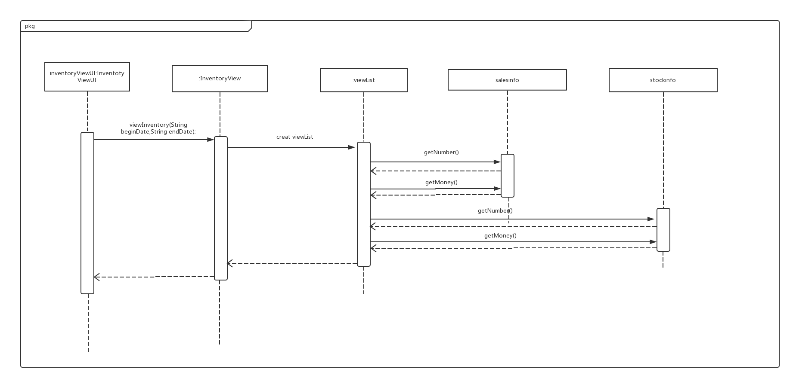

### 4.7.goodsClassificationbl模块
#### 1.模块概述
goodsClassficationbl模块的需求和职责参见规格需求文档以及体系结构设计概述
#### 2.整体结构
根据体系结构的设计，将系统分为展示层、业务逻辑层、数据层。每一层之间为了增加灵活性，我们会添加接口。比如展示层和业务逻辑层之间添加businesslogicservice.goodsclassficationblservice.GoodsClassficationBLService接口。业务逻辑层和数据层之间添加dataservice.salesdataservice.goodsclassficationdataservice.GoodsClassficationDataService接口。为了隔离业务逻辑职责和逻辑控制职责，我们增加了GoodsClassficationController,这样GoodsClassficationController会把对商品分类管理的业务逻辑处理委托给GoodsClassfication对象。GoodsClassficationPO是作为商品分类的持久化对象被添加到设计模型中去的。

goodsclassification模块各个类的职责
|**模块**|**职责**|
|:---|:---|  
|GoodsClassificationController|同GoodsClassificationbl|
|GoodsClassification|负责GoodsClassification的增删改|
|POVOChanger|负责POVO转换|

#### 3. 模块内部类的接口规范
|**供接口名**|**语法**|**前置条件**|**后置条件**|
|----|----|----|----|
|GoodsClassification.show|public ArrayList&lt;GoodsClassificationVO&gt; show();|已经创建一个Goods领域对象|显示所有分类|
|GoodsClassification.getID|public String getID(String upID);|需要添加分类|返回新建ID|
|GoodsClassification.addGoodsClassification|public String addGoodsClassification(String name,String upID);|分类名称输入合法，并且父类中没有添加商品|添加新的商品分类|
|GoodsClassification.deleteGoodsClassification|public String deleteGoodsClassification(String ID);|已选择分类|删除商品，更新信息|
|GoodsClassification.updateGoodsClassification|public String updateGoodsClassification(String ID,String name);|已选择分类|修改商品，更新信息|

|**需接口名**|**服务**|
|----|----|
|GoodsClassificationDataService.getID|得到新建分类的ID|
|GoodsClassificationDataService.insert(GoodsClassificationPO po)|添加单一化持久对象|
|GoodsClassificationDataService.delete(GoodsClassificationPO po)|删除单一化持久对象|
|GoodsClassificationDataService.update(GoodsClassificationPO po)|更新单一化持久对象|

#### 4.业务逻辑层的动态模型
下图是goodsClassificatio添加顺序图

下图是goodsClassificatio删除顺序图图

下图是goodsClassificatio修改顺序图图

下图是goodsClassification对象的生存期间的状态序列、引起转移的时间，以及因状态转移而伴随的动作

#### 5.业务逻辑层的设计原理
委托式设计

### 4.8.goodsbl模块
#### 1.模块概述
goodsbl模块的需求和职责参见规格需求文档以及体系结构设计概述
#### 2.整体结构
根据体系结构的设计，将系统分为展示层、业务逻辑层、数据层。每一层之间为了增加灵活性，我们会添加接口。比如展示层和业务逻辑层之间添加businesslogicservice.goodsblservice.GoodsBLService接口。业务逻辑层和数据层之间添加dataservice.goodsdataservice.goodsdataservice.GoodsDataService接口。为了隔离业务逻辑职责和逻辑控制职责，我们增加了GoodsController,这样GoodsController会把对商品分类管理的业务逻辑处理委托给Goods对象。GoodsPO是作为商品的持久化对象被添加到设计模型中去的.而goodsList是goods的容器类，goodsList保有所有商品及其属性，goodsclassfication的添加是因为对商品的管理的同时需要同步更新商品分类。

goods模块各个类的职责
|**模块**|**职责**|
|:---|:---|  
|GoodsController|同Goodsbl|
|Goods|负责Goods的增删改|
|GoodsList|goods的容器类|
|GoodsClassification|负责GoodsClassification的修改|
|POVOChanger|负责POVO转换|

#### 3. 模块内部类的接口规范
|**供接口名**|**语法**|**前置条件**|**后置条件**|
|----|----|----|----|
|Goods.show|public ArrayList&lt;GoodsVO&gt; show();|已经创建一个Goods领域对象|显示所有商品|
|Goods.addGoods|public String addGoods(GoodsVO goodsVO);|商品信息输入合法|添加商品到商品分类中|
|Goods.deleteGoods|public String deleteGoods(String ID);|商品编号输入合法|删除相应分类中的商品|
|Goods.updateGoods|public String updateGoods(GoodsVO goodsVO);|商品信息输入合法|更改相应商品信息|
|Goods.updateGoods|public ArrayList&lt;GoodsVO&gt; SearchGoods(String info);|商品信息输入合法|查找到商品|

|**需接口名**|**服务**|
|----|----|
|GoodsDataService.getID|得到新建商品的ID|
|GoodsDataService.insert(GoodsPO po)|添加单一化持久对象|
|GoodsDataService.delete(GoodsPO po)|删除单一化持久对象|
|GoodsDataService.update(GoodsPO po)|更新单一化持久对象|
|GoodsDataService.select(Sting info)|根据输入信息查找|
#### 4.业务逻辑层的动态模型
下图是goods添加顺序图

下图是goods删除顺序图

下图是goods查找顺序图

下图是goods修改顺序图

下图是goods对象的生存期间的状态序列、引起转移的时间，以及因状态转移而伴随的动作

#### 5.业务逻辑层的设计原理
委托式设计

### 4.9.inventoryViewbl模块
#### 1.模块概述
inventoryViewbl模块的需求和职责参见规格需求文档以及体系结构设计概述
#### 2.整体结构
根据体系结构的设计，将系统分为展示层、业务逻辑层、数据层。每一层之间为了增加灵活性，我们会添加接口。比如展示层和业务逻辑层之间添加businesslogicservice.inventoryViewblservice.InventoryViewBLService接口。业务逻辑层和数据层之间添加dataservice.inventoryViewdataservice.inventoryViewdataservice.InventoryViewDataService接口。为了隔离业务逻辑职责和逻辑控制职责，我们增加了InventoryViewController,这样InventoryViewController会把对库存查看管理的业务逻辑处理委托给InventoryView对象。goodList、stockList、salesList的添加是goodInfo、stockInfo、salesInfo的容器类，保有商品的出/入库数量/金额，销售/进货的数量/金额等属性。goodInfo、stockInfo、salesInfo都是依据依赖倒置原则，为了消除循环依赖而产生的接口。InventorySort是提供依据时间段进行筛选的服务

InventoryView模块各个类的职责
|**模块**|**职责**|
|:---|:---|  
|InventoryViewontroller|同InventoryViewbl|
|InventoryView|负责查看库存|
|GoodsList|goods的容器类|
|StockList|进货退货单的容器类|
|SalesList|销售单的容器类|

#### 3. 模块内部类的接口规范
|**供接口名**|**语法**|**前置条件**|**后置条件**|
|----|----|----|----|
|Inventory.viewInventory|public InventoryViewVO viewInventory(String beginDate,String endDate);|日期的输入合法|显示在此时间段内的出／入库数量／金额，销售／进货数量／金额，以及库存合计|

|**需接口名**|**服务**|
|----|----|
|InventoryDataService.insert(InventoryBillPO po)|提供商品分类数据集体载入、保存、增删改查服务|

#### 4.业务逻辑层的动态模型
以下是InventoryView顺序图

下图是InventoryView对象的生存期间的状态序列、引起转移的时间，以及因状态转移而伴随的动作

#### 5.业务逻辑层的设计原理
委托式设计

### 4.10.inventoryCheckbl模块
#### 1.模块概述
inventoryCheckbl模块的需求和职责参见规格需求文档以及体系结构设计概述
#### 2.整体结构
根据体系结构的设计，将系统分为展示层、业务逻辑层、数据层。每一层之间为了增加灵活性，我们会添加接口。比如展示层和业务逻辑层之间添加businesslogicservice.inventoryCheckblservice.InventoryCheckBLService接口。业务逻辑层和数据层之间添加dataservice.inventoryCheckdataservice.inventoryCheckdataservice.InventoryCheckDataService接口。为了隔离业务逻辑职责和逻辑控制职责，我们增加了InventoryCheckController,这样InventoryCheckController会把对库存盘点的业务逻辑处理委托给InventoryCheck对象。goodList、stockList、salesList的添加是goodInfo、stockInfo、salesInfo的容器类，保有各种商品的名称，型号，库存数量，库存均价，批次，批号，出厂日期。goodInfo、stockInfo、salesInfo都是依据依赖倒置原则，为了消除循环依赖而产生的接口.

InventoryCheck模块各个类的职责
|**模块**|**职责**|
|:---|:---|  
|InventoryCheckController|同InventoryCheckbl|
|InventoryCheck|负责盘点库存|
|GoodsList|goods的容器类|
|StockList|进货退货单的容器类|
|SalesList|销售单的容器类|
|InventorySort|负责通过时间筛选|

#### 3. 模块内部类的接口规范
|**供接口名**|**语法**|**前置条件**|**后置条件**|
|----|----|----|----|
|Inventory.checkInventory|public InventoryCheckVO checkInventory();|已经得到库存单据数据|显示截至盘点时间的库存快照|

|**需接口名**|**服务**|
|----|----|
|InventoryDataService.insert(InventoryBillPO po)|提供商品分类数据集体载入、保存、增删改查服务|

#### 4.业务逻辑层的动态模型
以下是InventoryCheck顺序图

下图是InventoryCheck对象的生存期间的状态序列、引起转移的时间，以及因状态转移而伴随的动作

#### 5.业务逻辑层的设计原理
委托式设计

### 4.11.inventoryDamagebl(including overflow and warning)模块
#### 1.模块概述
inventoryDamagebl(including overflow and warning)模块的需求和职责参见规格需求文档以及体系结构设计概述
#### 2.整体结构
根据体系结构的设计，将系统分为展示层、业务逻辑层、数据层。每一层之间为了增加灵活性，我们会添加接口。比如展示层和业务逻辑层之间添加businesslogicservice.inventoryinventoryDamageblservice.InventoryinventoryDamageBLService接口。业务逻辑层和数据层之间添加dataservice.inventoryinventoryDamagedataservice.inventoryinventoryDamagedataservice.InventoryDamageDataService接口。为了隔离业务逻辑职责和逻辑控制职责，我们增加了InventoryDamageController,这样InventoryDamageController会把对库存报损单管理的业务逻辑处理委托给InventoryDamage对象。goodList、stockList、salesLis的添加是goodInfo的容器类，保有各种商品的名称，型号，库存数量，库存均价，批次，批号，出厂日期。receiptinfo提供提交单据等服务。goodInfo都是依据依赖倒置原则，为了消除循环依赖而产生的接口.
.png)

InventoryDamage模块各个类的职责
|**模块**|**职责**|
|:---|:---|  
|InventoryDamageController|同InventoryDamagebl|
|InventoryDamage|负责生成库存报损单|
|GoodsList|goods的容器类|
|POVOChanger|负责POVO转换|

#### 3. 模块内部类的接口规范
|**供接口名**|**语法**|**前置条件**|**后置条件**|
|----|----|----|----|
|Inventory.getOverFlowBill|public InventoryBillVO getOverFlowBill();|已经得到库存单据数据|返回对应的库存报溢单|
|Inventory.getDamageBill|public InventoryBillVO getDamageBill();|已经得到库存单据数据|返回对应的库存报损单|
|Inventory.getWarningBill|public InventoryBillVO getWarningBill();|已经得到库存单据数据|返回对应的库存报警单|
|Goods.addGoods|public String addGoods(String ID,int num);|商品信息输入合法|添加相应商品|
|Goods.submit|public void submit();|输入数据合法|生成相应单据|

|**需接口名**|**服务**|
|----|----|
|InventoryDataService.insert(InventoryBillPO po)|提供商品分类数据集体载入、保存、增删改查服务|

#### 4.业务逻辑层的动态模型
以下是InventoryDamage顺序图
.png)

下图是InventoryDamage对象的生存期间的状态序列、引起转移的时间，以及因状态转移而伴随的动作
.png)

#### 5.业务逻辑层的设计原理
委托式设计