# 某灯具企业进销存管理系统详细设计文档
## V1.0beta版
### 南京大学GZYZ小分队
#### 2017-10-29

---
## 更新版本记录
| **修改人** |**修改日期** |**修改原因**|**版本号** |
| :------   |:----: | ----    | :----: |
| 小组     |2017.10.29| 第一稿初稿  |   v1.0beta |

---

# 1.引言
## 1.1编制目的
本报告详细完成了对某灯具进销存系统的概要设计，达到指导详细设计和开发的目的，同时实现和测试人员及用户的沟通。  
本报告面向开发人员、测试人员及最终用户而编写，是了解系统的导航

## 1.2词汇表
|**词汇表**|**词汇含义**|**备注**|
|----|----|---|
|ERP|进销存管理系统||
|User|用户||
|Promotion|销售策略||
|Log|操作记录||
|SystemMessage|系统消息||
|Check|单据审核||
|Sales|销售||
|Member|客户||
|Stock|库存||
|Bill|款单||
|Business|业务查询||
|Initial|期初建账||
|Account|账户||
|Inventory|库存||
|Goods|商品（管理）||
|GoodsClassification|商品分类||
|UserManager|用户管理||
|Administrator|管理员||
|InventoryView|库存查看||
|InventoryCheck|库存盘点||
|InventoryOverflow|库存报溢|
|InventoryDamage|库存报损|
|InventoryWarning|库存报警|
|MemberManager|客户管理||
|StockPurReceipt|进货单||
|StockRetReceipt|进货退货单||
|SalesSellReceipt|销售单|
|SalesRetReceipt|销售退货单||
|AccountManager|账户管理||
|BillPayReceipt|付款单|
|BillChargeReceipt|收款单||
|CashReceipt|现金费用单||
|SalesDetail|销售明细||
|BusinessProgress|经营历程||
|BusinessCondition|经营情况||
|Establish|期初建账||
|CreditNote|红冲||
|InventoryManager|库存管理人员||
|Salesman|销售人员||
|Accountant|财务人员||
|GeneralManager|总经理||

# 2.产品概述
参考某灯具企业进销存管理系统用例文档与某灯具企业进销存管理系统需求规格文档中对产品的概述

# 3.体系结构设计概述
参考某灯具企业进销存管理系统体系结构文档对体系结构概述

# 4.结构视角
## 4.1业务逻辑层的分解
### memberbl模块
#### 1.模块概述
memberbl模块的需求和职责参见规格需求文档以及体系结构设计概述
#### 2.整体结构
系统分为展示层、业务逻辑层、数据层，每一层之间做了接口。为了增加灵活性，添加了controller，并且添加了POVO转换的类
  

|**模块**|**职责**|
|:---|:---|  
|MemberController|同MemberManager|
|MemberManager|负责member的增删改查|
|POVOChanger|负责POVO转换|

#### 3.模块内部类的接口规范

memberManager的接口规范  

|**供接口名**|**语法**|**前置条件**|**后置条件**|
|:---|:---|:---|:---|
|MemberManager.add|public ResultMessage add(MemberVO memberVO)|输入合法|添加客户，返回执行结果|
|MemberManager.update|public ResultMessage update(MemberVO memberVO)|输入合法|更新客户，返回执行结果|
|MemberManager.delete|public ResultMessage delete(int id)|无|删除客户，返回执行结果|
|MemberManager.search|public Set<MemberListVO> search(MemberSearchVO memberSearchVO)|输入合法的搜索条件|返回搜索结果|

|**需接口名**|**服务**|
|:---|:---|
|MemberDataService.insert(MemberPO memberPO)|添加客户|
|MemberDataService.update(MemberPO memberPO)|更新客户|
|MemberDataService.delete(int id)|删除客户|
|MemberDataService.search(MemberSearchVO memberSearchVO)|搜索客户|

#### 4.业务逻辑层的动态模型

一般情况下为ui层传下vo，通过povo转换后对data层进行操作

下图是memberbl添加顺序图

下图是memberbl修改顺序图

下图是memberbl删除顺序图

下图是memberbl查询顺序图

#### 5.业务逻辑层的设计原理
委托式设计

### salesbl&&stockbl模块
#### 1.模块概述
memberbl模块的需求和职责参见规格需求文档以及体系结构设计概述
#### 2.整体结构
系统分为展示层、业务逻辑层、数据层，每一层之间做了接口。为了增加灵活性，添加了controller，并且添加了POVO转换的类
  

|**模块**|**职责**|
|:---|:---|  
|ReceiptController|同Receiptbl|
|Receiptbl|负责receipt的增删改查|
|POVOChanger|负责POVO转换|

#### 3.模块内部类的接口规范
|**供接口名**|**语法**|**前置条件**|**后置条件**|
|:---|:---|:---|:---|
|Receiptbl.add|public ResultMessage add(ReceiptVO ReceiptVO)|输入合法|增加单据，记录操作，返回执行结果|
|Receiptbl.update|public ResultMessage update(ReceiptVO ReceiptVO)|输入合法|更新单据，记录操作，返回执行结果|
|Receiptbl.delete|public ResultMessage delete(int id)|无|删除单据，记录操作，返回执行结果|
|Receiptbl.search|public Set<ReceiptListVO> search(ReceiptSearchVO receiptSearchVO)|输入合法单据号|查找单据，返回查找结果|

|**需接口名**|**服务**|
|:---|:---|
|ReceiptDataService.insert(ReceiptPO ReceiptPO)|添加销售类单据|
|ReceiptDataService.update(ReceiptPO ReceiptPO)|更新销售类单据|
|ReceiptDataService.delete(int id)|删除销售类单据|
|ReceiptDataService.Search(ReceiptSearchVO receiptSearchVO)|搜索销售类单据|
#### 4.业务逻辑层的动态模型

一般情况下为ui层传下vo，通过povo转换后对data层进行操作

下图是receiptbl添加顺序图

下图是receiptbl修改顺序图

下图是receiptbl删除顺序图

下图是receiptbl查询顺序图

#### 5.业务逻辑层的设计原理
委托式设计

### logbl模块
#### 1.模块概述
logbl模块的需求和职责参见规格需求文档以及体系结构设计概述
#### 2.整体结构
系统分为展示层、业务逻辑层、数据层，每一层之间做了接口。为了增加灵活性，添加了controller，并且添加了POVO转换的类
  

|**模块**|**职责**|
|:---|:---|  
|LogController|同Logbl|
|Logbl|负责log的增查|
|POVOChanger|负责POVO转换|

#### 3.模块内部类的接口规范
|**供接口名**|**语法**|**前置条件**|**后置条件**|
|----|----|----|----|
|Log.record|public void insert(LogPO log);|无|记录当前用户每次操作|
|Log.search|public Set<LogPO> search(String keyword);|财务人员或总经理启动搜索模块|返回操作查询列表|

|**需接口名**|**服务**|
|---|---|
|DataBaseFactory.getLogDatabase|得到Log数据库引用|
|LogDataService.insert(LogPO logpo)|系统新增Log条目|
|LogDataService.search|检索返回Log条目|

#### 4.业务逻辑层的动态模型

一般情况下为ui层传下vo，通过povo转换后对data层进行操作

下图是logbl添加顺序图

下图是logbl修改顺序图

下图是logbl删除顺序图

下图是logbl查询顺序图

#### 5.业务逻辑层的设计原理
委托式设计

### userbl模块
#### 1.模块概述
memberbl模块的需求和职责参见规格需求文档以及体系结构设计概述
#### 2.整体结构
系统分为展示层、业务逻辑层、数据层，每一层之间做了接口。为了增加灵活性，添加了controller，并且添加了POVO转换的类  
下图是login类图

下图是UserManager类图

|**模块**|**职责**|
|:---|:---|  
|LoginController|同Login|
|UserManagerController|同UserManager|
|Login|负责用户登录信息|
|UserManager|负责user的增删改查|
|POVOChanger|负责POVO转换|

#### 3.模块内部类的接口规范
Login类

|**供接口名**|**语法**|**前置条件**|**后置条件**|
|----|----|----|----|
|User.Login|public ResultMessage login(String username,String password);|password符合输入规则|查找是否存在相应的User，根据输入的password返回登陆验证的结果|
|User.Register|public ResultMessage register(String username,String password1,String password2);|password符合输入规则且两个password一致|根据输入的检查是否有此User，无则新建User并返回创建结果|
|User.SetSafeAnswer|public ResultMessage checkAnswer(String answer);|answer符合输入规则|返回设定验证的结果|
|User.Findpassword|public ResultMessage findPassword(String username);|username符合输入规则|根据输入的检查是否有此User，有则进入安全问题找回密码|
|User.SafeAnswer|public ResultMessage checkAnswer(String answer);|系统找到有此用户且answer符合输入规则|根据输入的检查验证，成功则进入修改密码页面|
|User.SetPassword|public ResultMessage setPassword(String password1,String password2);|两次密码输入一致|改变该用户密码|
|**需接口名**|**服务**|
|---|---|
|DataBaseFactory.getUserDatabase|得到User数据库引用|
|UserDataService.insert(UserPO po)|系统新增User|
|UserDataService.search|系统查询User|

UserManager类

|**供接口名**|**语法**|**前置条件**|**后置条件**|
|----|----|----|----|
|UserManager.Init|public void initUserManager();|用户管理人员成功登陆|系统初始化管理员初始界面数据|
|UserManager.User|public void showUserDetail(UserPO user);|用户管理人员启动用户信息模块|系统显示用户详细信息|
|UserManager.Search|public ArrayList<UserPO> search(String keyword);|用户管理人员启动搜索模块|返回查找用户列表|
|UserManager.Insert|public ResultMessage insert(UserPO user);|用户管理人员启动添加模块|若系统无此用户，则添加此用户，返回添加结果|
|UserManager.Delete|public ResultMessage delete(UserPO user);|用户管理人员启动删除模块|系统删除相应用户，返回删除结果|
|UserManager.Modify|public ResultMessage modify(UserPO user);|用户管理人员启动修改模块|系统修改相应用户，返回修改结果|

|**需接口名**|**服务**|
|---|---|
|DataBaseFactory.getUserDatabase|得到User数据库引用|
|UserDataService.insert(UserPO po)|系统新增User|
|UserDataService.search|系统查询User|
|UserDataService.delete(UserPO po)|系统删除User|
|UserDataService.modify(UserPO po)|系统修改User|
#### 4.业务逻辑层的动态模型

一般情况下为ui层传下vo，通过povo转换后对data层进行操作

login类  
下图是login顺序图

UserManager类  
下图是usermanager添加顺序图

下图是usermanager修改顺序图

下图是usermanager删除顺序图

下图是usermanager查询顺序图

#### 5.业务逻辑层的设计原理
委托式设计

### goodsClassificationbl模块
#### 1.模块概述
goodsClassficationbl模块的需求和职责参见规格需求文档以及体系结构设计概述
#### 2.整体结构
根据体系结构的设计，将系统分为展示层、业务逻辑层、数据层。每一层之间为了增加灵活性，我们会添加接口。比如展示层和业务逻辑层之间添加businesslogicservice.goodsclassficationblservice.GoodsClassficationBLService接口。业务逻辑层和数据层之间添加dataservice.salesdataservice.goodsclassficationdataservice.GoodsClassficationDataService接口。为了隔离业务逻辑职责和逻辑控制职责，我们增加了GoodsClassficationController,这样GoodsClassficationController会把对商品分类管理的业务逻辑处理委托给GoodsClassfication对象。GoodsClassficationPO是作为商品分类的持久化对象被添加到设计模型中去的。
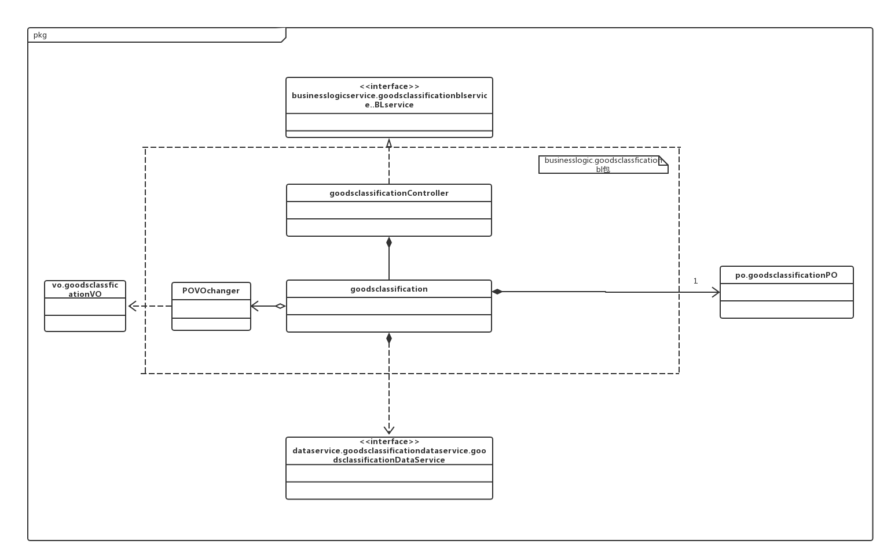

goodsclassification模块各个类的职责

|**模块**|**职责**|
|:---|:---|  
|GoodsClassificationController|同GoodsClassificationbl|
|GoodsClassification|负责GoodsClassification的增删改|
|POVOChanger|负责POVO转换|

#### 3. 模块内部类的接口规范
|**供接口名**|**语法**|**前置条件**|**后置条件**|
|----|----|----|----|
|GoodsClassification.show|public ArrayList&lt;GoodsClassificationVO&gt; show();|已经创建一个Goods领域对象|显示所有分类|
|GoodsClassification.getID|public String getID(String upID);|需要添加分类|返回新建ID|
|GoodsClassification.addGoodsClassification|public String addGoodsClassification(String name,String upID);|分类名称输入合法，并且父类中没有添加商品|添加新的商品分类|
|GoodsClassification.deleteGoodsClassification|public String deleteGoodsClassification(String ID);|已选择分类|删除商品，更新信息|
|GoodsClassification.updateGoodsClassification|public String updateGoodsClassification(String ID,String name);|已选择分类|修改商品，更新信息|

|**需接口名**|**服务**|
|----|----|
|GoodsClassificationDataService.getID|得到新建分类的ID|
|GoodsClassificationDataService.insert(GoodsClassificationPO po)|添加单一化持久对象|
|GoodsClassificationDataService.delete(GoodsClassificationPO po)|删除单一化持久对象|
|GoodsClassificationDataService.update(GoodsClassificationPO po)|更新单一化持久对象|

#### 4.业务逻辑层的动态模型
下图是goodsClassificatio添加顺序图

下图是goodsClassificatio删除顺序图图
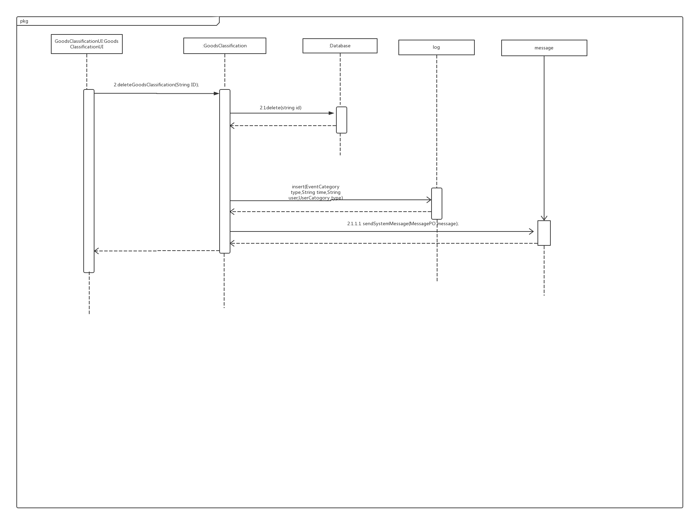
下图是goodsClassificatio修改顺序图图
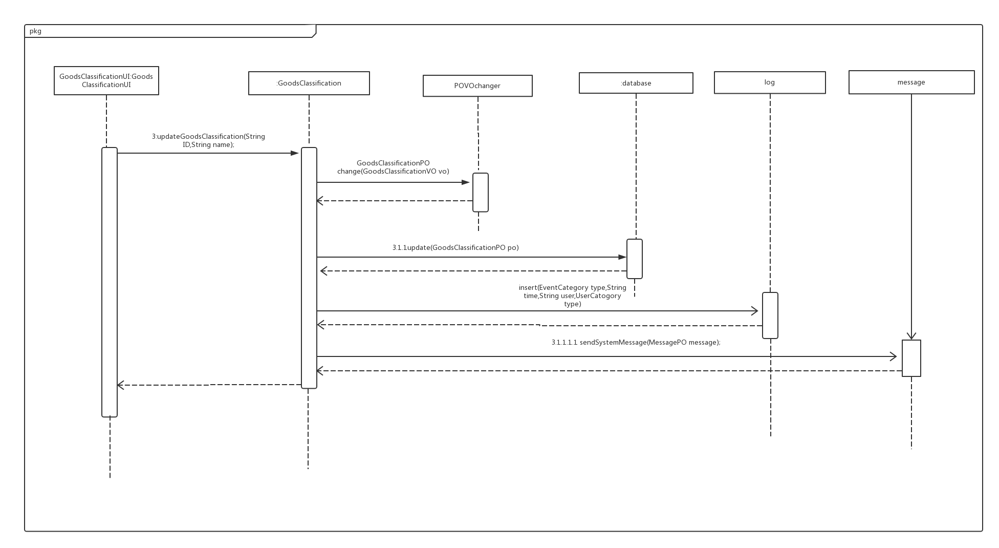

下图是goodsClassification对象的生存期间的状态序列、引起转移的时间，以及因状态转移而伴随的动作
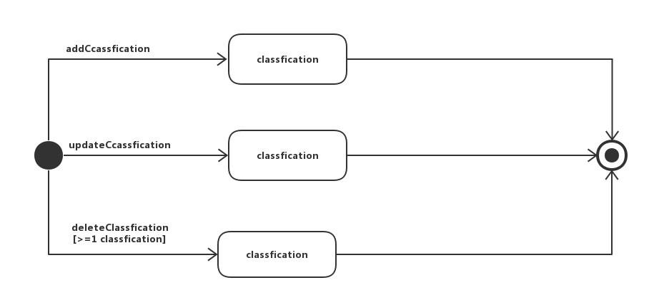
#### 5.业务逻辑层的设计原理
委托式设计

### goodsbl模块
#### 1.模块概述
goodsbl模块的需求和职责参见规格需求文档以及体系结构设计概述
#### 2.整体结构
根据体系结构的设计，将系统分为展示层、业务逻辑层、数据层。每一层之间为了增加灵活性，我们会添加接口。比如展示层和业务逻辑层之间添加businesslogicservice.goodsblservice.GoodsBLService接口。业务逻辑层和数据层之间添加dataservice.goodsdataservice.goodsdataservice.GoodsDataService接口。为了隔离业务逻辑职责和逻辑控制职责，我们增加了GoodsController,这样GoodsController会把对商品分类管理的业务逻辑处理委托给Goods对象。GoodsPO是作为商品的持久化对象被添加到设计模型中去的.而goodsList是goods的容器类，goodsList保有所有商品及其属性，goodsclassfication的添加是因为对商品的管理的同时需要同步更新商品分类。

goods模块各个类的职责

|**模块**|**职责**|
|:---|:---|  
|GoodsController|同Goodsbl|
|Goods|负责Goods的增删改|
|GoodsList|goods的容器类|
|GoodsClassification|负责GoodsClassification的修改|
|POVOChanger|负责POVO转换|

#### 3. 模块内部类的接口规范
|**供接口名**|**语法**|**前置条件**|**后置条件**|
|----|----|----|----|
|Goods.show|public ArrayList&lt;GoodsVO&gt; show();|已经创建一个Goods领域对象|显示所有商品|
|Goods.addGoods|public String addGoods(GoodsVO goodsVO);|商品信息输入合法|添加商品到商品分类中|
|Goods.deleteGoods|public String deleteGoods(String ID);|商品编号输入合法|删除相应分类中的商品|
|Goods.updateGoods|public String updateGoods(GoodsVO goodsVO);|商品信息输入合法|更改相应商品信息|
|Goods.updateGoods|public ArrayList&lt;GoodsVO&gt; SearchGoods(String info);|商品信息输入合法|查找到商品|

|**需接口名**|**服务**|
|----|----|
|GoodsDataService.getID|得到新建商品的ID|
|GoodsDataService.insert(GoodsPO po)|添加单一化持久对象|
|GoodsDataService.delete(GoodsPO po)|删除单一化持久对象|
|GoodsDataService.update(GoodsPO po)|更新单一化持久对象|
|GoodsDataService.select(Sting info)|根据输入信息查找|
#### 4.业务逻辑层的动态模型
下图是goods添加顺序图

下图是goods删除顺序图

下图是goods查找顺序图

下图是goods修改顺序图
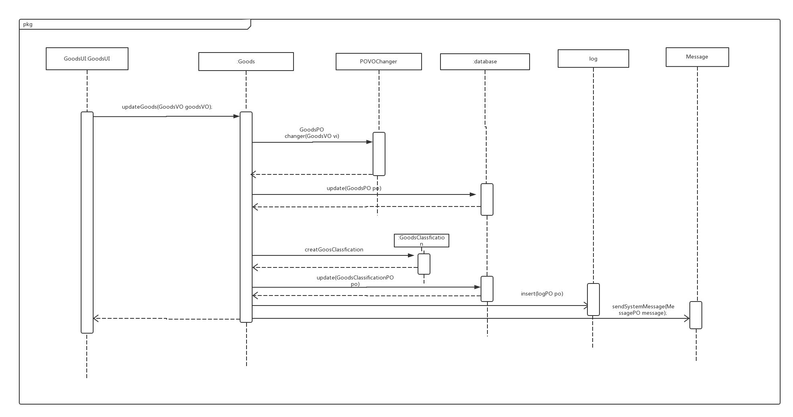

下图是goods对象的生存期间的状态序列、引起转移的时间，以及因状态转移而伴随的动作
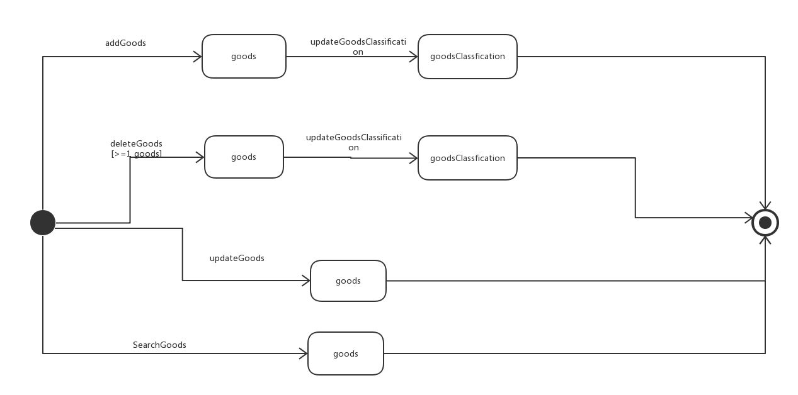

#### 5.业务逻辑层的设计原理
委托式设计

### inventoryViewbl模块
#### 1.模块概述
inventoryViewbl模块的需求和职责参见规格需求文档以及体系结构设计概述
#### 2.整体结构
根据体系结构的设计，将系统分为展示层、业务逻辑层、数据层。每一层之间为了增加灵活性，我们会添加接口。比如展示层和业务逻辑层之间添加businesslogicservice.inventoryViewblservice.InventoryViewBLService接口。业务逻辑层和数据层之间添加dataservice.inventoryViewdataservice.inventoryViewdataservice.InventoryViewDataService接口。为了隔离业务逻辑职责和逻辑控制职责，我们增加了InventoryViewController,这样InventoryViewController会把对库存查看管理的业务逻辑处理委托给InventoryView对象。goodList、stockList、salesList的添加是goodInfo、stockInfo、salesInfo的容器类，保有商品的出/入库数量/金额，销售/进货的数量/金额等属性。goodInfo、stockInfo、salesInfo都是依据依赖倒置原则，为了消除循环依赖而产生的接口。InventorySort是提供依据时间段进行筛选的服务
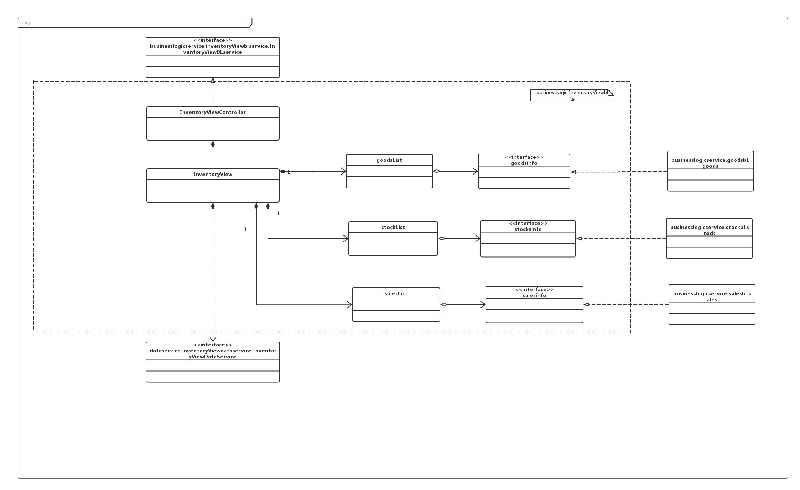

InventoryView模块各个类的职责

|**模块**|**职责**|
|:---|:---|  
|InventoryViewontroller|同InventoryViewbl|
|InventoryView|负责查看库存|
|GoodsList|goods的容器类|
|StockList|进货退货单的容器类|
|SalesList|销售单的容器类|

#### 3. 模块内部类的接口规范
|**供接口名**|**语法**|**前置条件**|**后置条件**|
|----|----|----|----|
|Inventory.viewInventory|public InventoryViewVO viewInventory(String beginDate,String endDate);|日期的输入合法|显示在此时间段内的出／入库数量／金额，销售／进货数量／金额，以及库存合计|

|**需接口名**|**服务**|
|----|----|
|InventoryDataService.insert(InventoryBillPO po)|提供商品分类数据集体载入、保存、增删改查服务|

#### 4.业务逻辑层的动态模型
以下是InventoryView顺序图

下图是InventoryView对象的生存期间的状态序列、引起转移的时间，以及因状态转移而伴随的动作
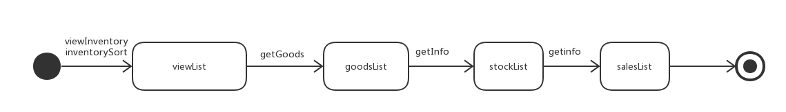

#### 5.业务逻辑层的设计原理
委托式设计

### inventoryCheckbl模块
#### 1.模块概述
inventoryCheckbl模块的需求和职责参见规格需求文档以及体系结构设计概述
#### 2.整体结构
根据体系结构的设计，将系统分为展示层、业务逻辑层、数据层。每一层之间为了增加灵活性，我们会添加接口。比如展示层和业务逻辑层之间添加businesslogicservice.inventoryCheckblservice.InventoryCheckBLService接口。业务逻辑层和数据层之间添加dataservice.inventoryCheckdataservice.inventoryCheckdataservice.InventoryCheckDataService接口。为了隔离业务逻辑职责和逻辑控制职责，我们增加了InventoryCheckController,这样InventoryCheckController会把对库存盘点的业务逻辑处理委托给InventoryCheck对象。goodList、stockList、salesList的添加是goodInfo、stockInfo、salesInfo的容器类，保有各种商品的名称，型号，库存数量，库存均价，批次，批号，出厂日期。goodInfo、stockInfo、salesInfo都是依据依赖倒置原则，为了消除循环依赖而产生的接口.
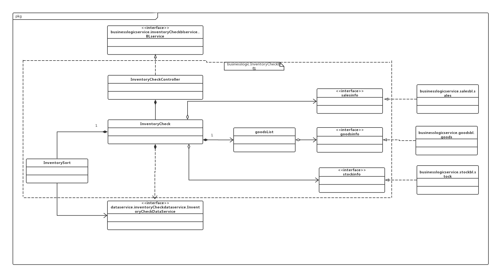

InventoryCheck模块各个类的职责

|**模块**|**职责**|
|:---|:---|  
|InventoryCheckController|同InventoryCheckbl|
|InventoryCheck|负责盘点库存|
|GoodsList|goods的容器类|
|StockList|进货退货单的容器类|
|SalesList|销售单的容器类|
|InventorySort|负责通过时间筛选|

#### 3. 模块内部类的接口规范
|**供接口名**|**语法**|**前置条件**|**后置条件**|
|----|----|----|----|
|Inventory.checkInventory|public InventoryCheckVO checkInventory();|已经得到库存单据数据|显示截至盘点时间的库存快照|

|**需接口名**|**服务**|
|----|----|
|InventoryDataService.insert(InventoryBillPO po)|提供商品分类数据集体载入、保存、增删改查服务|

#### 4.业务逻辑层的动态模型
以下是InventoryCheck顺序图
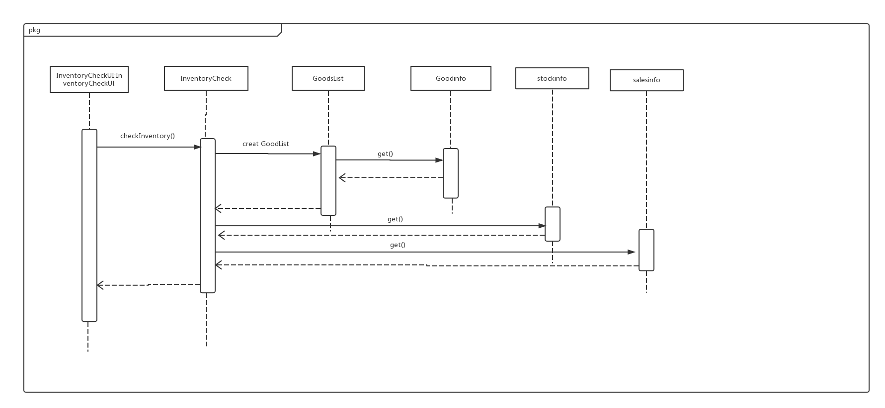

下图是InventoryCheck对象的生存期间的状态序列、引起转移的时间，以及因状态转移而伴随的动作
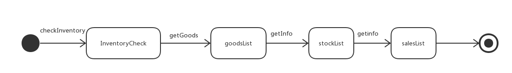

#### 5.业务逻辑层的设计原理
委托式设计

### inventoryDamagebl(including overflow and warning)模块
#### 1.模块概述
inventoryDamagebl(including overflow and warning)模块的需求和职责参见规格需求文档以及体系结构设计概述
#### 2.整体结构
根据体系结构的设计，将系统分为展示层、业务逻辑层、数据层。每一层之间为了增加灵活性，我们会添加接口。比如展示层和业务逻辑层之间添加businesslogicservice.inventoryinventoryDamageblservice.InventoryinventoryDamageBLService接口。业务逻辑层和数据层之间添加dataservice.inventoryinventoryDamagedataservice.inventoryinventoryDamagedataservice.InventoryDamageDataService接口。为了隔离业务逻辑职责和逻辑控制职责，我们增加了InventoryDamageController,这样InventoryDamageController会把对库存报损单管理的业务逻辑处理委托给InventoryDamage对象。goodList、stockList、salesLis的添加是goodInfo的容器类，保有各种商品的名称，型号，库存数量，库存均价，批次，批号，出厂日期。receiptinfo提供提交单据等服务。goodInfo都是依据依赖倒置原则，为了消除循环依赖而产生的接口.
.png)

InventoryDamage模块各个类的职责

|**模块**|**职责**|
|:---|:---|  
|InventoryDamageController|同InventoryDamagebl|
|InventoryDamage|负责生成库存报损单|
|GoodsList|goods的容器类|
|POVOChanger|负责POVO转换|

#### 3. 模块内部类的接口规范
|**供接口名**|**语法**|**前置条件**|**后置条件**|
|----|----|----|----|
|Inventory.getOverFlowBill|public InventoryBillVO getOverFlowBill();|已经得到库存单据数据|返回对应的库存报溢单|
|Inventory.getDamageBill|public InventoryBillVO getDamageBill();|已经得到库存单据数据|返回对应的库存报损单|
|Inventory.getWarningBill|public InventoryBillVO getWarningBill();|已经得到库存单据数据|返回对应的库存报警单|
|Goods.addGoods|public String addGoods(String ID,int num);|商品信息输入合法|添加相应商品|
|Goods.submit|public void submit();|输入数据合法|生成相应单据|

|**需接口名**|**服务**|
|----|----|
|InventoryDataService.insert(InventoryBillPO po)|提供商品分类数据集体载入、保存、增删改查服务|

#### 4.业务逻辑层的动态模型
以下是InventoryDamage顺序图
.png)

下图是InventoryDamage对象的生存期间的状态序列、引起转移的时间，以及因状态转移而伴随的动作
.png)

#### 5.业务逻辑层的设计原理
委托式设计

### Checkbl模块
#### 1. 模块概述
模块的需求和职责参见规格需求文档以及体系结构设计概述
#### 2. 整体结构
CheckController负责控制对应于审批界面所需要的服务。
Checkbl负责实现对应于审界面的服务。
ApproveHelper负责实现审批通过后的后续操作。
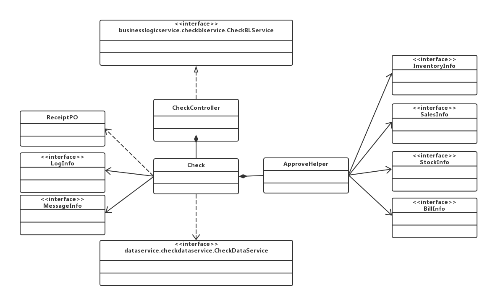  
#### 3. 模块内部类的接口规范

##### CheckController的接口规范
参见checkbl

##### Checkbl
|**供接口名**|**语法**|**前置条件**|**后置条件**|
|----|----|----|----|
|Checkbl.initCheck|public ArrayList\<ReceiptVO> initCheck();|总经理启动审批单据模块|系统加载完毕界面数据|
|Checkbl.showDetail|public ReceiptVO showDetail(int id);|总经理查看单据信息|系统加载单据信息|
|Checkbl.approve|public ResultMessage approve(int id);|总经理审批同意单据|系统改变单据状态并储存并发送消息|
|Checkbl.reject|public ResultMessage reject(int id);|总经理审批拒绝单据|系统改变单据状态并储存并发送消息|
|Checkbl.approveBatch|public ResultMessage approveBatch(ArrayList\<Integer> ids);|总经理审批同意单据|系统改变单据状态并储存并发送消息|
|Checkbl.approveBatch|public ResultMessage rejectBatch(ArrayList\<Integer> ids);|总经理审批拒绝单据|系统改变单据状态并储存并发送消息|
|Checkbl.update|public ResultMessage update(ReceiptVO receiptVO)|总经理修改单据|系统修改单据信息|
|Checkbl.search|public ArrayList\<ReceiptVO> search(CheckSearchVO checkSearchVO)|总经理搜索单据|返回符合条件的待审批单据|

|**需接口名**|**服务**|
|---|---|
|DataBaseFactory.getCheckDatabase|得到Check数据库引用|
|CheckDataService.initCheck|返回单据列表|
|CheckDataService.update|更新系统单据持久化|
|CheckDataService.reject|拒绝单据|
|CheckDataService.approve|通过单据|
|CheckDataService.rejectBatch|批量拒绝单据|
|CheckDataService.approveBatch|批量通过单据|
|CheckDataService.select|搜索单据|
|LogInfo.insert|记录日志|
|MessageInfo.send|发送消息|
|ApproveHelper.approve|执行通过单据后的后续行为|

##### ApproveHelper
|**供接口名**|**语法**|**前置条件**|**后置条件**|
|----|----|----|----|
|Approvehelper.approve|approve(ReceiptPO receiptPO)|单据审批通过|根据不同单据的类型执行相应的后绪操作|

|**需接口名**|**服务**|
|---|---|
|StockInfo.approve|执行通过进货类单据的后续操作|
|SalesInfo.approve|执行通过销售类单据的后续操作|
|BillInfo.approve|执行通过付款单收款单的后续操作|
|InventaryInfo.approve|执行通过库存类单据的后续操作|

#### 4. 业务逻辑层的动态模型
下为审批销售单的顺序图
  

#### 5. 设计原理
委托式设计

### CheckDataService模块
#### 1. 模块概述
模块的需求和职责参见规格需求文档以及体系结构设计概述
#### 2. 整体结构
CheckDataService实现审批单据时对持久化层的操作
#### 3. 模块内部类的接口规范
##### CheckDataService接口规范
|**供接口名**|**语法**|**前置条件**|**后置条件**|
|----|----|----|----|
|CheckDataService.initCheck|public ArrayList\<ReceiptPO> initCheck()|数据层申请|返回当前待审批单据列表|
|CheckDataService.update|public ResultMessage update(ReceiptPO receiptPO)|数据层申请|更新系统单据持久化|
|CheckDataService.reject|public ResultMessage reject(int id);|数据层申请|拒绝单据|
|CheckDataService.approve|public ResultMessage approve(int id);|数据层申请|通过单据|
|CheckDataService.rejectBatch|public ResultMessage rejectBatch(ArrayList\<Integer> ids)|数据层申请|批量拒绝单据|
|CheckDataService.approveBatch|public ResultMessage approveBatch(ArrayList\<Integer> ids)|数据层申请|批量通过单据|
|CheckDataService.search|public ArrayList\<ReceiptPO> search(SearchVO searchVO)|数据层申请|返回符合条件的待审批单据|

### Promotionbl模块
#### 1. 模块概述
模块的需求和职责参见规格需求文档以及体系结构设计概述
#### 2. 整体结构
PromotionInfo负责对bl同层内的提供服务
PromotionController负责控制对应于制作单据界面所需要的服务。
Promotionbl负责实现对应于审界面的服务。

#### 3. 模块内部类的接口规范

##### PromotionInfo的接口规范
|**供接口名**|**语法**|**前置条件**|**后置条件**|
|----|----|----|----|
|PromotionInfo.getCurrentPromotions|public ArrayList\<PromotionPO> getCurrentPromotions()|无|返回当前在时间内的所有促销策略|

##### Promotionbl的接口规范
|**供接口名**|**语法**|**前置条件**|**后置条件**|
|----|----|----|----|
|Promotionbl.initPromotion|public ArrayList\<PromotionVO> initPromotion();|总经理必须已经被识别和授权|初始化销售策略数据|
|Promotionbl.showDetail|public PromotionVO showDetail(int id);|总经理必须已经被识别和授权|显示策略详细信息|
|Promotionbl.getID|public int getID()|总经理新建促销策略|返回生成的ID|
|Promotionbl.add|ublic ResultMessage add(PromotionVO promotionVO);|总经理必须已经被识别和授权|系统增加销售策略|
|Promotionbl.update|public ResultMessage update(PromotionVO promotionVO);|总经理必须已经被识别和授权|系统修改销售策略|
|Promotionbl.delete|public ResultMessage delete(int id);|总经理必须已经被识别和授权|删除销售策略|
|Promotionbl.search|public ArrayList\<PromotionPO> search(PromotionSearchVO promotionSearchVO)|总经理必须已经被识别和授权|返回符合条件的待审批单据|

|**需接口名**|**服务**|
|---|---|
|DataBaseFactory.getPromotionDatabase|得到Promotion数据库引用|
|PromotionDataService.getID|返国新策略的ID|
|PromotionDataService.insert|系统新增Promotion|
|PromotionDataService.delete|系统删除Promotion|
|PromotionDataService.update|系统更新Promotion|
|PromotionDataService.select|系统查找返回PromotionPO|
|LogInfo.insert|记录日志|
|MessageInfo.send|发送消息|
|GoodInfo.getGoods|获得可以用于制作促销策略的商品列表|

#### 4. 业务逻辑层的动态模型

#### 5. 设计原理
委托式设计

### PromotionDataService模块
#### 1. 模块概述
模块的需求和职责参见规格需求文档以及体系结构设计概述
#### 2. 整体结构
PromotionDataService实现制定促销策略时对持久化层的操作
#### 3. 模块内部类的接口规范
##### PromotionDataService

|**供接口名**|**语法**|**前置条件**|**后置条件**|
|----|----|----|----|
|PromotionDataService.initPromotion|public ArrayList\<PromotionPO> initPromotion();||初始化销售策略数据|
|PromotionDataService.getID|public int getID()||返回生成的ID|
|PromotionDataService.insert|public ResultMessage insert(PromotionPO promotionPO);||系统增加销售策略|
|PromotionDataService.update|public ResultMessage update(PromotionPO promotionPO);||系统修改销售策略|
|PromotionDataService.delete|public ResultMessage delete(int id);||删除销售策略|
|PromotionDataService.select|public ArrayList\<PromotionPO> select(SearchVO searchVO)|数据层申请|返回符合条件的待审批单据|

### Accountbl模块
#### 1. 模块概述
模块的需求和职责参见规格需求文档以及体系结构设计概述
#### 2. 整体结构
AccountController负责控制对应于审批界面所需要的服务。
Accountbl负责实现对应于审界面的服务。
  
#### 3. 模块内部类的接口规范

##### AccountController的接口规范
参见accountbl

##### accountbl模块的接口规范
|**供接口名**|**语法**|**前置条件**|**后置条件**|
|----|----|----|----|
|Account.getAll|public Set(AccountListVO> getAll()|无|返回所有账户信息|
|Account.add|public ResultMessage add(AccountListVO accountListVO)|无|增加新的账户，持久化更新涉及的对象的数据|
|Account.delete|public ResultMessage delete(int ID)|无|删除账户信息，持久化更新涉及的对象的数据|
|Account.update|public ResultMessage update(AccountListVO accountVO)|无|修改账户信息，持久化更新涉及的对象的数据|
|Account.decbalance| public void decBalance(int id,double total)|无|减少相应账户余额|
|Account.incbalance| public void incBalance(int id,double total)|无|增加相应账户余额|

|**需接口名**|**服务**|
|---|---|
|AccountDataService.getID (String name)|得到账户名称对应的ID|
|AccountDataService.getAccountByName(String name)|根据姓名取出PO|
|AccountDataService.insert(AccountPO po)|插入单一持久化对象|
|AccountDataService.delete(AccountPO po)|删除单一持久化对象|
|AccountDataService.update(AccountPO po)|更新单一持久化对象|
|AccountDataService.getAll|得到所有账户|

#### 4. 业务逻辑层的动态模型
下为账户管理的顺序图
  

#### 5. 设计原理
委托式设计

### AccountDataService模块
#### 1. 模块概述
模块的需求和职责参见规格需求文档以及体系结构设计概述
#### 2. 整体结构
AccountDataService实现账户管理时对持久化层的操作
#### 3. 模块内部类的接口规范
##### AccountDataService接口规范
|**供接口名**|**语法**|**前置条件**|**后置条件**|
|----|----|----|----|
|AccountDataService.getID (String name)|getID (String name)||得到账户名称对应的ID|
|AccountDataService.getAccountByName(String name)|AccountPO getAccountByName(String name)||根据姓名取出PO|
|AccountDataService.insert(AccountPO po)|insert(AccountPO po)||插入单一持久化对象|
|AccountDataService.delete(AccountPO po)|delete(AccountPO po)||删除单一持久化对象|
|AccountDataService.update(AccountPO po)|update(AccountPO po)||更新单一持久化对象|
|AccountDataService.getAll|ArrayList getAll()||得到所有账户|

### Billbl模块
#### 1. 模块概述
模块的需求和职责参见规格需求文档以及体系结构设计概述
#### 2. 整体结构
BillController负责控制对应于制作单据界面所需要的服务。
Billbl负责实现对应界面的服务。
  
#### 3. 模块内部类的接口规范

##### BillController的接口规范
参见billbl

##### billbl模块的接口规范
|**供接口名**|**语法**|**前置条件**|**后置条件**|
|----|----|----|----|
|billbl.PaymentBillReceiiptbl.getnew|PaymentReceiptVO getnew()||返回一张空的付款单|
|billbl.PaymentBillReceiiptbl.insert|ResultMessage insert(PaymentReceiptVO)||插入一张付款单|
|billbl.PaymentBillReceiiptbl.update|ResultMessage update(PaymentReceiptVO)||修改付款单|
|billbl.PaymentBillReceiiptbl.delete|ResultMessage delete(PaymentReceiptVO)||删除一张付款单|
|billbl.PaymentBillReceiptbl.selectByMold|PaymentReceiptVO selectByMold(PaymentReceiptVO)||根据id和时间取出一张单据|
|billbl.PaymentBillReceiptbl.search|ArrayList&lt;PaymentReceiptVO&gt; search(RespectiveReceiptSearchCondition respectiveReceiptSearchCondition)||用于单据本身的搜索|
|billbl.PaymentBillReceiptbl.search|ArrayList&lt;PaymentReceiptVO&gt; search(ReceiptSearchCondition receiptSearchCondition)||用于经营历程表中对单据的搜索|

|**需接口名**|**服务**|
|----|----|
|PaymentReceiptDataService.getNew|得到一张空的付款单|
|PaymentReceiptDataService.insert(PaymentReceiptPO po)|插入单一持久化对象|
|PaymentReceiptDataService.delete(PaymentReceiptPO po)|删除单一持久化对象|
|PaymentReceiptDataService.insert(PaymentReceiptPO po)|修改单一持久化对象|
|PaymentReceiptDataService.selectByMold(PaymentReceiptPO po)|搜索单一单据|
|PaymentReceiptDataService.selectBetween(LocalDateTime begin, LocalDateTime end)|搜索某时间区间的单据|
|PaymentReceiptDataService.selectByState(ReceiptState receiptState)|搜索某状态的单据|
|PaymentReceiptDataService.search(ReceiptSearchCondition receiptSearchCondition)|用于经营里程表中的搜索|
|PaymentReceiptDataService.search(RespectiveReceiptSearchCondition respectiveReceiptSearchCondition)|用于单据本身的搜索|

#### 4. 业务逻辑层的动态模型
下为制作单据的顺序图
  

#### 5. 设计原理
委托式设计

### BillDataService模块
#### 1. 模块概述
模块的需求和职责参见规格需求文档以及体系结构设计概述
#### 2. 整体结构
BillDataService实现制作单据对持久化层的操作
#### 3. 模块内部类的接口规范

##### BillDataService接口规范
|**供接口名**|**语法**|**前置条件**|**后置条件**|
|----|----|----|----|
|PaymentReceiptDataService.getNew|paymentPO getNew()||得到一张空的付款单|
|PaymentReceiptDataService.insert(PaymentReceiptPO po)|insert(PaymentReceiptPO po)||插入单一持久化对象|
|PaymentReceiptDataService.delete(PaymentReceiptPO po)|delete(PaymentReceiptPO po)||删除单一持久化对象|
|PaymentReceiptDataService.insert(PaymentReceiptPO po)|修改单一持久化对象|
|PaymentReceiptDataService.selectByMold(PaymentReceiptPO po)|PaymentPO selectByMold(PaymentReceiptPO po)||搜索单一单据|
|PaymentReceiptDataService.selectBetween(LocalDateTime begin, LocalDateTime end)|ArrayList selectBetween(LocalDateTime begin, LocalDateTime end)||搜索某时间区间的单据|
|PaymentReceiptDataService.selectByState(ReceiptState receiptState)|ArrayList selectByState(ReceiptState receiptState)||搜索某状态的单据|
|PaymentReceiptDataService.search(ReceiptSearchCondition receiptSearchCondition)|ArrayListsearch(ReceiptSearchCondition receiptSearchCondition)||用于经营里程表中的搜索|
|PaymentReceiptDataService.search(RespectiveReceiptSearchCondition respectiveReceiptSearchCondition)|ArrayList search(RespectiveReceiptSearchCondition respectiveReceiptSearchCondition)||用于单据本身的搜索|

### Businessbl模块
#### 1. 模块概述
模块的需求和职责参见规格需求文档以及体系结构设计概述
#### 2. 整体结构
BusinessController负责控制对应于查看表单界面所需要的服务。
Businessbl负责实现对应于审界面的服务。
  
#### 3. 模块内部类的接口规范

##### BusinessController的接口规范
参见businessbl

##### businessbl模块的接口规范
|**供接口名**|**语法**|**前置条件**|**后置条件**|
|----|----|----|----|
|----|----|----|----|
|businessbl.SalesDetailbl.searchSalesDetail|public ArrayList&lt;ListGoodsItemVO&gt; searchSalesDetail(ReceiptSearchCondition receiptSearchCondition)|关键字符合输入条件|返回符合条件的销售明细表|
|businessbl.BuisnessProgressbl.search|public ArrayList&lt;ReceiptVO&gt; search(ReceiptSearchCondition receiptSearchCondition)|关键字符合输入条件|返回符合条件的经营历程表|
|Business.BuisnessConditionbl.insert| public void insert(BusinessConditionPO businessConditionPO) |无|插入一条新的经营情况|
|Business.BuisnessConditionbl.search|public BusinessConditionPO search(LocalDateTime begin, LocalDateTime end)|搜索条件合法|返回符合条件的经营情况|

|**需接口名**|**服务**|
|----|----|
|SalesDetailDataService.select(SalesDetailInfo salesDetailInfo)|得到符合条件的销售明细信息|
|BusinessConditionDataService.insert(BusinessConditionPO businessConditionPO) |插入一条经营情况信息|
|BusinessConditionDataService.select(LocalDateTime begin, LocalDateTime end)|得到符合条件的经营情况|

#### 4. 业务逻辑层的动态模型
下为businessbl的顺序图
顺序图.png)  

#### 5. 设计原理
委托式设计

### BusinessDataService模块
#### 1. 模块概述
模块的需求和职责参见规格需求文档以及体系结构设计概述
#### 2. 整体结构
BillDataService实现对持久化层的操作
#### 3. 模块内部类的接口规范

##### BusinessDataService接口规范
|**供接口名**|**语法**|**前置条件**|**后置条件**|
|----|----|----|----|
|SalesDetailDataService.select(SalesDetailInfo salesDetailInfo)|ArrayList&lt;SaleDetailPO&gt; select(SalesDetailInfo salesDetailInfo)||得到符合条件的销售明细信息|
|BusinessConditionDataService.insert(BusinessConditionPO businessConditionPO)|ResultMessage insert(BusinessConditionPO businessConditionPO)||插入一条经营情况信息|
|BusinessConditionDataService.select(LocalDateTime begin, LocalDateTime end)|ArrayList&lt;BusinessConditionPO&gt;select(LocalDateTime begin, LocalDateTime end)||得到符合条件的经营情况|

### Initialbl模块
#### 1. 模块概述
模块的需求和职责参见规格需求文档以及体系结构设计概述
#### 2. 整体结构
InitialController负责控制对应于查看表单界面所需要的服务。
Initialbl负责实现对应于审界面的服务。
  
#### 3. 模块内部类的接口规范

##### EstablishController的接口规范
参见Establishbl

##### initialbl模块的接口规范
|**供接口名**|**语法**|**前置条件**|**后置条件**|
|----|----|----|----|
|initialbl.init| public void initial(String year)|输入合法年份|生成期初信息|

|**需接口名**|**服务**|
|----|----|
|InitialDataService.intial|数据库中实现数据的初始化|

#### 4. 业务逻辑层的动态模型
下为initialbl的顺序图
  

#### 5. 设计原理
委托式设计

### EstablishDataService模块
#### 1. 模块概述
模块的需求和职责参见规格需求文档以及体系结构设计概述
#### 2. 整体结构
EstablishDataService实现对持久化层的操作
#### 3. 模块内部类的接口规范

#### EstablishDataService接口规范
|**供接口名**|**语法**|**前置条件**|**后置条件**|
|----|----|----|----|
|InitialDataService.intial|void initial()||数据库中实现数据的初始化|

# 5.依赖视角
下图为客户端开发包图
  
  
下图为服务器端开发包图
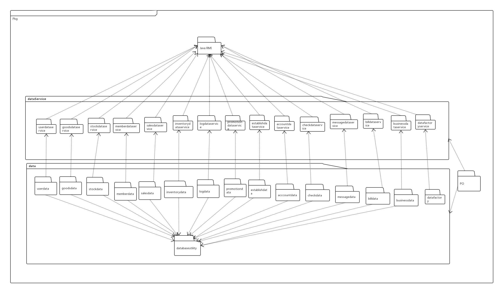  
