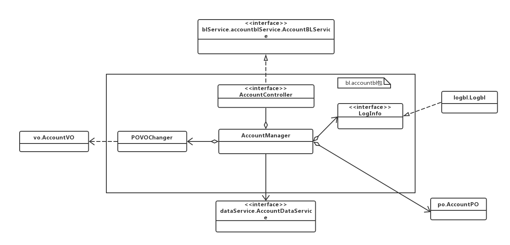
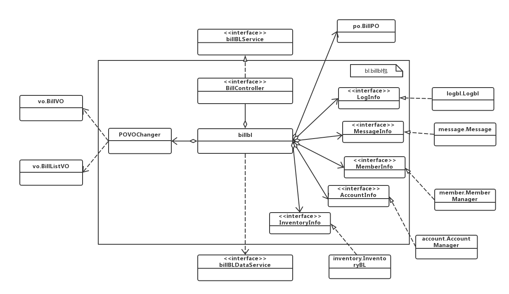

### Accountbl模块
#### 1. 模块概述
模块的需求和职责参见规格需求文档以及体系结构设计概述
#### 2. 整体结构
AccountController负责控制对应于审批界面所需要的服务。
Accountbl负责实现对应于审界面的服务。
  
#### 3. 模块内部类的接口规范

##### AccountController的接口规范
参见accountbl

##### accountbl模块的接口规范
|**供接口名**|**语法**|**前置条件**|**后置条件**|
|----|----|----|----|
|Account.ShowAll|public ArrayList(AccountVO> showAllAcounts()|无|返回所有账户信息|
|Account.find|public ArrayList（AccountVO> find(String keywords, FindType type)|关键字符合输入条件|返回符合条件的账户信息|
|Account.add|public Message add(AccountVO vo)|无|增加新的账户，持久化更新涉及的对象的数据|
|Account.delete|public Message delete(AccountVO vo)|无|删除账户信息，持久化更新涉及的对象的数据|
|Account.modify|public Message modify(AccountVO vo)|无|修改账户信息，持久化更新涉及的对象的数据|

|**需接口名**|**服务**|
|---|---|
|AccountDataService.search(String keywords)|根据关键字及其类型查找多个持久化对象|
|AccountDataService.add(AccountPO po)|插入单一持久化对象|
|AccountDataService.delete(AccountPO po)|删除单一持久化对象|
|AccountDataService.update(AccountPO po)|更新单一持久化对象|
|DatabaseFactory.getAccountsDatabase|得到Accounts数据库的服务的引用|

#### 4. 业务逻辑层的动态模型
下为账户管理的顺序图
  

#### 5. 设计原理
委托式设计

### AccountDataService模块
#### 1. 模块概述
模块的需求和职责参见规格需求文档以及体系结构设计概述
#### 2. 整体结构
AccountDataService实现账户管理时对持久化层的操作
#### 3. 模块内部类的接口规范
##### AccountDataService接口规范
|**供接口名**|**语法**|**前置条件**|**后置条件**|
|----|----|----|----|
|AccountDataService.find|public ArrayList(AccountPO> find(String keywords, FindType type)|数据库中存在符合条件的账户|返回符合条件的AccountPO结果|
|AccountDataService.insert|public void insert(AccountPO po)|相同账户不存在|在数据库增加一个po记录|
|AccountDataService.delete|public void delete(AccountPO po)|该账户已存在|在数据库删除一个po记录|
|AccountDataService.update|public void update(AccountPO po)|相同账户已存在|在数据库更新一个po记录|
|AccountDataService.showAll|public ArrayList(AccountPO> showAll()|无|返回所有账户信息|
|AccountDataService.init|public void init()|无|初始化持久化数据库|

### Billbl模块
#### 1. 模块概述
模块的需求和职责参见规格需求文档以及体系结构设计概述
#### 2. 整体结构
BillController负责控制对应于制作单据界面所需要的服务。
Billbl负责实现对应界面的服务。
  
#### 3. 模块内部类的接口规范

##### BillController的接口规范
参见billbl

##### billbl模块的接口规范
|**供接口名**|**语法**|**前置条件**|**后置条件**|
|----|----|----|----|
|Bill.billPayReceipt.init|public billPayReceiptVO init()|无|初始化一个付款单|
|Bill.BillChargeReceipt.init|public BillChargeReceiptVO init()|无|初始化一个收款单|
|Bill.billPayReceipt.addTransferItem|public void addTransferItem(TransferItemVO vo)|已建立一个收款单|收款单添加一个转账列表|
|Bill.BillChargeReceipt.addTransferItem|public void addTransferItem(TransferItemVO vo)|已建立一个付款单|付款单添加一个转账列表|
|Bill.billPayReceipt.addAccounts|public void addAccounts(AccountsVO vo)|已建立一个转账列表|收款单添加一个银行账户|
|Bill.BillChargeReceipt.addAccounts|public void addAccounts(AccountsVO vo)|已建立一个转账列表|付款单添加一个银行账户|
|Bill.billPayReceipt.addTranferMoney|public void addTransferMoney(double transferMoney)|符合输入条件|收款单添加转账金额|
|Bill.BillChargeReceipt.addTransferMoney|public void addTransferMoney(double transferMoney)|符合输入条件|付款单添加转账金额|
|Bill.billPayReceipt.addRemarks|public void addAccounts(String remark)|已建立一个付款单|收款单添加备注|
|Bill.BillChargeReceipt.addRemarks|public void addRemarks(String remark)|已建立一个收款单|付款单添加备注|
|Bill.billPayReceipt.addSum|public void addSum(double sum)|符合输入条件|收款单添加金额总额|
|Bill.BillChargeReceipt.addSum|public void addSum(double sum)|符合输入条件|付款单添加金额总额|
|Bill.CashReceipt.init|public CashReceiptVO init()|无|初始化一个现金费用单|
|Bill.CashReceipt.addItem|public void addItem(ItemVO vo)|已建立一个现金费用单|现金费用单添加一个条目|
|Bill.CashReceipt.addItemSum|public void addItemSum(double ItemSum)|符合输入条件|付款单添加条目金额|
|Bill.CashReceipt.addRemarks|public void addRemarks(String remark)|已建立一个条目|现金费用单添加备注|
|Bill.CashReceipt.addSum|public void addSum(double sum)|符合输入条件|现金费用单添加金额总额|
|Bill.submit|public Message submit(BillVO vo)|已建立相应单据|单据提交给总经理审批|
|Bill.deriveExcel|public ArrayList(ExcelVO> deriveExcel()|已建立相应单据|导出单据Excel|

|**需接口名**|**服务**|
|----|----|
|BillDataService.insert(BillPO po)|插入单一持久化对象|
|BillDataService.delete(BillPO po)|删除单一持久化对象|
|BillDataService.update(BillPO po)|插入单一持久化对象|
|DatabaseFactory.getBillDatabase|得到Bill数据库的服务的引用|

#### 4. 业务逻辑层的动态模型
下为制作单据的顺序图
  

#### 5. 设计原理
委托式设计

### BillDataService模块
#### 1. 模块概述
模块的需求和职责参见规格需求文档以及体系结构设计概述
#### 2. 整体结构
BillDataService实现制作单据对持久化层的操作
#### 3. 模块内部类的接口规范

##### BillDataService接口规范
|**供接口名**|**语法**|**前置条件**|**后置条件**|
|----|----|----|----|
|BillDataService.findbillPayReceipt|public ArrayList(BillPO> findbillPayReceipt(Date start， Date end，ReciptType type,memberPO member，UserPO user，CommodityPO commodity)|数据库中已存在符合条件付款单|返回符合条件的BillPO(付款单)结果|
|BillDataService.findBillChargeReceipt|public ArrayList(BillPO> findBillChargeReceipt(Date start， Date end，ReciptType type,memberPO member，UserPO user，CommodityPO commodity)|数据库中已存在符合条件的收款单|返回符合条件的BillPO(收款单)结果|
|BillDataService.findCashReceipt|public BillPO findCshOrder(Date start， Date end，ReciptType type,memberPO member，UserPO user，CommodityPO commodity)|数据库中已存在符合条件的现金费用单|返回符合条件的BillPO(现金费用单)结果|
|BillDataService.insert|public void insert(BillPO po)|同样的记录不存在|在数据库增加一个po记录|
|BillService.delete|public void delete(BillPO po)|该记录已存在|在数据库删除一个po记录|
|BillDataService.init|public void init()|无|初始化持久化数据库|

### Businessbl模块
#### 1. 模块概述
模块的需求和职责参见规格需求文档以及体系结构设计概述
#### 2. 整体结构
BusinessController负责控制对应于查看表单界面所需要的服务。
Businessbl负责实现对应于审界面的服务。
  
#### 3. 模块内部类的接口规范

##### BusinessController的接口规范
参见businessbl

##### businessbl模块的接口规范
|**供接口名**|**语法**|**前置条件**|**后置条件**|
|----|----|----|----|
|Business.SalesDetail.find|public ArrayList(SalesDetailVO> find(Date start， Date end，GoodVO good,MemberVO member，UserVO user，CommodityVO commodity)|关键字符合输入条件|返回符合条件的销售明细表|
|Business.buisnessProgress.find|public ArrayList(BuisnessProgressVO> find(Date start， Date end，ReciptType type,MemberVO member，UserVO user，CommodityVO commodity)|关键字符合输入条件|返回符合条件的经营历程表|
|Business.buisnessProgres.creditNote|public Message creditNote(BuisnessProgressVO vo)|同样的经营历程表已经存在|返回红冲结果|
|Business.buisnessProgres.creditNote.copy|public Message creditNoteCopy(BuisnessProgressVO vo)|同样的经营历程表已经存在|返回红冲并复制结果|
|Business.businessCondition.find|public ArrayList(BusinessConditionVO> find(Date start， Date end)|关键字符合输入条件|返回符合条件的经营情况表|
|Business.derive|public ArrayList(ExcelVO> deriveEecel()|无|导出excel|

|**需接口名**|**服务**|
|----|----|
|BusinessDataService.insert(BusinessPO po)|插入单一持久化对象|
|BusinessDataService.delete(BusinessPO po)|删除单一持久化对象|
|BusinessDataService.update(BusinessPO po)|插入单一持久化对象|
|DatabaseFactory.getBusinessDatabase|得到Business数据库的服务的引用|

#### 4. 业务逻辑层的动态模型
下为businessbl的顺序图
顺序图.png)  

#### 5. 设计原理
委托式设计

### BusinessDataService模块
#### 1. 模块概述
模块的需求和职责参见规格需求文档以及体系结构设计概述
#### 2. 整体结构
BillDataService实现对持久化层的操作
#### 3. 模块内部类的接口规范

##### BusinessDataService接口规范
|**供接口名**|**语法**|**前置条件**|**后置条件**|
|----|----|----|----|
|BusinessDataService.findBusinessPro|public ArrayList(BusinessPO> findBusinessPro(String keywords, FindType type)|数据库中存在符合条件的经营历程表、经营情况表、销售明细表|返回符合条件的BussinessPO(经营历程表)结果|
|BusinessDataService.findBusinessCon|public ArrayList(BusinessPO> findBusinessCon(String keywords, FindType type)|数据库中存在符合条件的经营情况表|返回符合条件的BussinessPO(经营情况表)结果|
|BusinessDataService.findSalesAccount|public ArrayList(BusinessPO> findSalesAccount(String keywords, FindType type)|数据库中存在符合条件的销售明细表|返回符合条件的BussinessPO(销售明细表)结果|
|BusinessDataService.insert|public void insert(BusinessPO po)|同样的记录不存在|在数据库增加一个po记录|
|BusinessDataService.delete|public void delete(BusinesstPO po)|该记录已存在|在数据库删除一个po记录|
|BusinessDataService.update|public void update(BusinesstPO po)|该记录已存在|在数据库腾信一个po记录|
|BusinessDataService.init|public void init()|无|初始化持久化数据库|

### Establishbl模块
#### 1. 模块概述
模块的需求和职责参见规格需求文档以及体系结构设计概述
#### 2. 整体结构
EstablishController负责控制对应于查看表单界面所需要的服务。
Establishbl负责实现对应于审界面的服务。
  
#### 3. 模块内部类的接口规范

##### EstablishController的接口规范
参见Establishbl

##### establishbl模块的接口规范
|**供接口名**|**语法**|**前置条件**|**后置条件**|
|----|----|----|----|
|Establishbl.init|public EstablishVO init(GoodSortVO goodSort,ArrayList(GoodVO> good,ArrayList(MemberVO> member, ArrayList(AccountVO> account|输入符合条件|生成期初信息|
|Establishbl.findIntial|public IntialAccount findIntial()|已生成期初信息|查看期初信息|

|**需接口名**|**服务**|
|----|----|
|EstablishService.insert(EstablishPO po)|插入单一持久化对象|
|EstablishService.intial|初始化单一持久化对象|

#### 4. 业务逻辑层的动态模型
下为eatablishbl的顺序图
  

#### 5. 设计原理
委托式设计

### EstablishDataService模块
#### 1. 模块概述
模块的需求和职责参见规格需求文档以及体系结构设计概述
#### 2. 整体结构
EstablishDataService实现对持久化层的操作
#### 3. 模块内部类的接口规范

#### EstablishDataService接口规范
|**供接口名**|**语法**|**前置条件**|**后置条件**|
|----|----|----|----|
|EstablisDataService.show|public EstablishPO show()|数据库已存在期初信息|返回期初信息|
|EstablishDataService.insert|public Message insert|同样的记录不存在|在数据库中增加一个po记录|
|EstablishDataService.init|public void init|无|初始化持久化数据库|

