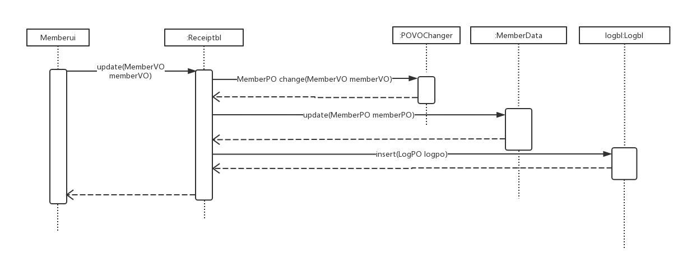
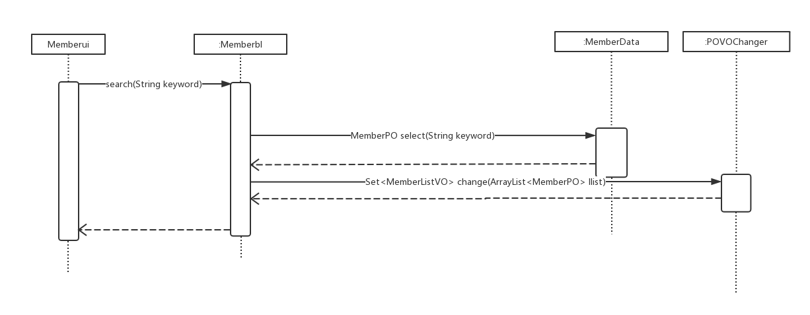
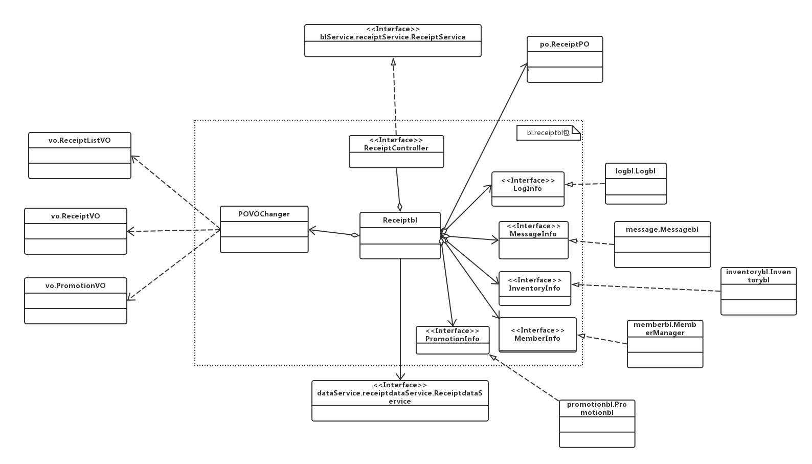
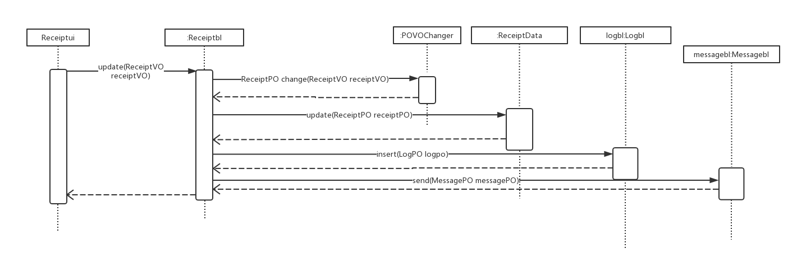
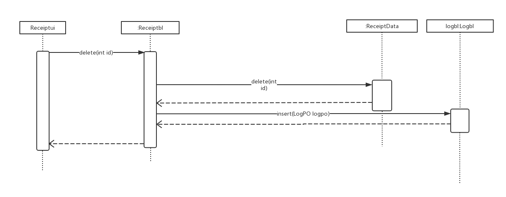
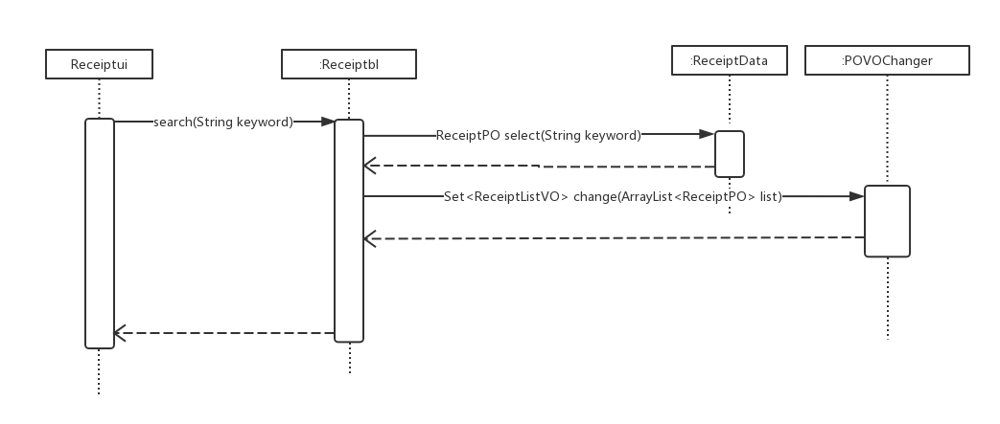
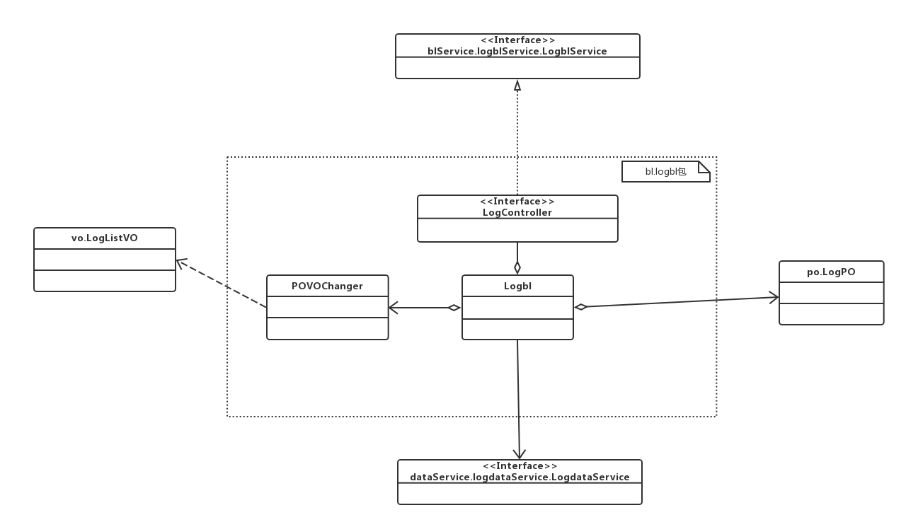
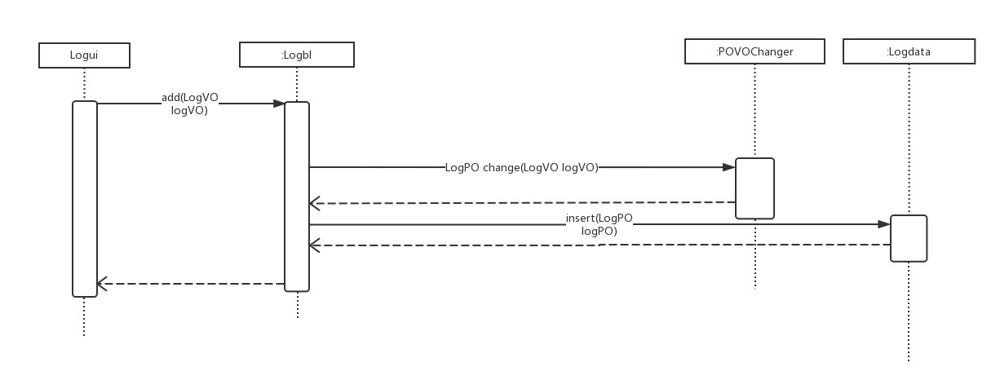
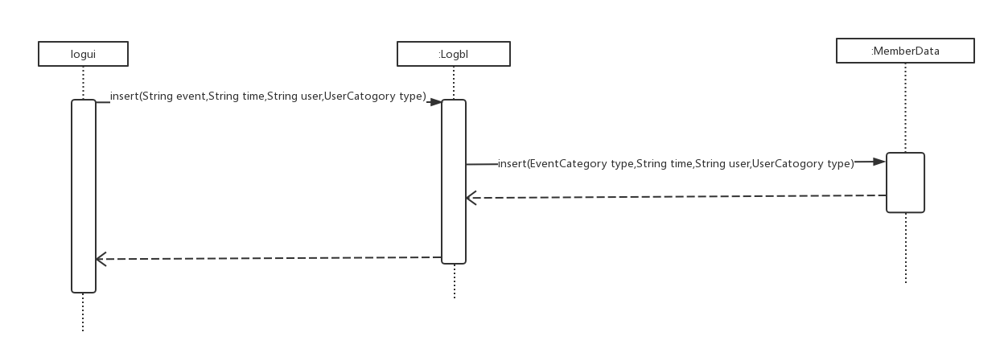
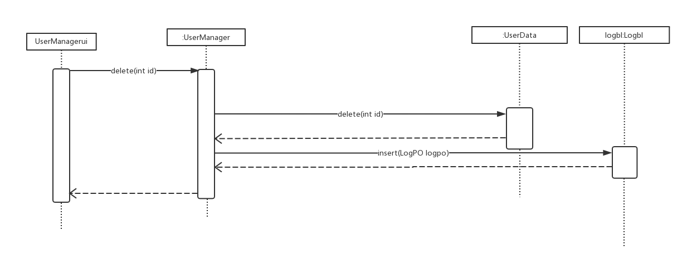

### 4.1.memberbl模块
#### 1.模块概述
memberbl模块的需求和职责参见规格需求文档以及体系结构设计概述
#### 2.整体结构
系统分为展示层、业务逻辑层、数据层，每一层之间做了接口。为了增加灵活性，添加了controller，并且添加了POVO转换的类
  

|**模块**|**职责**|
|:---|:---|  
|MemberController|同MemberManager|
|MemberManager|负责member的增删改查|
|POVOChanger|负责POVO转换|

#### 3.模块内部类的接口规范

memberManager的接口规范  

|**供接口名**|**语法**|**前置条件**|**后置条件**|
|:---|:---|:---|:---|
|MemberManager.add|public ResultMessage add(MemberVO memberVO)|输入合法|添加客户，返回执行结果|
|MemberManager.update|public ResultMessage update(MemberVO memberVO)|输入合法|更新客户，返回执行结果|
|MemberManager.delete|public ResultMessage delete(int id)|无|删除客户，返回执行结果|
|MemberManager.search|public Set<MemberListVO> search(MemberSearchVO memberSearchVO)|输入合法的搜索条件|返回搜索结果|

|**需接口名**|**服务**|
|:---|:---|
|MemberDataService.insert(MemberPO memberPO)|添加客户|
|MemberDataService.update(MemberPO memberPO)|更新客户|
|MemberDataService.delete(int id)|删除客户|
|MemberDataService.search(MemberSearchVO memberSearchVO)|搜索客户|

#### 4.业务逻辑层的动态模型

一般情况下为ui层传下vo，通过povo转换后对data层进行操作

下图是memberbl添加顺序图

下图是memberbl修改顺序图

下图是memberbl删除顺序图

下图是memberbl查询顺序图

#### 5.业务逻辑层的设计原理
委托式设计

### 4.2.salesbl&&stockbl模块
#### 1.模块概述
memberbl模块的需求和职责参见规格需求文档以及体系结构设计概述
#### 2.整体结构
系统分为展示层、业务逻辑层、数据层，每一层之间做了接口。为了增加灵活性，添加了controller，并且添加了POVO转换的类
  

|**模块**|**职责**|
|:---|:---|  
|ReceiptController|同Receiptbl|
|Receiptbl|负责receipt的增删改查|
|POVOChanger|负责POVO转换|

#### 3.模块内部类的接口规范
|**供接口名**|**语法**|**前置条件**|**后置条件**|
|:---|:---|:---|:---|
|Receiptbl.add|public ResultMessage add(ReceiptVO ReceiptVO)|输入合法|增加单据，记录操作，返回执行结果|
|Receiptbl.update|public ResultMessage update(ReceiptVO ReceiptVO)|输入合法|更新单据，记录操作，返回执行结果|
|Receiptbl.delete|public ResultMessage delete(int id)|无|删除单据，记录操作，返回执行结果|
|Receiptbl.search|public Set<ReceiptListVO> search(ReceiptSearchVO receiptSearchVO)|输入合法单据号|查找单据，返回查找结果|

|**需接口名**|**服务**|
|:---|:---|
|ReceiptDataService.insert(ReceiptPO ReceiptPO)|添加销售类单据|
|ReceiptDataService.update(ReceiptPO ReceiptPO)|更新销售类单据|
|ReceiptDataService.delete(int id)|删除销售类单据|
|ReceiptDataService.Search(ReceiptSearchVO receiptSearchVO)|搜索销售类单据|
#### 4.业务逻辑层的动态模型

一般情况下为ui层传下vo，通过povo转换后对data层进行操作

下图是receiptbl添加顺序图

下图是receiptbl修改顺序图

下图是receiptbl删除顺序图

下图是receiptbl查询顺序图

#### 5.业务逻辑层的设计原理
委托式设计

### 4.4.logbl模块
#### 1.模块概述
logbl模块的需求和职责参见规格需求文档以及体系结构设计概述
#### 2.整体结构
系统分为展示层、业务逻辑层、数据层，每一层之间做了接口。为了增加灵活性，添加了controller，并且添加了POVO转换的类
  

|**模块**|**职责**|
|:---|:---|  
|LogController|同Logbl|
|Logbl|负责log的增查|
|POVOChanger|负责POVO转换|

#### 3.模块内部类的接口规范
|**供接口名**|**语法**|**前置条件**|**后置条件**|
|----|----|----|----|
|Log.record|public void insert(LogPO log);|无|记录当前用户每次操作|
|Log.search|public Set<LogPO> search(String keyword);|财务人员或总经理启动搜索模块|返回操作查询列表|

|**需接口名**|**服务**|
|---|---|
|DataBaseFactory.getLogDatabase|得到Log数据库引用|
|LogDataService.insert(LogPO logpo)|系统新增Log条目|
|LogDataService.search|检索返回Log条目|

#### 4.业务逻辑层的动态模型

一般情况下为ui层传下vo，通过povo转换后对data层进行操作

下图是logbl添加顺序图

下图是logbl修改顺序图

下图是logbl删除顺序图

下图是logbl查询顺序图

#### 5.业务逻辑层的设计原理
委托式设计

### 4.6.userbl模块
#### 1.模块概述
memberbl模块的需求和职责参见规格需求文档以及体系结构设计概述
#### 2.整体结构
系统分为展示层、业务逻辑层、数据层，每一层之间做了接口。为了增加灵活性，添加了controller，并且添加了POVO转换的类  
下图是login类图

下图是UserManager类图

|**模块**|**职责**|
|:---|:---|  
|LoginController|同Login|
|UserManagerController|同UserManager|
|Login|负责用户登录信息|
|UserManager|负责user的增删改查|
|POVOChanger|负责POVO转换|

#### 3.模块内部类的接口规范
Login类

|**供接口名**|**语法**|**前置条件**|**后置条件**|
|----|----|----|----|
|User.Login|public ResultMessage login(String username,String password);|password符合输入规则|查找是否存在相应的User，根据输入的password返回登陆验证的结果|
|User.Register|public ResultMessage register(String username,String password1,String password2);|password符合输入规则且两个password一致|根据输入的检查是否有此User，无则新建User并返回创建结果|
|User.SetSafeAnswer|public ResultMessage checkAnswer(String answer);|answer符合输入规则|返回设定验证的结果|
|User.Findpassword|public ResultMessage findPassword(String username);|username符合输入规则|根据输入的检查是否有此User，有则进入安全问题找回密码|
|User.SafeAnswer|public ResultMessage checkAnswer(String answer);|系统找到有此用户且answer符合输入规则|根据输入的检查验证，成功则进入修改密码页面|
|User.SetPassword|public ResultMessage setPassword(String password1,String password2);|两次密码输入一致|改变该用户密码|
|**需接口名**|**服务**|
|---|---|
|DataBaseFactory.getUserDatabase|得到User数据库引用|
|UserDataService.insert(UserPO po)|系统新增User|
|UserDataService.search|系统查询User|

UserManager类

|**供接口名**|**语法**|**前置条件**|**后置条件**|
|----|----|----|----|
|UserManager.Init|public void initUserManager();|用户管理人员成功登陆|系统初始化管理员初始界面数据|
|UserManager.User|public void showUserDetail(UserPO user);|用户管理人员启动用户信息模块|系统显示用户详细信息|
|UserManager.Search|public ArrayList<UserPO> search(String keyword);|用户管理人员启动搜索模块|返回查找用户列表|
|UserManager.Insert|public ResultMessage insert(UserPO user);|用户管理人员启动添加模块|若系统无此用户，则添加此用户，返回添加结果|
|UserManager.Delete|public ResultMessage delete(UserPO user);|用户管理人员启动删除模块|系统删除相应用户，返回删除结果|
|UserManager.Modify|public ResultMessage modify(UserPO user);|用户管理人员启动修改模块|系统修改相应用户，返回修改结果|

|**需接口名**|**服务**|
|---|---|
|DataBaseFactory.getUserDatabase|得到User数据库引用|
|UserDataService.insert(UserPO po)|系统新增User|
|UserDataService.search|系统查询User|
|UserDataService.delete(UserPO po)|系统删除User|
|UserDataService.modify(UserPO po)|系统修改User|
#### 4.业务逻辑层的动态模型

一般情况下为ui层传下vo，通过povo转换后对data层进行操作

login类  
下图是login顺序图

UserManager类  
下图是usermanager添加顺序图

下图是usermanager修改顺序图

下图是usermanager删除顺序图

下图是usermanager查询顺序图

#### 5.业务逻辑层的设计原理
委托式设计
