# 某灯具企业进销存管理系统需求规格文档
## V1.0beta版
### 南京大学GZYZ小分队
#### 2017-10-5

---
## 更新版本记录
| **修改人** |**修改日期** |**修改原因**|**版本号** |
| :------   |:----: | ----    | :----: |
| 小组     |2017.10.1| 第一稿整合  |   v1.0 |
| 林宇超| 2017.10.2| 修改格式|v1.0|
|林宇超|2017.10.4|增加管理员|v1.1|
|林鹏|2017.10.5|添加现金费用单|v1.1|
|林鹏|2017.10.17|添加红冲|v1.1|
# 1.引言
  
---
## 1.1目的
本文档描述了灯具进销存系统的功能需求以及非功能需求，开发小组的软件系统实现与验证工作都以此文档为依据。

---  
## 1.2范围  
该进销存系统是为某灯具企业开发的业务系统，开发的目标主要是为该企业处理日常的重点业务，包括库存管理人员、进销人员、财务人员、总经理的业务  
通过该进销存管理的应用，期望为该企业提高人员的效率，并减少人员的工作量，人员包括库存管理人员、进销人员、财务人员、总经理

---  
## 1.3参考文献
1）IEEE标准  
2）某灯具进销存用例文档V1.1

---  
# 2.总体描述

---  
## 2.1产品前景  
### 2.1.1
一民营企业专业从事灯具照明行业，是某灯具的南京地区总代理，主要在南京负责品牌的推广及项目的落地销售、分销的批发等工作，服务对象包括项目业主、施工单位、分销商、设计院、终端用户等。  
该产品主要为此公司服务，它包括一个数据集中服务器和多个客户端，通过实时通信的方式加强工作人员和数据间的交互
### 2.1.2业务需求
BR1：系统使用6个月后，库存积压、缺货和报废的现象要减少50%。  
BR2：系统使用6个月后，销售额增加20%。  
BR3：系统使用6个月后，财务人员工作效率提高50%  
BR4：系统使用时，能帮助总经理制定销售策略

---  
## 2.2产品功能
SF1：帮助库存管理人员管理商品  
SF2：帮助库存管理人员管理库存，定期查看、盘点库存  
SF3：帮助销售人员管理公司客户  
SF4：帮助销售人员处理进退货、销售任务  
SF5：为财务人员提供账户管理、制定收款与付款单、查看销售明细表、查看经营历程表、查看经营情况表和期初建账等功能。  
SF6：为总经理提供制定销售策略、审批单据、查看销售明细、查看经营历程、查看经营情况的功能

---
## 2.3用户特征
| 用户 | 特征  |
| ---- |   ----  |
| 库存管理人员| 有1到2名库存管理人员。他们每天的任务就是对商品分类和商品的信息的管理，同时定期查看、盘点库存，盘点当天的各种商品的名称，型号，库存数量，库存均价，批次，批号，出厂日期，查看某个时间段内的出/入库数量/金额，销售/进货的数量/金额以及合计库存数量。他们每天还要制定各种单据，会根据总经理制定的促销赠送策略制定库存赠送单，通过比较实际库存和系统库存中的数量，生成相应的库存赠送单、库存报损单、库存报溢单、库存报警单，并送总经理审批。他们对基本持积极态度，但不希望增加现有工作量，能够简单使用办公信息化系统，操作计算机的技能一般，希望新系统尽可能帮他们解决工作上的问题 |
|进销人员|整个部门共有4-8名销售人员，他们工作日主要进行公司的客户管理以及制作进货单、进货退货单、销售单、销售退货单等，他们对系统保持积极态度，并且希望不要增加自己的工作量|
|财务人员|有1~2名财务人员。他们需要对账户进行管理，包括查看账户名称和金额、增加账户、删除账户、修改账户属性和查询账户。需要制定收款单、付款单交给经理审批。同时他们可以查看财务报表，包括销售明细表、经营历程表、经营情况表。除此之外，还可以进行期初建账的操作。他们对系统持积极态度，不希望增加现有工作量|
|总经理|总经理：公司会有1～2个总经理。所有单据都需要经过总经理的审批。为了更好的掌握公司的运营情况，总经理需要能查看财务工作，包括查盾销售明细，经营历程，经营情况。在商品滞销，节假日，需要发展会员等情况，总经理需要制定促销策略。总经理工作烦忙，希望新系统不要浪费太多时间。总经理的计算机操作技能较好。|

---  
## 2.4约束

CON1：系统将运行在Windows上  
CON2：系统不使用Web界面，而是图形界面  
CON3：项目要使用持续集成方法进行开发  
CON4：在开发中，开发者要提交软件需求规格说明文档、设计描述文档以及测试报告

# 3.详细需求描述

---  
## 3.1对外接口需求  

---
## 3.1.1用户界面
UI1.商品分类管理：系统使用自定义风格，帮助库存管理人员进行商品分类管理  
界面视图为：  
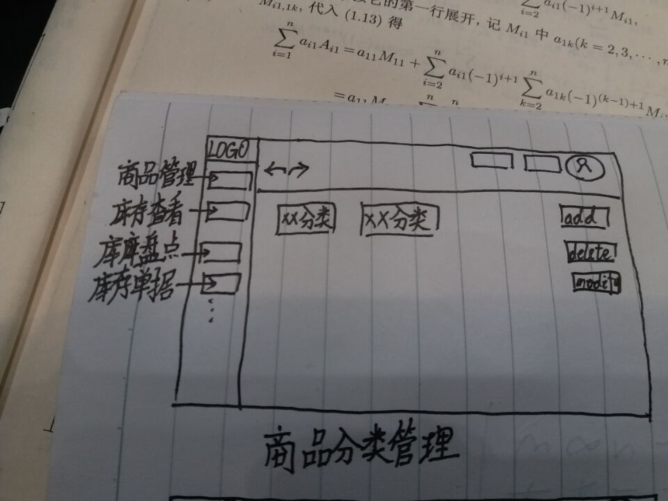   
UI2.商品管理：系统使用自定义风格，帮助库存管理人员进行商品管理  
界面视图为： 
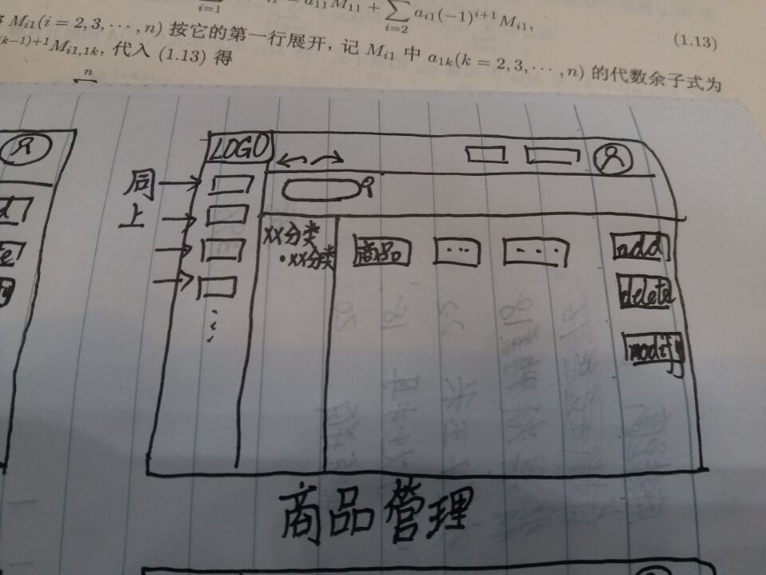  
UI3.库存查看：系统使用自定义风格，帮助库存管理人员进行库存查看  
界面视图为： 
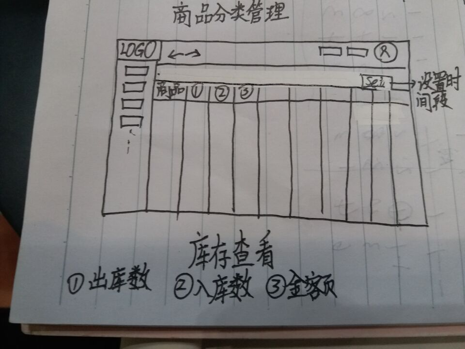    
UI4.库存盘点：系统使用自定义风格，帮助库存管理人员进行库存盘点  
界面视图为： 
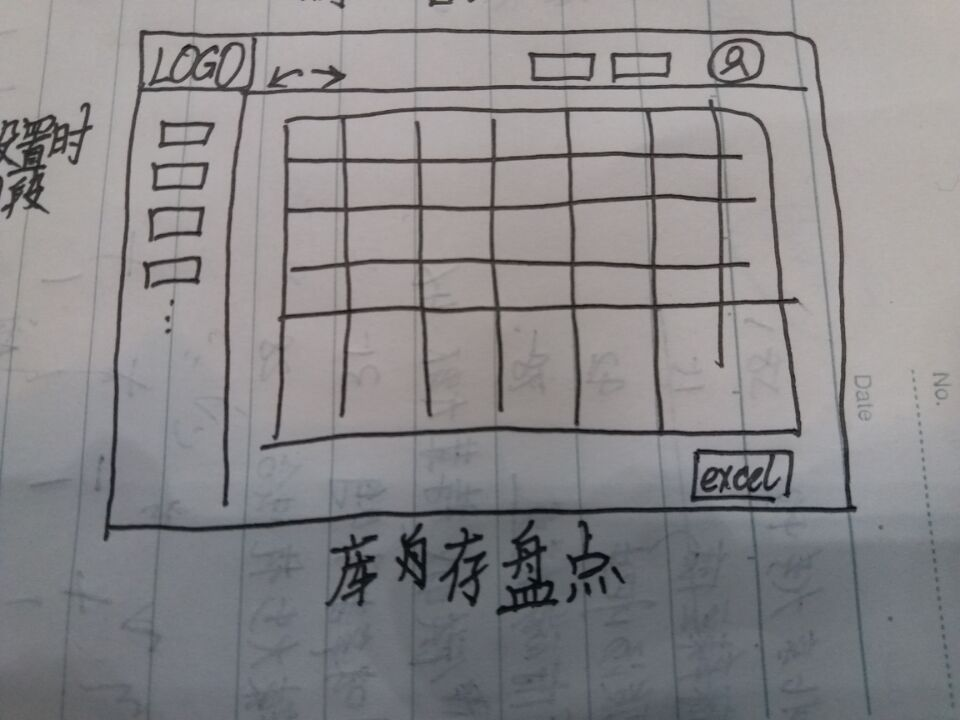    
UI5.库存表单：系统使用自定义风格，帮助库存管理人员进行制作各种表单  
界面视图为： 
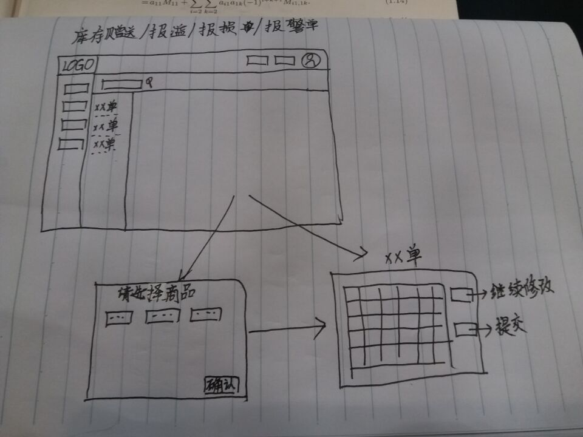    
UI6.客户管理：系统使用自定义风格，帮助进销人员进行客户管理  
界面视图为： 
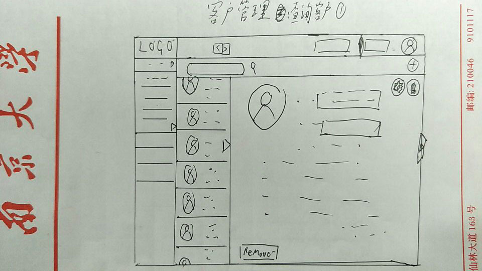      
UI7.制作单据：系统使用自定义风格，帮助进销人员制作单据   
界面视图为： 
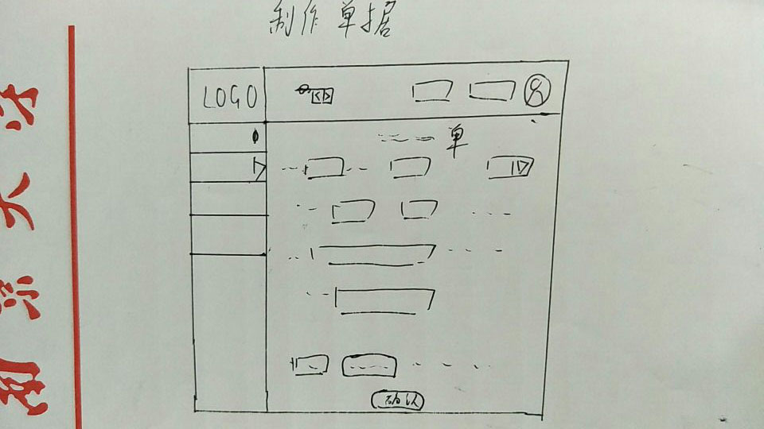  
UI8.账户管理：系统使用自定义风格，帮助财务人员进行账户管理  
界面视图为： 
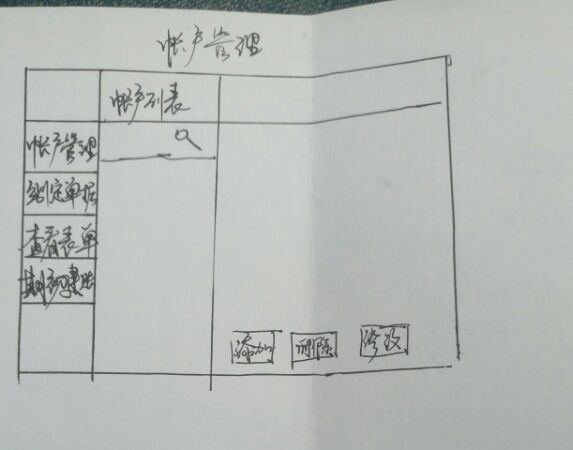  
UI9.制作单据：系统使用自定义风格，帮助财务人员制作单据   
界面视图为： 
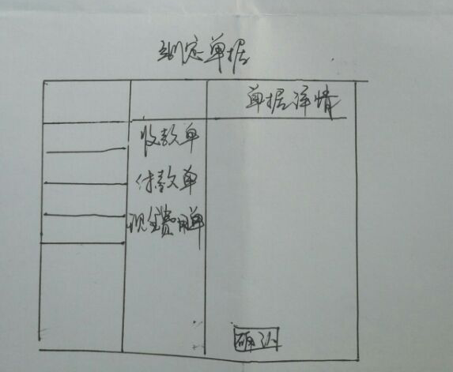    
UI10.查看明细：系统使用自定义风格，帮助财务人员进行明细查看  
界面视图为： 
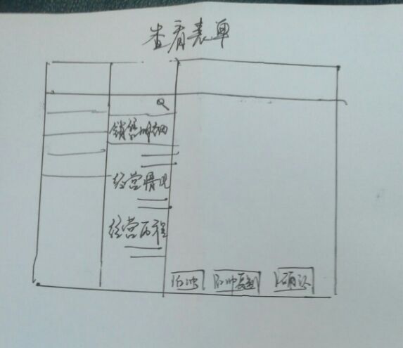    
UI11.期初建账：系统使用自定义风格，帮助财务人员进行期初建账  
界面视图为： 
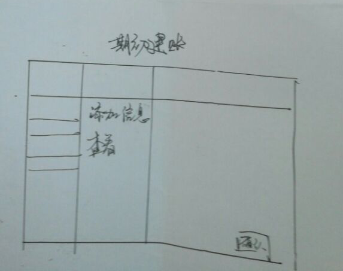  
UI12.查看明细：系统使用自定义风格，帮助总经理员进行明细查看  
界面视图为： 
    
UI13.制作销售策略：系统使用自定义风格，帮助总经理员进行明细查看  
界面视图为： 
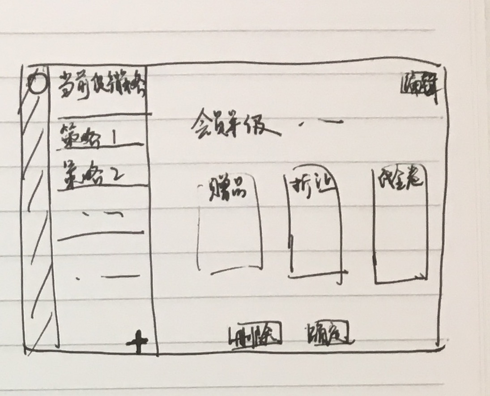  
UI14.审批单据：系统使用自定义风格，帮助总经理员进行单据审批  
界面视图为： 
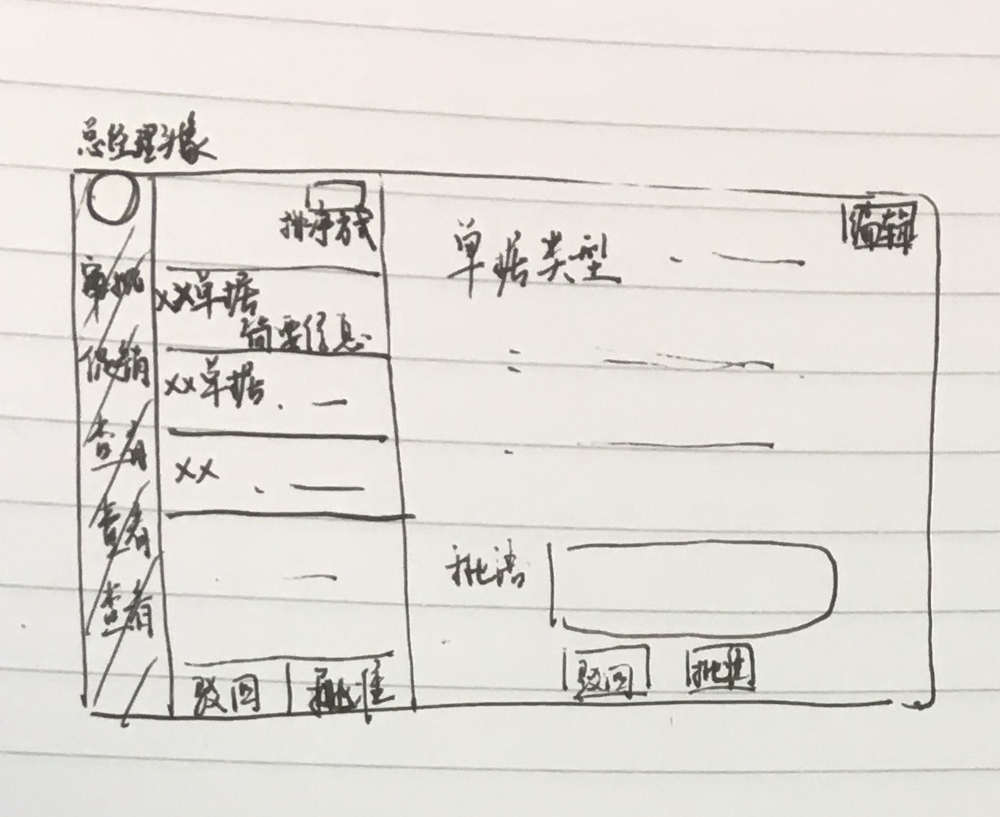        
UI15.用户管理：系统使用自定义风格，帮助管理员进行用户管理  
界面视图为：（同客户管理） 
     

---  
## 3.1.2通信接口

CI：客户端与服务器使用RMI的方式进行通信
 
---  
## 3.2功能需求
### 3.2.1 商品分类管理
### 3.2.1.1 特性描述
在库存管理人员需要管理商品分类时，一位经过验证的库存管理人员可以进入商品分类界面，商品分类呈树状结构。
优先级 = 低

### 3.2.1.2 刺激/响应序列
刺激：库存管理人员点击商品分类模块
响应：系统显示商品分类界面
刺激：库存管理人员点击增加，输入新分类信息
响应：系统生成新分类并自动生成其分类编号
刺激：库存管理人员选择分类，点击删除
响应：系统删除所选分类
刺激：库存管理人员选择分类，进行修改
响应：系统显示所选分类的所有信息
刺激：库存管理人员修改信息
响应：系统更新分类信息

### 3.2.1.3 相关功能需求
|GoodCategoryManagement |  商品分类管理 |
|---|---|
|GoodCategoryManagement.View   GoodCategoryManagement.View.Cancle  | 在库存管理人员点击分类节点时，系统要显示其子分类   在库存管理人员请求隐藏子分类时，再次点击分类节点，系统要隐藏其子分类|
|GoodCategoryManagement.Input.NewCategory  GoodCategoryManagement.Input.Categorynewinformation   GoodCategoryManagement.Input.Invalid| 在库存管理人员输入新分类信息时，系统要进行相应更改，参见GoodCategoryManagement.Category   在库存管理人员输入、修改分类新信息时，系统要进行相应更改，参见GoodCategoryManagement.Category   在库存管理人员输入时，如果格式不合法，系统提示输入无效|
|GoodCategoryManagement.Category.Add  GoodCategoryManagement.Delete  GoodCategoryManagement.Modify  | 在库存管理人员请求增加新商品分类时，系统要显示新增分类信息表，自动生成其编号   在库存人员删除分类时，系统要进行相应更改   在库存管理人员请求修改商品分类信息时，系统要显示该商品分类的所有信息|
|GoodCategoryManagement.End.Null| 在库存管理人员修改新增分类时，什么也不输入就退出时，系统要关闭新增修改商品分类任务|
|GoodCategoryManagement.Update| 在库存管理人员管理分类完成之后，系统要更新分类界面|
|GoodCategoryManagement.Close|系统关闭商品分类管理任务|

### 3.2.2 商品管理
### 3.2.2.1 特性描述
在库存管理人员需要管理商品时，一位经过验证的库存管理人员可以直接进入商品界面或者点击商品分类页叶节点进入。
优先级 = 低

### 3.2.2.2 刺激/响应序列
刺激：库存管理人员点击商品模块
响应：系统显示商品界面
刺激：库存管理人员点击增加，输入新商品信息
响应：系统生成新商品并自动生成其商品编号
刺激：库存管理人员选择商品，点击删除
响应：系统删除所选商品
刺激：库存管理人员选择商品，进行修改
响应：系统显示所选商品的所有信息
刺激：库存管理人员修改信息
响应：系统更新分类信息
刺激：库存管理人员选择查询商品
响应：库存管理人员显示输入框
刺激：库存管理人员输入商品编号或关键字
响应：系统显示商品及其信息

### 3.2.2.3 相关功能需求
|GoodManagement |  商品管理 |
|---|---|
|GoodManagement.Input.NewGoods    GoodCategoryManagement.Input.CategoryNewInformation    GoodManagement.Input.Check  GoodManagement.Input.Invalid | 在库存管理人员输入新商品信息时，系统要进行相应更改，参见GoodManagement.Good   在库存管理人员输入、修改分类商品时，系统要进行相应更改，参见GoodCategoryManagement.Good   在库存管理人员输入商品编号或其关机子时，系统要进行检索   在库存管理人员输入时，如果格式不合法，系统提示输入无效 |
|GoodManagement.Good.Add   GoodManagement.Good.Delete  GoodManagement.Good.Modify    GoodManagement.Good.enquiry| 在库存管理人员请求增加新商品时，系统要显示新增商品信息表，自动生成其编号   在库存人员删除商品时，系统要进行相应更改   在库存管理人员请求修改商品信息时，系统要显示该商品分类的所有信息   在库吨管理人员请求查询商品时，系统要显示该商品的所有信息或显示该商品不存在|
|GoodManagement.End.Null| 在库存管理人员修改新增分类时，什么也不操作就退出时，系统关闭商品管理任务|
|GoodManagement.Update| 在库存管理人员管理商品完成之后，系统要更新商品界面|
|GoodCategoryManagement.Close|系统关闭商品分类管理任务|

### 3.2.3 库存查看
### 3.2.3.1 特性描述
当想了解某个时间段库存情况时，一位经过验证的库存管理人员可以进行库存查看
优先级 = 低
### 3.2.3.2 刺激/响应序列
刺激：库存管理人员点击库存查看模块
响应：系统提示设定一个时间段
刺激：库存管理人员设定时间段
响应：系统生统计此时间段内的出/入库数量/金额，销售/进货的数量/金额与库存合计数量

### 3.2.3.3 相关功能需求
|StorageCheck |  库存查看 |
|---|---|
|StorageCheck.Input | 在库存管理人员设置时间段时，系统要统计此时间段内的出/入库数量/金额，销售/进货的数量/金额与库存合计数量 |
|StorageCheck.View| 系统显示此时间段内的出/入库数量/金额，销售/进货的数量/金额与库存合计数量|
|StorageCheck.Close|在库存管理人员请求结束库存查看任务时，系统要关闭库存查看任务|

### 3.2.4 库存盘点
### 3.2.4.1 特性描述
当想统计当天库存中商品的情况时，一位经过验证的库存管理人员可以进行库存盘点
优先级 = 低
### 3.2.4.2 刺激/响应序列
刺激：库存管理人员点击库存盘点模块
响应：系统生成当天的库存快照
刺激：库存管理人员选择导出excel
响应：系统导出库存快照excel格式

### 3.2.4.3 相关功能需求
|StorageStorktaking |  库存盘点 |
|---|---|
| StorageStorktaking.View| 系统生成当天的库存快照，包括当天的各种商品的名称，型号，库存数量，库存均价，批次，批号，出厂日期|
|StorageStorktaking.Excel|系统导出当天库存快照的excel格式|
|StorageStorktaking.Close|在库存管理人员请求结束库存盘点任务时，系统要关闭库存盘点任务|

### 3.2.5 库存赠送单
### 3.2.5.1 特性描述
在库存管理人员响应总经理的赠送策略时，系统库存管理人员允许生成库存赠送单
优先级 = 低
### 3.2.5.2 刺激/响应序列
刺激：库存管理人员点击库存赠送单模块
响应：系统显示商品界面
刺激：库存管理人员选择商品
响应：系统提示输入赠送数量
刺激：库存管理人员输入赠送数量
响应：系统生成库存赠送单并提交审批

### 3.2.5.3 相关功能需求
|StorageSendList |  库存赠送单 |
|---|---|
|StorageSendList.View    StorageSendList.View.SendList |在库存管理人员请求生成库存赠送单的时候，系统显示仍有库存的商品  系统生成并显示库存赠送单|
|StorageSendList.Good.Choose   StorageSendList.Good.Numbers   StorageSendList.Good.enquiry  StorageSendList.Good.Invalid   StorageSendList.Good.Cancle| 在库存管理人员选择商品时，系统要标识选中的商品并提示输入数量  系统应该允许库存管理人员输入赠送商品的数量 系统应该允许库存管理人员输入商品编号、关键字查询商品来选择 当输入的数量少于库存数量或者格式不合法，系统提示数量不足或输入无效 系统允许库存管理人员取消所选中的商品|
|StorageSendList.Review|系统将生成的库存赠送单提交审批 |
|StorageSendList.Update|当库存赠送单获得审批时，系统会更新库存|
|StorageSendList.close|当库存管理人员请求结束库存赠送单任务时，系统结束库存赠送单任务|

### 3.2.6 库存报溢单
### 3.2.6.1 特性描述
在发现库存中商品数量溢出时，系统库存管理人员允许生成库存报溢单
优先级 = 中
### 3.2.6.2 刺激/响应序列
刺激：库存管理人员点击库存报溢单模块
响应：系统显示商品界面
刺激：库存管理人员选择商品
响应：系统提示输入实际库存数量
刺激：库存管理人员输入实际库存数量
响应：系统根据实际数量和系统数量的比较生成库存报溢单并提交审批

### 3.2.6.3 相关功能需求
|StorageSendList |  库存报溢单 |
|---|---|
|StorageOverFlowList.View    StorageOverFlowList.View.OverFlowList |在库存管理人员请求生成库存报溢单的时候，系统显示库存中的商品  系统生成并显示库存报溢单|
|StorageOverFlowList.Good.Choose   StorageOverFlowList.Good.Numbers   StorageOverFlowList.Good.enquiry  StorageOverFlowList.Good.Invalid   StorageOverFlowList.Good.Cancle| 在库存管理人员选择商品时，系统要标识选中的商品并提示输入实际库存数量  系统应该允许库存管理人员输入商品的实际库存数量数量 系统应该允许库存管理人员输入商品编号、关键字查询商品来选择 当输入的数量异常或者格式不合法，系统提示数量不足或输入无效 系统允许库存管理人员取消所选中的商品|
|StorageOverFlowList.Compare|系统将比较实际库存数量和系统数量来决定是否生成库存报溢单|
|StorageOverFlowList.Faliure|系统提示无法生成库存报溢单|
|StorageOverFlowList.Review|系统将生成的库存报溢单提交审批 |
|StorageOverFlowList.Update|当库存报溢单获得审批时，系统会更新库存|
|StorageOverFlowList.close|当库存管理人员请求结束库存报溢单任务时，系统结束库存报溢单任务|

### 3.2.7 库存报损单
### 3.2.7.1 特性描述
在发现残次品、商品报废时，系统库存管理人员允许生成库存报损单
优先级 = 中
### 3.2.7.2 刺激/响应序列
刺激：库存管理人员点击库存报损单模块
响应：系统显示商品界面
刺激：库存管理人员选择商品
响应：系统提示输入实际库存数量
刺激：库存管理人员输入实际库存数量
响应：系统根据实际数量和系统数量的比较生成库存报损单并提交审批

### 3.2.7.3 相关功能需求
|StorageDamageList |  库存报损单 |
|---|---|
|StorageDamageList.View    StorageDamageList.View.StorageDamageList |在库存管理人员请求生成库存报损单的时候，系统显示库存中的商品  系统生成并显示库存报损单|
|StorageDamageList.Good.Choose   StorageDamageList.Good.Numbers   StorageDamageList.Good.enquiry  StorageDamageList.Good.Invalid   StorageDamageList.Good.Cancle| 在库存管理人员选择商品时，系统要标识选中的商品并提示输入实际库存数量  系统应该允许库存管理人员输入商品的实际库存数量数量 系统应该允许库存管理人员输入商品编号、关键字查询商品来选择 当输入的数量异常或者格式不合法，系统提示数量不足或输入无效 系统允许库存管理人员取消所选中的商品|
|StorageDamageList.Compare|系统将比较实际库存数量和系统数量来决定是否生成库存报损单|
|StorageDamageList.Faliure|系统提示无法生成库存报损单|
|StorageDamageList.Review|系统将生成的库存报损单提交审批 |
|StorageDamageList.Update|当库存报损单获得审批时，系统会更新库存|
|StorageDamageList.close|当库存管理人员请求结束库存报损单任务时，系统结束库存报损单任务|

### 3.2.8 库存报警单
### 3.2.7.1 特性描述
在发现库存数量不足时，系统库存管理人员允许生成库存报损单
优先级 = 中
### 3.2.8.2 刺激/响应序列
刺激：库存管理人员点击库存报警单单模块
响应：系统显示商品界面
刺激：库存管理人员选择商品
响应：系统提示输入实际库存数量
刺激：库存管理人员输入实际库存数量
响应：系统根据实际数量和警戒数量的比较生成库存报警单提交审批

### 3.2.8.3 相关功能需求
|StorageWarningList |  库存报警单 |
|---|---|
|StorageWarningList.View    StorageWarningList.View.StorageWarningList |在库存管理人员请求生成库存报警单的时候，系统显示库存中的商品  系统生成并显示库存报警单|
|StorageWarningList.Good.Choose   StorageWarningList.Good.Numbers   StorageWarningList.Good.enquiry  StorageWarningList.Good.Invalid   StorageWarningList.Good.Cancle StorageWarningList.Good.Modify| 在库存管理人员选择商品时，系统要标识选中的商品并提示输入实际库存数量  系统应该允许库存管理人员输入商品的实际库存数量 系统应该允许库存管理人员输入商品编号、关键字查询商品来选择 当输入的数量异常或者格式不合法，系统提示数量不足或输入无效 系统允许库存管理人员取消所选中的商品 系统应该允许库存管理人员修改商品的警戒数量|
|StorageWarningList.Compare|系统将比较实际库存数量和系统数量来决定是否生成库存报警单|
|StorageWarningList.Faliure|系统提示无法生成库存报警单|
|StorageWarningList.Review|系统将生成的库存报警单提交审批 |
|StorageWarningList.close|当库存管理人员请求结束库存报警单任务时，系统结束库存报警单任务|

### 3.2.9客户管理
### 3.2.9.1特性描述  
销售人员进行对客户的增删改查操作  
优先级=高
### 3.2.9.2刺激/响应序列
刺激：进销人员输入客户账号或关键字  
响应：系统根据关键字或编号进行模糊查询并显示  
刺激：进销人员选择添加客户并输入相关信息  
响应：系统根据信息进行存储或提示信息错误  
刺激：进销人员选择列表中客户并删除  
响应：客户列表删除相关信息（不影响其他信息）  
刺激：进销人员选择列表中客户进行信息修改  
响应：系统根据信息进行存储或提示信息错误  
刺激：进销人员取消客户管理  
相应：系统回到主页面  
### 3.2.9.3相关功能需求
| **编号** |  **需求描述与度量** |
| -------- | :----- |
| ClientManager.Init   ClientManager.Init.List | 进销人员进入系统，客户管理系统初始化    进销人员进入系统，系统初始化用户列表(输出：进销主界面)|
| ClientManager.Member  ClientManager.Search    ClientManager.Add|进销人员选择（查询）初始化列表中的客户，系统显示相应信息（输出）   进销人员搜索客户（查询），系统显示客户相应信息，参见ClientManager.Search  进销人员添加客户（查询），系统进行添加客户操作，参见ClientManager.Add|
| ClientManager.Search.Input  ClientManager.Search.Input.Null  ClientManager.Search.Input.Member  ClientManager.Search.Input.Invalid  ClientManager.Search.Input.Valid.List  ClientManager.Search.Input.Valid.List.Member  ClientManager.Search.Fail  ClientManager.Search.Input.Cancel | 进销人员进入客户管理查询系统，系统显示界面（输出：客户管理查询界面）  在进销人员查询客户时未输入任何信息时查询，系统不予处理   在进销人员查询（查询）客户时（输入）要输入客户编号或关键字    进销人员输入无效数据时，系统提示错误    进销人员输入正确格式的信息时（逻辑文件），系统显示模糊查询后的信息列表（输出）  进销人员选择（查询）信息列表中的客户并显示客户信息（输出）   进销人员查询时出现系统错误，系统提示错误（输出）  进销人员取消客户查询(查询)，系统返回客户管理主界面，参见ClientManager|
| ClientManager.Add  ClientManager.Add.Input.Null  ClientManager.Add.Input.Member  ClientManager.Add.Input.Invalid  ClientManager.Add.Input.Error  ClientManager.Add.Input.Valid  ClientManager.Add.Input.Valid.Sure  ClientManager.Add.Fail  ClientManager.Add.Input.Cancel | 进销人员进入添加客户环节（输出：添加客户界面）  在进销人员查询客户时未输入任何信息时查询，系统提示错误   系统允许进销人员添加（查询）客户时（输入）输入客户相关信息，系统进行操作（逻辑文件）    进销人员输入无效数据时，系统提示错误   进销人员输入已有客户信息时（逻辑文件），系统提示错误   进销人员输入正确格式的信息时（逻辑文件），系统显示输入后的模板请求确认并保存（输出）  进销人员确认输入正确的客户信息（查询），系统保存信息（逻辑文件）   进销人员添加客户时出现系统错误，系统提示（输出）  进销人员取消添加客户(查询)，系统返回客户管理主界面，参见ClientManager|
| ClientManager.Member  Client.Manager.Search.Input.Valid.List.Member  ClientManager.Member.Delete  ClientManager.Member.Delete.Warning  ClientManager.Member.Delete.Fail  ClientManager.Member.Delete.Cancel  ClientManager.Member.Delete.Error  ClientManager.Member.Delete.Succeed| 进销人员选择客户，系统显示客户信息，参见ClientManager  进销人员选择客户，系统显示客户信息，参见ClientManager.Search  进销人员选择客户界面并（查询）删除客户，系统删除对应客户信息（逻辑文件）  进销人员删除客户时出现删除提醒（输出），并且要求输入验证码确认（输入），系统确认用户输入  进销人员删除客户时系统出现错误，系统提示（输出）  进销人员取消（查询）删除客户，系统返回显示客户列表（输出）  进销人员删除客户时输入的验证码错误，系统提示错误（输出）并更新验证码（逻辑文件）  进销人员成功删除客户，系统提示删除成功（输出）更新列表（逻辑文件）|
| ClientManager.Member  Client.Manager.Search.Input.Valid.List.Member  ClientManager.Member.Modify  ClientManager.Member.Modify.Input  ClientManager.Member.Modify.Warning  ClientManager.Member.Modify.Fail  ClientManager.Member.Modify.Cancel  ClientManager.Member.Modify.Error  ClientManager.Member.Modify.Succeed| 进销人员选择客户，系统显示客户信息，参见ClientManager  进销人员选择客户，系统显示客户信息，参见ClientManager.Search  进销人员选择客户界面并（查询）修改客户，系统跳转修改客户界面（输出）  进销人员修改客户输入相应信息，系统将保存修改客户信息（逻辑文件）  进销人员修改客户完成时系统出现修改提醒（输出），并且要求输入验证码确认（输入）  进销人员修改客户时系统出现错误，系统提示（输出）  进销人员取消（查询）修改客户，系统返回显示客户列表（输出）  进销人员修改客户时输入的验证码错误，系统提示错误（输出）并更新验证码（逻辑文件）  进销人员成功修改客户，系统提示修改成功（输出），更新列表（逻辑文件）|
### 3.2.10制作进货单
### 3.2.10.1特性描述
当有进货时，销售人员制作进货单  
优先级=中
### 3.2.10.2刺激/响应序列
刺激：进销人员选择并填写进货单  
响应：系统保存，进货单据进入待审核状态    
刺激：进销人员取消制作进货单据  
响应：系统回到主页面  
### 3.2.10.3相关功能需求
| **编号** |  **需求描述与度量** |
| -------- | :----- |
| PurReceipt.Init| 进销人员进入制作进货单据环节（查询），系统显示制作单据的界面（输出） | 
| PurReceipt.Input  PurReceipt.Input.Null  PurReceipt.Input.Information  PurReceipt.Input.Invalid  PurReceipt.Input.Valid  PurReceipt.Input.Valid.Show  PurReceipt.Input.Sure  PurReceipt.Input.Error  PurReceipt.Input.Succeed| 系统允许进销人员进行信息输入  进销人员未输入，系统提示未处理（输出）  进销人员填写相应数据（输入），并提交，系统接受数据  进销人员提交数据，系统检测数据无效，提示无效（输出）  进销人员提交数据，系统监测有效，系统保留相应数据（逻辑文件）  进销人员提交数据成功时，系统将显示完整的单据表10秒（输出）  进销人员确认信息（查询），系统进行更新  进销人员提交数据时，系统发生错误，系统提示错误（输出）  进销人员成功完成单据时，系统更新数据（逻辑文件），并显示成功制作单据（输出）|

### 3.2.11制作进货退货单
### 3.2.11.1特性描述
当有（库存）退货时，销售人员制作进货退货单  
优先级=中
### 3.2.11.2刺激/响应序列
刺激：进销人员选择并填写进货退货单  
响应：系统保存，单据进入待审核状态    
刺激：进销人员取消制作单据  
响应：系统回到主页面  
### 3.2.11.3相关功能需求
| **编号** |  **需求描述与度量** |
| -------- | :----- |
| RetReceipt.Init| 进销人员进入制作进货退货单据环节（查询），系统显示制作单据的界面（输出） | 
| RetReceipt.Input  RetReceipt.Input.Null  RetReceipt.Input.Information  RetReceipt.Input.Invalid  RetReceipt.Input.Valid  RetReceipt.Input.Valid.Show  RetReceipt.Input.Sure  RetReceipt.Input.Error  RetReceipt.Input.Succeed| 系统允许进销人员进行信息输入  进销人员未输入，系统提示未处理（输出）  进销人员填写相应数据（输入），并提交，系统接受数据  进销人员提交数据，系统检测数据无效，提示无效（输出）  进销人员提交数据，系统监测有效，系统保留相应数据（逻辑文件）  进销人员提交数据成功时，系统将显示完整的单据表10秒（输出）  进销人员确认信息（查询），系统进行更新  进销人员提交数据时，系统发生错误，系统提示错误（输出）  进销人员成功完成单据时，系统更新数据（逻辑文件），并显示成功制作单据（输出）|

### 3.2.12制作销售单
### 3.2.12.1特性描述
当有销售时，销售人员制作销售单  
优先级=中
### 3.2.12.2刺激/响应序列
刺激：进销人员选择并填写销售单  
响应：系统保存，单据进入待审核状态    
刺激：进销人员取消制作销售单据  
响应：系统回到主页面  
### 3.2.12.3相关功能需求
| **编号** |  **需求描述与度量** |
| -------- | :----- |
| SaleReceipt.Init| 进销人员进入制作销售单据环节（查询），系统显示制作单据的界面（输出） | 
| SaleReceipt.Input  SaleReceipt.Input.Null  SaleReceipt.Input.Information  SaleReceipt.Input.Invalid  SaleReceipt.Input.Valid  SaleReceipt.Input.Valid.Show  SaleReceipt.Input.Sure  SaleReceipt.Input.Error  SaleReceipt.Input.Succeed| 系统允许进销人员进行信息输入  进销人员未输入，系统提示未处理（输出）  进销人员填写相应数据（输入），并提交，系统接受数据  进销人员提交数据，系统检测数据无效，提示无效（输出）  进销人员提交数据，系统监测有效，系统保留相应数据（逻辑文件）  进销人员提交数据成功时，系统将显示完整的单据表10秒（输出）  进销人员确认信息（查询），系统进行更新  进销人员提交数据时，系统发生错误，系统提示错误（输出）  进销人员成功完成单据时，系统更新数据（逻辑文件），并显示成功制作单据（输出）|

### 3.2.13制作销售退货单
### 3.2.13.1特性描述
当有销售退货时，销售人员制作销售退货单  
优先级=中
### 3.2.13.2刺激/响应序列
刺激：进销人员选择并填写销售退货单  
响应：系统保存，单据进入待审核状态    
刺激：进销人员取消制作销售退货单据  
响应：系统回到主页面  
### 3.2.13.3相关功能需求
| **编号** |  **需求描述与度量** |
| -------- | :----- |
| SaleReReceipt.Init| 进销人员进入制作销售退货单据环节（查询），系统显示制作单据的界面（输出） | 
| SaleReReceipt.Input  SaleReReceipt.Input.Null  SaleReReceipt.Input.Information  SaleReReceipt.Input.Invalid  SaleReReceipt.Input.Valid  SaleReReceipt.Input.Valid.Show  SaleReReceipt.Input.Sure  SaleReReceipt.Input.Error  SaleReReceipt.Input.Succeed| 系统允许进销人员进行信息输入  进销人员未输入，系统提示未处理（输出）  进销人员填写相应数据（输入），并提交，系统接受数据  进销人员提交数据，系统检测数据无效，提示无效（输出）  进销人员提交数据，系统监测有效，系统保留相应数据（逻辑文件）  进销人员提交数据成功时，系统将显示完整的单据表10秒（输出）  进销人员确认信息（查询），系统进行更新  进销人员提交数据时，系统发生错误，系统提示错误（输出）  进销人员成功完成单据时，系统更新数据（逻辑文件），并显示成功制作单据（输出）|

### 3.2.14 账户管理
### 3.2.14.1 特性描述
 当需要管理账户的时候，财务人员开始对账户进行管理，完成对公司账户的管理，可以增加账户、删除账户、修改账户属性和查询账户。  
 优先级＝高
### 3.2.14.2 刺激/响应序列
 刺激：财务人员请求查看账户  
 响应：显示账户名称和余额   
 刺激：财务人员添加新的账户，输入名称和金额  
 响应：系统更新信息  
 刺激：财务人员添加的账户与现有账户名称重复  
 响应：系统提示重复，要求重新添加  
 刺激：财务人员选择账户进行删除  
 响应：系统删除账户，更新信息  
 刺激：财务人员选中已有账户，修改属性  
 响应：系统更新信息  
 刺激：财务人员输入账户的查询信息  
 响应：系统显示符合查询信息的账户信息  
 刺激：财务人员试图查找得到账户不存在  
 响应：系统提示无匹配结果  
### 3.2.14.3 相关功能需求
|.||
|---|---|
|Account.Input| 系统允许财务人员在进行账户管理操作时进行键盘输入|
|Account.Show   <Account.Show.Search   Account.Show.Search.Failure   Account.Show.Search.Null| 系统允许财务人员查看公司银行账户的名称和余额。系统将显示账号的名称以及其金额。系统在财务人员点击查看时会自动列出所有账户信息   系统允许财务管理人员对账户进行关键字的模糊搜，通过输入账户名称、时间、银行名称等进行模糊搜索。输入完成后，点击“查找”按钮进行模糊查找，系统将显示符合条件的账户。  如果无匹配结果，系统将提示无匹配结果  财务人员未输入查询条件就点击查询时，系统不予响应|
|Account.Add   Account.Add.Failure   Account.Add.Null|系统允许财务人员进行账户的添加，点击添加账户，输入账户名称、金额。输入后点击确认进行添加工作，并且在系统中保存账户信息。  若添加的账户名称与已有账户名称重复，提示与已有账户重复  若账户信息未输入完整就点击添加，系统不予响应|
|Account.Modify   Account.Modify.Failure|财务人员选择需要修改的账户并修改所选账户的属性，之后点击修改账户属性进行属性修改,并且在系统文件中保存账户信息。  输入数据不符合格式，系统提示输入格式错误|
|Account.Delete   Account.Delete.Null|财务人员选择需要删除的账户，然后点击删除账户进行账户删除工作,并且在系统文件中保存账户信息  若未选择账户就点击删除按钮，则系统不予响应|
### 3.2.15 制定收款单
### 3.2.15.1 特性描述
 当需要制定收款单的时候，财务人员开始制定收款单，完成对收款单的建立。  
优先级＝中
### 3.2.15.2 刺激/响应序列
 刺激：财务人员选择制定收款单  
 响应：系统响应，自动生成单据编号和操作员  
 刺激：财务人员输入转账列表（银行账户，转账金额，备注）并进行汇总  
 响应：系统保存信息  
 刺激：财务人员点击提交  
 响应：系统建立收款单并入账  
### 3.2.15.3 相关功能需求
|.||
|---|---|
|CollectionOrder.Initialization|允许财务人员在收款单的制定操作时进行键盘输入以及鼠标点击操作|
|CollectionOrder.Add    CollectionOrder.Add.Failure    CollectionOrder.Add.Null|系统允许财务人员进行收款单的创建工作，输入转账列表（银行账户，转账金额，备注）以及总额汇总。填写完毕后点击提交。若数据格式正确，显示制定成功。并且向总经理发送审批信息，在系统文件中保存账户信息。  若输入数据格式错误，系统提示格式错误，并要求重新输入  若收款单数据未输入完全就点击提交，系统不予响应并提示继续输入|
|CollectionOrder.Derive|财务人员在成功创建收款单之后，可以进行导出操作，以excel格式保存在指定路径|
|CollectionOrder.Audit|收款单在创建完毕后进入待审核状态，在经过审核之后，会更改客户的应收应付数据|
### 3.2.16 制定付款单
### 3.2.16.1 特性描述
 当需要制定付款单的时候，财务人员开始制定付款单，完成对付款单的建立。  
优先级＝中
### 3.2.16.2 刺激/响应序列
 刺激：财务人员选择制定付款单
 响应：系统响应，自动生成单据编号和操作员
 刺激：财务人员输入转账列表（银行账户，转账金额，备注）并进行汇总
 响应：系统保存信息
 刺激：财务人员点击提交
 响应：系统建立收款单并入账
### 3.2.16.3 相关功能需求
|.||
|---|---|
|PaymentOrder.Initialization|允许财务人员在付款单的制定操作时进行键盘输入以及鼠标点击操作|
|PaymentOrder.Add   PaymentOrder.Add.Failure   PaymentOrder.Add.Null|系统允许财务人员进行付款单的创建工作，输入转账列表（银行账户，转账金额，备注）并进行汇总。填写完毕后点击提交。若数据格式正确，显示制定成功。并且向总经理发送审批信息，在系统文件中保存账户信息。  若输入数据格式错误，系统提示格式错误，并要求重新输入  若付款单数据未输入完全就点击提交，系统不予响应并提示继续输入|
|PaymentOrder.Derive|财务人员在成功创建付款单之后，可以进行导出操作，以excel格式保存在指定路径|
|PaymentOrder.Audit|付款单在创建完毕后进入待审核状态，在经过审核之后，会更改客户的应收应收数据|

### 3.2.17 制定现金费用单
### 3.2.17.1 特性描述
 当需要制定现金费用单的时候，财务人员开始制定现金费用单，完成对现金费用单的建立。  
优先级＝中
### 3.2.17.2 刺激/响应序列
 刺激：财务人员选择制定现金费用单
 响应：系统响应，自动生成单据编号和操作员
 刺激：财务人员输入银行账户，条目清单，总额。条目清单中包括：条目名，金额，备注。
 响应：系统保存信息
 刺激：财务人员点击提交
 响应：系统建立现金费用单并入账
### 3.2.17.3 相关功能需求
|.||
|---|---|
|CashOrder.Initialization|允许财务人员在现金费用单的制定操作时进行键盘输入以及鼠标点击操作|
|CashOrder.Add    CashOrder.Add.Failure    CashOrder.Add.Null|系统允许财务人员进行现金费用单的创建工作，输入银行账户，条目清单（条目名，金额，备注），总额。填写完毕后点击提交。若数据格式正确，显示制定成功。并且减少该账户的余额。  若输入数据格式错误，系统提示格式错误，并要求重新输入  若现金费用单数据未输入完全就点击提交，系统不予响应并提示继续输入|
|CashOrder.Derive|财务人员在成功创建现金费用单之后，可以进行导出操作，以excel格式保存在指定路径|

### 3.2.18 查看销售明细表
### 3.2.18.1 特性描述
 当需要了解商品销售情况或者查询出货单据记录的时候，财务人员选择查看销售明细表。  
优先级＝中
### 3.2.18.2 刺激/响应序列
 刺激：财务人员选择查看销售明细表  
 响应：系统要求输入时间区间，商品名，客户，业务员，仓库  
 刺激：财务人员或总经理输入筛选条件  
 响应：系统以列表形式显示匹配的结果，列表中包含如下信息：时间（精确到天），商品名，型号，数量，单价，总额  
### 3.2.18.3 相关功能需求
|.||
|---|---|
|SaleAccount.Show    SaleAccount.Show.Search    SaleAccount.Show.Search.Failure    SaleAccount.Show.Search.Null| 系统允许财务人员查看销售出货记录，以列表形式显示   系统允许财务管理人员对销售记录进行关键字的模糊搜索，通过输入时间区间，商品名，客户，业务员，仓库等进行模糊搜索。输入完成后，点击“查找”按钮进行模糊查找，系统将显示符合条件的销售记录。   如果无匹配结果，系统将提示无匹配结果   财务人员未输入查询条件就点击查询时，系统不予响应|
|SaleAcount.Derive| 系统允许财务人员导出商品销售记录|
### 3.2.19 查看经营历程表
### 3.2.19.1 特性描述
 当需要查看一段时间内的所有单据，财务人员选择查看经营历程表  
优先级＝中
### 3.2.19.2 刺激/响应序列
 刺激：财务人员选择查看经营历程表  
 响应：系统要求输入时间区间，单据类型，客户，业务员，仓库  
 刺激：财务人员输入筛选条件  
 响应：系统显示符合条件的单据  
### 3.2.19.3 相关功能需求
|.||
|---|---|
|SaleProgress.Initialization| 系统允许财务人员进行查看销售历程表操作时进行键盘输入操作|
|SaleProgress.Show   <SaleProgress.Show.Search   SaleProgress.Show.Search.Failure   SaleProgress.Show.Search.Null| 系统允许财务人员查看一段时间内的所有单据。单据包括销售类单据（销售出货单，销售退货单），进货类单据（进货单，进货退货单），财务类单据（现金费用单，收款单，现金费用单），库存类单据（报溢单，报损单，赠送单）。   财务人员输入时间区间，单据类型，客户，业务员，仓库等筛选条件进行查找，系统显示符合条件的单据   若无匹配结果，则提示找不到符合条件的单据   若未输入筛选条件就进行查找，则系统不予响应|
|SaleProgress.Derive| 财务人员可以将单据以excel形式导出|
### 3.2.20 红冲
### 3.2.20.1 特性描述
 需要对某些单据进行红冲或者红冲并复制操作
优先级＝中
### 3.2.20.2 刺激/响应序列
 刺激：财务人员选择单据红冲操作  
 响应：系统生成一个一模一样但是仅仅把数量取负数的单子并入账，以此来抵消之前的单子  
 刺激：财务人员选择红冲并复制操作  
 响应：在红冲的基础上，新建一张以之前单子为模板的草稿单，给用户编辑后，保存  
### 3.2.20.3 相关功能需求
|.||
|---|---|
|SaleProgress.Initialization|
|SaleProgress.Hongchong   SaleProgress.Hongchong.Copy   SaleProgress.Hongchong.Copy.Failure   SaleProgress.Hongchong.copy.Null| 财务人员可以选择单据进行红冲操作，生成一个一模一样但是仅仅把数量取负数的单子并入账，以此来抵消之前的单子   财务人员选择单据进行红冲并复制的操作，在红冲的基础上，新建一张以之前单子为模板的草稿单，进行编辑，之后保存   编辑时输入格式错误，提示格式错误，重新输入  财务人员未进行输入，系统不予响应|
### 3.2.21 查看经营情况表
### 3.2.21.1 特性描述
 当需要查看经营情况时，财务人员选择查看经营历程表  
优先级＝中
### 3.2.21.2 刺激/响应序列
 刺激：财务人员选择查看经营情况表  
 响应：系统要求输入时间  
 刺激：财务人员输入时间段  
 响应：系统显示收入类、支出类、利润等信息  
### 3.2.21.3 相关功能需求
|.||
|---|---|
|BusinessCondition.Initialization| 系统允许财务人员进行经营情况表操作时进行键盘输入以及鼠标点击操作|
|BusinessCondition.Show     BusinessCondition.Show.Failure     BusinessCondition.Show.Null| 系统允许财务人员输入时间段查看经营情况，系统显示信息：1. 收入类：销售收入、商品类收入（商品报溢收入 成本调价收入 进货退货差价 代金券与实际收款差额收入）。收入类显示折让后总收入，并显示折让了多少。2. 支出类：销售成本、商品类支出（商品报损 商品赠出）。支出类显示总支出。3. 利润：折让后总收入-总支出。）   若输入非法时间段，提示错误，要求重新输入   若未输入时间段就点击查询，系统不予响应|
|BusinessCondition.Derive| 系统允许财务人员将经营情况表以exc形式导出|
### 3.2.22 期初建账
### 3.2.22.1 特性描述
 当需要进行建账时，财务人员选择期初建账  
优先级＝高  
### 3.2.22.2 刺激/响应序列
 刺激：财务人员选择期初建账  
 响应：系统要求输入所有信息  
 刺激：财务人员输入信息  
 响应：系统保存，并将此信息作为系统的启动初始状态  
### 3.2.22.3 相关功能需求
|.||
|---|---|
|InitialAccount.Initial| 财务人员点击期初建账进行期初建账,添加商品信息（商品分类，某一商品的名称，类别，型号，进价/售价(默认为上年平均)，最近进价和最近售价留空），客户信息（客户分类，某一个客户的名称，联系方式等，应收应付(之前遗留)），银行账户信息（名称，余额）。期初的信息一旦建立完毕就会单独存储起来，同时将此信息作为系统的启动初始状态，之后的一切操作将会改变系统里的信息，但不会改变期初信息。|
|InitialAccount.Show| 财务人员可以选择之前期初的信息进行查看，点击查看期初信息,将会显示期初的信息。|

### 3.23 审批单据
### 3.23.1 特性描述
当有单据需要审批的时候，一个经过验证的总经理进行审批处理。 
段先级=高
### 3.23.2 刺激/响应序列
刺激：总经理点击查看某单据 
响应：系统显示该单据的详细信息 
刺激：总经理修改某单据信息 
响应：系统记录并显示修改内容 
刺激：总经理为单据添加评语 
响应：系统记录评语 
刺激：总经理单独批准某单据 
响应：系统更新该单据状态，执行该单据对应后绪操作，更新未处理单据列表 
刺激：总经理单独驳回某单据 
响应：系统更新该单据状态，通知单据发出人，更新未处理单据列表 
刺激：总经理选择单据 
响应：系统在已选单据中作标记 
刺激：总经理取消已选单据 
响应：系统去除该单据的选中标记 
刺激：总经理批量批准单据 
响应：系统更新这批单据状态，执行该单据对应后绪操作，更新未处理单据列表 
刺激：总经理批量驳回单据 
响应：系统更新这批单据状态，通知单据发出人，更新未处理单据列表 
### 3.23.3 相关功能需求
| 编号 | 需求描述 |
| ---- | ------ |
| Examine.List Examine.List.Detail  Examine.List.Reorder  Examine.List.Choose  Examine.List.CancelChoice  Examine.List.Approve  Examine.List.Reject | 系统显示未审批单据列表(逻辑文件，输出)。 在总经理点击查看某单据时（查询），系统显示该单据的详细信息（输出），并打上已读标记（输出）。之后参见Examine.Detail。 在总经理更换未处理单据列表的排序方式（接时间，种类等）的时候（查询），系统更新列表视图（输出）。  在总经理选择单据时（查询），系统在已选单据中作标记，如果是第一个选择，激活批量批准驳回操作（输出）。  在总经理取消已选单据时（查询），系统去除该单据的选中标记，如果去除了最后一个，禁止批量批准驳回操作（输出）。  在总经理批量批准单据时（查询），参见Examine.Approve。  在总经理批量驳回单据时（查询），参见Examine.Reject。  |
| Examine.Detail  Examine.Detail.Modify   Examine.Detail.Modify.Invalid  Examine.Detail.Comment Examine.Detail.Approve  Examine.Detail.Reject  | 系统显示该单据的详细信息。  在总经理修改单据信息时（输入），系统记录并显示修改内容。  如果修改的信息不符合数据规范（参见写各单据时的标准），系统给出提醒（输出）。 在总经理为单据添加批语（输入），系统记录批语。  在总经理单独批准某单据时（查询），参见Examine.Approve。 在总经理单独驳回某单据时（查询），参见Examine.Reject。  |
| Examine.Approve  Examine.Approve.Warning  Examine.Reject  | 在总经理批准单据时，系统请求确认（输出）。如果总经理确定（查询），更新单据状态，更新未处理单据列表（输出）。执行单据对应后绪操作（逻辑文件）。  如果总经理选择批准时仍有不符合规范的数据，系统给出警告（输出）。  在总经理驳回单据时，系统请求确认（输出）。如果确认（查询），更新单据状态，更新未处理单据列表（输出），提醒单据发出人（逻辑文件）。  |

### 3.24 制定促销策略
### 3.24.1 特性描述
当需要制定促销策略的时候，一个经过验证的总经理制定促销策略。 
优先级=中
### 3.24.2 响应序列
刺激：总经理增加/修改促销策略 
响应：系统显示促销策略详细信息 
刺激：总经理选择促销策略方式 
响应：系统记录并显示 
刺激：总经理输入促销策略详细信息 
响应：系统记录并显示 
刺激：总经理保存促销策略 
响应：系统更新促销策略列表，更新数据 
刺激：总经理删除促销策略 
响应：系统更新促销策略列表，更新数据 
### 3.24.3 相关功能需求
| 编号 | 需求描述 |
| ---- | ------ |
| Promotion.List  Promotion.List.Detail  Promotion.List.Add  | 系统显示当前用户列表（逻辑文件，输出）。  在总经理点击查看某促销策略（查询）时，系统显示该促销策略的详细信息（输出），参见Promotion.Detail。  在总经理点击新增促销策略（查询）时，系统要求选择促销方式（输出。查询），即针对不同级别的用户制定促销策略，制定特价包，制定针对不同总价的促销策略三种。之后参见Promotion.Modify。  |
| Promotion.Detail  Promotion.Detail.Modify   | 系统显示该促销策略的详细信息。  在总经理点击修改某促销策略时（查询），参见Promotion.Modify。   |
| Promotion.Modify  Promotion.Modify.Band  Promotion.Modify.Combination  Promotion.Modify.Total  Promotion.Modify.Discount  Promotion.Modify.Token  Promotion.Modify.Gift  Promotion.Modify.Time    Promotion.Modify.Confirm  Promotion.Modify.Valid   Promotion.Modify.Invalid  Promotion.Modify.Delete   | 在总经理修改或新赠促销策略时，如果是针对不同用户级别，参见Promotion.Modify.Band, Promotion.Modify.Gift, Promotion.Modify.Discount, Promotion.Modify.Token；如果是针对组合商品，参见Promotion.Modify.Combination, Promotion.Modify.Discount；如果是针对总价，参见Promotion.Modify.Total, Promotion.Modify.Token, Promotion.Modify.Gift。  在总经理选择促销策略针对的用户级别时（查询），系统记录并显示。  在总经理输入组合商品（输入），包括组合中各商品的编号和数量，系统显示该商品信息。  在总经理输入促销策略针对的总价时（输入），系统记录并显示。   在总经理输入折让数额（输入），系统记录并显示。  在总经理输入代金劵数额（输入），系统记录并显示。 在总经理输入赠品时（输入），系统显示赠品信息。   在总经理输入该促销策略作用时间时（输入），系统记录并显示。  在总经理确认更改某项促销策略时（查询），系统请求确认（输出）。 在总经理确定（查询）且输入数据符合要求时，更新促销策略数据（逻辑文件），更新促销策略列表（输出）。 在总经理确认理改某项促销策略时，如果输入数据不符合要求（包括选择的商品库存低于警戒数，时间间隔是负数，折让数额大于商品数额，有空缺信息），系统提出警告（输出）。   在总经理删除某项促销策略时（查询），系统请求确认（输出）。如果总经理确定（查询），更新促销策略数据（逻辑文件），更新促销策略列表（输出）。  |

### 3.2.25用户管理
### 3.2.25.1特性描述  
销售人员进行对用户的增删改查操作  
优先级=高
### 3.2.25.2刺激/响应序列
刺激：管理员输入用户账号或关键字  
响应：系统根据关键字或编号进行模糊查询并显示  
刺激：管理员选择添加用户并输入相关信息  
响应：系统根据信息进行存储或提示信息错误  
刺激：管理员选择列表中用户并删除  
响应：用户列表删除相关信息（不影响其他信息）  
刺激：管理员选择列表中用户进行信息修改  
响应：系统根据信息进行存储或提示信息错误  
刺激：管理员取消用户管理  
相应：系统回到主页面  
### 3.2.25.3相关功能需求
| **编号** |  **需求描述与度量** |
| -------- | :----- |
| UserManager.Init   UserManager.Init.List | 管理员进入系统，用户管理系统初始化    管理员进入系统，系统初始化用户列表(输出：进销主界面)|
| UserManager.Member  UserManager.Search    UserManager.Add|管理员选择（查询）初始化列表中的用户，系统显示相应信息（输出）   管理员搜索用户（查询），系统显示用户相应信息，参见UserManager.Search  管理员添加用户（查询），系统进行添加用户操作，参见UserManager.Add|
| UserManager.Search.Input  UserManager.Search.Input.Null  UserManager.Search.Input.Member  UserManager.Search.Input.Invalid  UserManager.Search.Input.Valid.List  UserManager.Search.Input.Valid.List.Member  UserManager.Search.Fail  UserManager.Search.Input.Cancel | 管理员进入用户管理查询系统，系统显示界面（输出：用户管理查询界面）  在管理员查询用户时未输入任何信息时查询，系统不予处理   在管理员查询（查询）用户时（输入）要输入用户编号或关键字    管理员输入无效数据时，系统提示错误    管理员输入正确格式的信息时（逻辑文件），系统显示模糊查询后的信息列表（输出）  管理员选择（查询）信息列表中的用户并显示用户信息（输出）   管理员查询时出现系统错误，系统提示错误（输出）  管理员取消用户查询(查询)，系统返回用户管理主界面，参见UserManager|
| UserManager.Add  UserManager.Add.Input.Null  UserManager.Add.Input.Member  UserManager.Add.Input.Invalid  UserManager.Add.Input.Error  UserManager.Add.Input.Valid  UserManager.Add.Input.Valid.Sure  UserManager.Add.Fail  UserManager.Add.Input.Cancel | 管理员进入添加用户环节（输出：添加用户界面）  在管理员查询用户时未输入任何信息时查询，系统提示错误   系统允许管理员添加（查询）用户时（输入）输入用户相关信息，系统进行操作（逻辑文件）    管理员输入无效数据时，系统提示错误   管理员输入已有用户信息时（逻辑文件），系统提示错误   管理员输入正确格式的信息时（逻辑文件），系统显示输入后的模板请求确认并保存（输出）  管理员确认输入正确的用户信息（查询），系统保存信息（逻辑文件）   管理员添加用户时出现系统错误，系统提示（输出）  管理员取消添加用户(查询)，系统返回用户管理主界面，参见UserManager|
| UserManager.Member  User.Manager.Search.Input.Valid.List.Member  UserManager.Member.Delete  UserManager.Member.Delete.Warning  UserManager.Member.Delete.Fail  UserManager.Member.Delete.Cancel  UserManager.Member.Delete.Error  UserManager.Member.Delete.Succeed| 管理员选择用户，系统显示用户信息，参见UserManager  管理员选择用户，系统显示用户信息，参见UserManager.Search  管理员选择用户界面并（查询）删除用户，系统删除对应用户信息（逻辑文件）  管理员删除用户时出现删除提醒（输出），并且要求输入验证码确认（输入），系统确认用户输入  管理员删除用户时系统出现错误，系统提示（输出）  管理员取消（查询）删除用户，系统返回显示用户列表（输出）  管理员删除用户时输入的验证码错误，系统提示错误（输出）并更新验证码（逻辑文件）  管理员成功删除用户，系统提示删除成功（输出）更新列表（逻辑文件）|
| UserManager.Member  User.Manager.Search.Input.Valid.List.Member  UserManager.Member.Modify  UserManager.Member.Modify.Input  UserManager.Member.Modify.Warning  UserManager.Member.Modify.Fail  UserManager.Member.Modify.Cancel  UserManager.Member.Modify.Error  UserManager.Member.Modify.Succeed| 管理员选择用户，系统显示用户信息，参见UserManager  管理员选择用户，系统显示用户信息，参见UserManager.Search  管理员选择用户界面并（查询）修改用户，系统跳转修改用户界面（输出）  管理员修改用户输入相应信息，系统将保存修改用户信息（逻辑文件）  管理员修改用户完成时系统出现修改提醒（输出），并且要求输入验证码确认（输入）  管理员修改用户时系统出现错误，系统提示（输出）  管理员取消（查询）修改用户，系统返回显示用户列表（输出）  管理员修改用户时输入的验证码错误，系统提示错误（输出）并更新验证码（逻辑文件）  管理员成功修改用户，系统提示修改成功（输出），更新列表（逻辑文件）|

---  
## 3.3非功能需求
### 3.3.1 安全性
Safety1：系统应该只允许经过验证和授权的用户访问   
Safety2：重要的操作（删除客户、账户、总经理制定策略）需要有验证码  
Safety3：系统应该按照用户身份验证用户的访问权限  
Safety4：系统中有一个默认的管理员账户，该账户只允许管理员用户修改口令
Usability1：系统将提供使用者交流平台，能够帮助使用者更有效地进行工作上的交流
### 3.3.4 可靠性
Reliability1：在客户端与服务器通信时，如果网络故障，系统不能出现故障  
&nbsp;Reliability1.1：客户端应该检测到故障，并尝试重新连接网络3次，每次15秒  
&nbsp;&nbsp;Reliability1.1.1：重新连接后，客户端应该继续之前的工作  
&nbsp;&nbsp;Reliability1.1.2：如果重新连接不成功，客户端应该等待5分钟后再次尝试重新连接  
&nbsp;&nbsp;&nbsp;Reliability1.1.2.1：重新连接后，客户端应该继续之前的工作  
&nbsp;&nbsp;&nbsp;Reliability1.1.2.2：如果重新连接仍然不成功，客户端报警  
### 3.3.6 约束
IC1：系统要在网络上分布为一个服务器和多个客户端    
IC2：系统开发语言为java语言，用户电脑上需安装jdk  
### 3.4 数据需求
###3.4.1数据定义
DR1：在系统存储的数据实体中价格均以浮点数形式存储，数量均以整数形式存储，其余均以字符串形式存储  
DR2：系统存储1年内的单据记录以及经营情况，直到期初建账
###  3.4.2默认数据
默认数据只用于：新增数据时候  
Default1：新建客户时默认应收应付为0    
Default2：新建客户时默认为进货商  
###  3.4.3数据格式要求
Format1：价格以及数量格式必须大于等于0，价格精确到小数点后2位，单位为元  
Format2：日期格式yyyy-mm-dd  
Format3：填写邮箱时，邮箱必须有@
Format4：价格位数不得超过10位，数量位数不得超过8位，字符串不得超过20位

